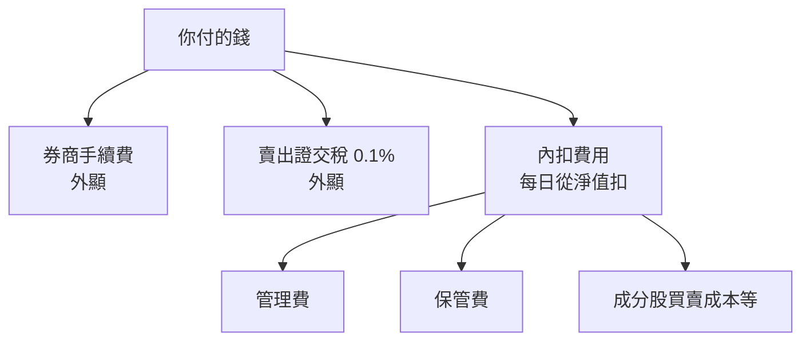
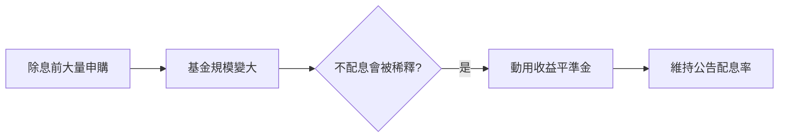

# ETF 費用與折溢價

## 本篇你會學到

- ETF 的**三層費用**（手續費、證交稅、內扣費用）
- **0050 vs 006208** 怎麼選
- **折溢價**與**收益平準金**的白話解讀
- 長期內扣費的複利影響

[← ETF 入門](etf-intro.md) · [0050 定期定額](../08-investing/etf-passive-dca.md)

!!! warning "免責聲明"
    以下為教學整理，**不構成投資建議**。費率與稅率以券商、投信公開說明書及現行法規為準。

---

## 先講結論

| 問題 | 答案 |
|------|------|
| ETF 比個股省什麼？ | 賣出**證交稅 0.1%**（個股一般 0.3%）；長期**內扣費**通常低於共同基金 |
| 0050 還是 006208？ | 都追蹤台灣 50；**選一檔長期定額即可**，不必兩檔都買 |
| 折溢價要管嗎？ | 定期定額可忽略小幅差異；**大額單筆**宜留意勿大幅溢價買進 |
| 收益平準金是什麼？ | 會計機制，**不是額外獲利**；高股息 ETF 配息公告要看來源占比 |

---

## 三層費用

ETF 像股票一樣在交易所買賣，但還有**看不到帳單**的內扣成本。

| 層級 | 項目 | 白話 | 教學參考 |
|------|------|------|----------|
| **外顯 1** | 買賣手續費 | 跟個股相同機制 | 0.1425% 牌告，常打折；定額部分券商有均一價 |
| **外顯 2** | 證交稅 | **僅賣出**時課徵 | ETF **0.1%**；個股一般 **0.3%** |
| **內扣** | 管理費、保管費等 | 每天從淨值默默扣 | 被動大盤 ETF 常 **0.3%～0.5%／年** |

!!! tip "內扣 vs 外扣"
    **申購共同基金**的外扣申購費，買當下就看得到扣款。  
    **ETF 內扣費**不會出現在成交明細，但長期會反映在淨值曲線上。

詳見 [交割與稅費](settlement-fees.md)、[交易成本](../06-risk/trading-costs.md)。

---

## 0050 vs 006208 {#0050-vs-006208}

兩檔都是**被動型、追蹤台灣 50 指數**的大盤 ETF，差異主要在發行投信與細節：

| 項目 | 0050 | 006208 |
|------|------|--------|
| **追蹤指數** | 台灣 50 | 台灣 50 |
| **發行投信** | 元大 | 富邦 |
| **白話** | 歷史最久、成交量大、討論度高 | 同指數的替代選擇 |
| **長期定額** | ✅ 常見選擇 | ✅ 常見選擇 |

| 建議 |
|------|
| **不必兩檔都買** — 追蹤同一指數，分散買兩檔並不能降低「大盤風險」 |
| 可比較：內扣費率、成交量、自己券商定額優惠 |
| 選定後**長期紀律**比「哪一檔多 0.05% 費用」更重要 |

完整定額流程 → [0050 與定期定額](../08-investing/etf-passive-dca.md)

---

## 折溢價

ETF 有兩個價格概念：

| 名詞 | 定義 | 白話 |
|------|------|------|
| **淨值（NAV / iV 值）** | 一籃子標的的公允價值 | 「這檔 ETF 理論上值多少」 |
| **市價** | 盤中撮合成交價 | 「大家現在願意出多少錢買」 |

| 現象 | 條件 | 對買方意味 |
|------|------|------------|
| **溢價** | 市價 > 淨值 | 可能**買貴** |
| **折價** | 市價 < 淨值 | 可能**買便宜**（賣出時則相反） |

### 哪裡查

| 來源 | 說明 |
|------|------|
| 證交所 ETF 資訊 | 盤中 iV 值（指示淨值） |
| 投信官網 | 收盤後淨值、折溢價統計 |
| 券商看盤 | 部分軟體並列市價與 iV |

### 實務建議

| 做法 | 折溢價敏感度 |
|------|--------------|
| **定期定額** | 低 — 長期平均，小幅溢價可接受 |
| **大額單筆買進** | 高 — 避免在明顯溢價時追價 |
| **海外／跨時區 ETF** | 更高 — 開盤時常因時差、匯率出現較大折溢價 |

!!! warning "折溢價不是套利保證"
    折價不一定立刻填平；流動性低的 ETF 折溢價可能持續較久。

---

## 收益平準金 {#收益平準金}

**常見於高股息 ETF**（如 0056 等），0050 類大盤 ETF 較少討論。

### 是什麼

| 項目 | 說明 |
|------|------|
| **本質** | ETF 會計科目之一，不是「基金公司額外送你的錢」 |
| **用途** | 當除息前大量申購、基金規模暴增時，**維持配息率不被稀釋** |
| **白話** | 新錢進來時，把一部分記在「收益平準金」，除息時動用，讓舊戶配息不會因規模變大而縮水 |

### 你要看什麼

| 文件 | 重點 |
|------|------|
| **收益分配公告** | 配息來源占比：股利、債息、**收益平準金**各占多少 |
| **公開說明書** | 收益分配政策、平準金啟動條件 |

| 誤解 | 實際 |
|------|------|
| 配息多 = 賺得多 | 配息後淨值常下修；要看**含息總報酬** |
| 收益平準金 = bonus | 是會計調節，**非保證收益** |
| 月配 X% = 年化 X×12 | 常忽略淨值變化與平準金占比 |

高股息 ETF 選擇 → [高股息 ETF](../08-investing/etf-high-dividend.md)  
個股存股配息 → [存股與除權息](../08-investing/dividend-investing.md)

---

## 數字試算：內扣費的複利差距

假設：本金 **100 萬**、標的年化報酬 **8%**（假設，非保證）、持有 **10 年**。

| 情境 | 年化內扣費 | 10 年後約略（示意） |
|------|------------|---------------------|
| A | 0.4%（大盤 ETF 量級） | 約 **215 萬** |
| B | 1.5%（部分主動商品量級） | 約 **196 萬** |
| **差距** | 差 1.1%／年 | 約 **19 萬** |

| 重點 |
|------|
| 1% 左右的年化費差，長期複利後差距可觀 |
| 選 ETF 前可至 [公開資訊觀測站](https://mops.twse.com.tw) 或投信官網查「各年度基金之費用率」 |
| 與 [共同基金入門](mutual-fund-intro.md) 的試算邏輯相同 |

---

## 選 ETF 前費用檢查表

| # | 檢查項 | 哪裡查 |
|---|--------|--------|
| 1 | 內扣費率（管理費+保管費等） | 公開說明書 |
| 2 | 券商定額手續費 | 自家券商公告 |
| 3 | 賣出證交稅 0.1% | [交割與稅費](settlement-fees.md) |
| 4 | 折溢價（大額單筆） | 證交所 iV 值 |
| 5 | 配息來源（高股息型） | 收益分配公告 |

---

## 重點回顧

- ETF 費用 = **手續費 + 證交稅（0.1%）+ 內扣費**；內扣最隱形、長期最關鍵。
- **0050 / 006208** 同指數，選一檔定額即可。
- **折溢價**：定額可淡化；大額買進宜看 iV 值。
- **收益平準金**：配息機制的一環，看公告占比，勿當額外獲利。
- 延伸：[ETF 入門](etf-intro.md) · [0050 定額](../08-investing/etf-passive-dca.md) · [高股息 ETF](../08-investing/etf-high-dividend.md) · [交易成本](../06-risk/trading-costs.md)
