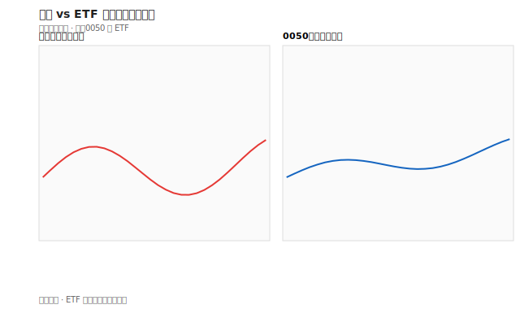

# ETF 入門

## 本篇你會學到

- ETF 與個股的差異
- 被動型 vs 主動型 ETF
- 如何把 ETF 當學習參考

## ETF 是什麼

**ETF（交易所交易基金）** 像股票一樣在盤中買賣，但底層是一籃子股票或債券。

| 比較 | 個股 | ETF |
|------|------|-----|
| 風險 | 集中單一公司 | 分散多檔 |
| 研究深度 | 需看公司財報 | 需看追蹤指數或經理策略 |
| 代號 | 通常 4 碼 | 常見 5 碼（如 0050） |

與**共同基金**的三方比較見 [共同基金入門：基金 vs ETF vs 個股](mutual-fund-intro.md#基金-vs-etf-vs-個股)。

---

| 類型 | 說明 | 範例概念 |
|------|------|----------|
| **被動型** | 追蹤指數，持股隨指數調整 | 台灣 50、S&P 500 |
| **主動型** | 經理人主動選股，持股會變動 | 各類主題、產業 ETF |

### 主動 ETF 當「參考」

部分投資人觀察**主動 ETF 持股變化**（加碼、新建倉）作為研究線索，但：

- 不是保證獲利
- 公布有時間差
- 需搭配 [基本面](../05-analysis/three-pillars.md) 與 [法人籌碼](../03-tables/institutional.md)

## 0050 快速認識

0050 是追蹤**台灣 50** 的被動型大盤 ETF（5 碼、盤中像股票買賣），常見用法是閒錢 + 定期定額。

| 延伸 | 章節 |
|------|------|
| 定額流程、進場評估、常見說法修正 | **[被動 ETF 與定期定額](../08-investing/etf-passive-dca.md)** |
| 0050 vs 006208、費用與折溢價 | [ETF 費用與折溢價](etf-costs-and-premium.md#0050-vs-006208) |

---

## 何時適合 ETF

| 情境 | 說明 |
|------|------|
| 入門分散 | 單筆資金買一籃子，降低單一公司風險 |
| 大盤定期定額 | 如 0050，見 [被動 ETF 專章](../08-investing/etf-passive-dca.md) |
| 存股 | 高股息 ETF 為常見選擇（仍看內扣費與成分） |
| 練習看盤 | 0050 與大盤連動，適合觀察大勢 |

---

!!! tip "閒錢與定額"
    進場前請先讀 [資金配置：閒錢與生活費](../06-risk/capital.md#閒錢與生活費)；0050 定額完整觀念見 [被動 ETF 專章](../08-investing/etf-passive-dca.md)。

## 延伸閱讀

| 主題 | 章節 |
|------|------|
| 費用、折溢價、收益平準金 | [ETF 費用與折溢價](etf-costs-and-premium.md) |
| 0050 定期定額 | [被動 ETF 與定期定額](../08-investing/etf-passive-dca.md) |
| 高股息 ETF | [高股息 ETF](../08-investing/etf-high-dividend.md) |
| 主動 ETF 分析 | [主動 ETF](../05-analysis/active-etf.md) |

---

## 重點回顧

- ETF 是商品，不是「另一種散戶」。
- 0050 是入門最常討論的**被動大盤 ETF**之一；同指數替代與費用見 [ETF 費用與折溢價](etf-costs-and-premium.md#0050-vs-006208)。
- 主動 ETF 持股可當研究線索，非買賣指令。
- 延伸：[ETF 投資模式](../08-investing/etf-investing.md) · [共同基金入門](mutual-fund-intro.md) · [市場參與者](roles.md)
