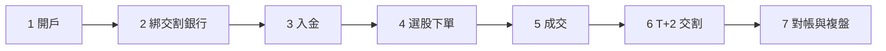

# 第一筆交易完整走一遍

## 本篇你會學到

- 從開戶到第一筆交易對帳的**完整流程**
- 每一步要準備什麼、容易卡在哪
- 各步驟對應的詳細章節

!!! note "定位"
    本頁是**新手總路線圖**，把分散在各章的步驟串成一條龍。每一步的細節都連到對應章節，看完就知道「下一步做什麼」。

## 全流程一覽

## 步驟拆解

### 1. 開證券戶

到券商（臨櫃或線上）開**證券交易帳戶**，同時會開一個對應的**交割銀行帳戶**。需要雙證件、印章。

詳見 [開戶與下單前準備](open-account.md)。

### 2. 綁定交割銀行帳戶

買股票的錢會從這個銀行帳戶**自動扣款**，賣出的錢也匯入這裡。開戶時通常一併完成。

### 3. 入金（存錢進交割戶）

下單前，**交割帳戶要有足夠的錢**。台股是 T+2 交割，雖然不是下單當下扣款，但到 T+2 一定要備妥，否則會 [違約交割](settlement-fees.md)。

### 4. 選股與下單

用 [報價畫面](quote-screen.md) 看價格，決定**限價或市價**、**張數或零股**，送出委託。新手建議先用**限價單**控制成交價。

- 怎麼看價：[報價畫面怎麼看](quote-screen.md)
- 下單規則：[交易流程](trading-flow.md)
- 小錢起步：用 [零股](trading-flow.md#零股) 買高價股或 ETF

### 5. 成交

委託價格與市場撮合成功就**成交**，庫存出現股票。沒成交的限價單會留在委託區，可改價或刪單。

### 6. T+2 交割

成交日算第 0 天，**第 2 個營業日**完成款券交割：買進扣款、賣出入帳。

詳見 [交割與費用](settlement-fees.md)。

### 7. 對帳與複盤

到券商 APP 看**對帳單**：成交價、手續費、證交稅、淨損益。把這筆交易記下來，養成複盤習慣。

- 算清成本：[交易成本與期望值](../06-risk/trading-costs.md)
- 複盤方法：[系統化研究流程](../09-advanced/research-workflow.md)

## 第一筆交易檢查表

下單前快速自問（完整版見 [投資檢查清單](../appendix/investor-checklist.md)）：

- [ ] 交割戶的錢夠 T+2 扣款嗎？
- [ ] 我用的是限價還是市價，價格合理嗎？
- [ ] 這檔有沒有 [處置／全額交割](trading-restrictions.md) 標記？
- [ ] 我事先設好停損了嗎？（見 [停損三層](../06-risk/stop-loss.md)）

## 常見誤區

| 誤區 | 正確做法 |
|------|----------|
| 以為下單當下就扣款 | 是 T+2 交割，但錢要先備好 |
| 第一筆就重押單一個股 | 先小額、分散，控制曝險 |
| 成交後不對帳 | 一定要核對費稅與淨損益 |

## 重點回顧

- 流程是：開戶 → 綁銀行 → 入金 → 下單 → 成交 → T+2 交割 → 對帳。
- 新手先用**限價單 + 小額／零股**降低風險。
- 下單前務必確認交割能力與停損計畫。

相關：[開戶準備](open-account.md) · [交易流程](trading-flow.md) · [交割與費用](settlement-fees.md) · [投資檢查清單](../appendix/investor-checklist.md) · [常見問答](../appendix/faq.md)
