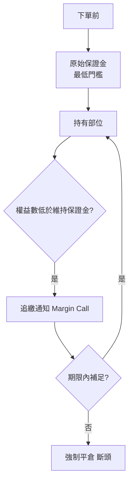

# 期貨入門

## 本篇你會學到

- 期貨是什麼、與現股的根本差異
- **大台、小台、微台**的合約規格
- **保證金**三層與追繳、強制平倉
- 結算日、成本與風險警示

[← 入門導覽](index.md) · [期貨輔助現貨](../09-advanced/futures-signal.md)

!!! warning "免責聲明"
    以下為教學整理，**不構成投資建議**。保證金、稅費以期交所及期貨商最新公告為準。

!!! note "本站定位"
    Stock School 以**現股現貨**為主；期貨在此是**認識市場工具**，老手可進一步讀 [期貨輔助現貨判斷](../09-advanced/futures-signal.md)。**不建議散戶以期貨為主戰場。**

---

## 先講結論

| 問題 | 答案 |
|------|------|
| 期貨是什麼？ | 標準化**合約**，約定未來以特定價格買賣標的（如台股加權指數） |
| 跟股票差在哪？ | **不是公司所有權**；保證金交易、可做多做空、有到期日 |
| 散戶該操作嗎？ | 本站建議主戰場仍是**現股 / ETF**；期貨先**認識**即可 |
| 保證金去哪查？ | [臺灣期貨交易所](https://www.taifex.com.tw) 最新公告 |

---

## 期貨 vs 現股

| 項目 | 期貨（台指期） | 現股 / ETF |
|------|----------------|------------|
| **本質** | 指數（或商品）的**合約** | 公司**所有權**或一籃子基金 |
| **方向** | 可做多、可做空 | 現股先買後賣（融券另論） |
| **付款** | **保證金**（部分押金） | 全額股款（或融資） |
| **到期** | 月契約，需**換月或結算** | 無到期（除非下市） |
| **最大風險** | 保證金不足→**追繳、強平** | 最多賠光投入本金（現股） |
| **適合** | 專業避險、短線 | 多數散戶長期配置 |

---

## 台指期：大台、小台、微台

**台指期** = 以**台灣加權股價指數**為標的的期貨，俗稱「大台指」。

| 商品 | 代號概念 | 合約規模 | 每點價值（教學參考） |
|------|----------|----------|----------------------|
| **大台** | TX | 指數 × 200 元 | **200 元／點** |
| **小台** | MTX | 大台的 1/4 | **50 元／點** |
| **微台** | TM / 微台指 | 大台的 1/10 量級 | **10 元／點** |

| 白話 |
|------|
| 指數從 20,000 漲到 20,001（1 點），大台約 **+200 元**／口 |
| 小台、微台波動金額較小，**認識規格用**；不代表適合新手實操 |

!!! tip "最小跳動"
    台指期最小跳動單位通常為 **1 點**；盤中「一點點」對大台已是可觀金額。

---

## 保證金三層

期貨採**保證金制度**：不必付足全部合約價值，存入一筆押金即可建立部位。

| 類型 | 白話 |
|------|------|
| **原始保證金** | 建立新倉位前，帳戶須有的**最低金額** |
| **維持保證金** | 持倉期間須維持的底線（常約原始的 75% 量級） |
| **追繳** | 虧損使權益低於維持線 → 須補至**原始保證金**水位 |
| **強制平倉** | 未補足 → 期貨商可**斷頭** |

| 教學參考（請以期交所最新公告為準） |
|-----------------------------------|
| 大台原始保證金：約 **40 萬～50 萬** 量級（隨波動調整） |
| 小台約大台的 **1/4**；微台約 **1/10** 量級 |

!!! warning "槓桿"
    用約 20 萬保證金操作價值數百萬的合約 → **槓桿極高**。專業建議帳戶權益宜為原始保證金的 **3 倍以上**，以降低實質槓桿。

---

## 結算與到期

| 項目 | 說明 |
|------|------|
| **契約月份** | 近月、次月等；到期須**平倉或換月** |
| **最後結算日** | 依契約規定結算（常為該月第三個週三等，以期交所為準） |
| **現股對照** | 現股 T+2 交割；期貨是**合約到期**機制 |

| 白話 |
|------|
| 買進台指期不是「永久持有指數」，而是持有**特定月份合約** |
| 散戶若只把期貨當**溫度計**看開盤，不必深入換月操作 |

---

## 交易成本

| 項目 | 說明 |
|------|------|
| **手續費** | 依期貨商，常為定額或折扣 |
| **期貨交易稅** | 依現行法規（以期交所公告為準） |

短線頻繁交易時，成本與 [現股交易成本](../06-risk/trading-costs.md) 一樣會侵蝕獲利。

---

## 如何開始（認識用）

若僅想**理解市場**而非實操：

| 步驟 | 說明 |
|------|------|
| 1 | 讀本篇，搞懂保證金與合約規格 |
| 2 | 看盤軟體上的**台指期報價**與 [期現價差](../02-glossary/chips.md#期現價差) |
| 3 | 讀 [期貨輔助現貨](../09-advanced/futures-signal.md) — 用期貨看溫度、用現股下單 |

若真要開戶交易：須至**期貨商**開立期貨帳戶、完成風險評估、入金至**保證金專戶** — 本站不教下單策略。

---

## 風險警示

| 風險 | 說明 |
|------|------|
| **槓桿放大虧損** | 幾點反向波動即可吃掉大量保證金 |
| **追繳與斷頭** | 非現股「最多賠光本金」這麼單純 — 可能被迫平倉 |
| **零和色彩** | 多空對做，有人賺必有人賠（扣除成本） |
| **夜盤波動** | 受美股等影響，與 [跨市場](../05-analysis/cross-market.md) 相關 |

| 本站建議 |
|----------|
| 散戶主戰場：**現股、ETF 定額** |
| 期貨：**輔助判斷**開盤情緒，見 [futures-signal](../09-advanced/futures-signal.md) |
| 當沖現股者：可觀察 08:45 期貨開盤，但**不必自己炒期貨** |

---

## 重點回顧

- 期貨 = **合約 + 保證金 + 到期**，不是買股票。
- **大台 / 小台 / 微台** = 合約規模不同，每點價值 200 / 50 / 10 元量級。
- **原始 → 維持 → 追繳 → 強平** 是風控核心。
- 本站用法：期貨**看溫度**，現股**下單** → [期貨輔助現貨](../09-advanced/futures-signal.md)
