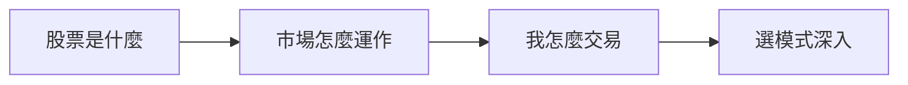

# 入門導覽

## 本篇你會學到

- 入門章節的閱讀順序
- 股票基礎、市場規則、實務操作三條主線

---

## 三條主線

| 主線 | 章節 | 回答的問題 |
|------|------|------------|
| **認識股票** | [股票是什麼](what-is-stock.md) · [股價與市值](price-and-cap.md) · [報價畫面](quote-screen.md) | 我買的是什麼？畫面上數字是什麼？ |
| **市場規則** | [市場概覽](market-overview.md) · [參與者](roles.md) · [除權息](dividend.md) · [ETF](etf-intro.md) · [ETF 費用](etf-costs-and-premium.md) · [共同基金](mutual-fund-intro.md) · [期貨入門](futures-intro.md) | 上市上櫃、誰在交易、配息、ETF、基金、期貨？ |
| **實務操作** | [交易流程](trading-flow.md) · [交割與稅費](settlement-fees.md) · [開戶](open-account.md) | 怎麼下單？錢什麼時候扣？ |

選定操作風格後 → [對號入座](../10-persona/index.md) 或 [投資模式總覽](../08-investing/index.md)。  
基礎穩定後 → [老手專區](../09-advanced/index.md)。

---

## 建議閱讀順序

> 依身分規劃的**全站路徑**見 [首頁學習路徑](../index.md)。以下為**入門章**三日範例。

=== "第一天（2 小時）"

    1. [股票是什麼](what-is-stock.md)
    2. [台股市場概覽](market-overview.md)
    3. [報價畫面怎麼看](quote-screen.md)
    4. [圖表總覽](../04-charts/index.md)（知道有哪些圖）

=== "第二天"

    1. [股價與市值](price-and-cap.md)
    2. [一筆交易怎麼完成](trading-flow.md)
    3. [交割與稅費](settlement-fees.md)
    4. [市場參與者](roles.md)

=== "第三天起"

    1. [對號入座](../10-persona/index.md) 或 [如何選投資模式](../08-investing/choose-style.md)
    2. [模式與心態](../08-investing/mode-psychology.md)
    3. [ETF 入門](etf-intro.md) · [ETF 費用與折溢價](etf-costs-and-premium.md) · [共同基金入門](mutual-fund-intro.md) · [期貨入門](futures-intro.md)
    4. [術語詞典](../02-glossary/index.md)
    5. 依模式讀 [看表](../03-tables/watchlist.md) / [看圖](../04-charts/index.md)

---

## 與其他章節的關係

| 入門缺什麼 | 去哪補 |
|------------|--------|
| 名詞定義 | [術語詞典](../02-glossary/index.md) |
| 表格欄位 | [怎麼看表](../03-tables/watchlist.md) |
| 圖表種類 | [圖表總覽](../04-charts/index.md) |
| 分析怎麼想 | [三大支柱](../05-analysis/three-pillars.md) |
| 成本與停損 | [風險與紀律](../06-risk/capital.md) |

---

## 重點回顧

- 入門先搞懂**股票本質**與**報價畫面**，再學 K 線與指標。
- 交易流程與稅費影響實際獲利，見 [交易成本](../06-risk/trading-costs.md)。
- 下一步：[股票是什麼](what-is-stock.md)
