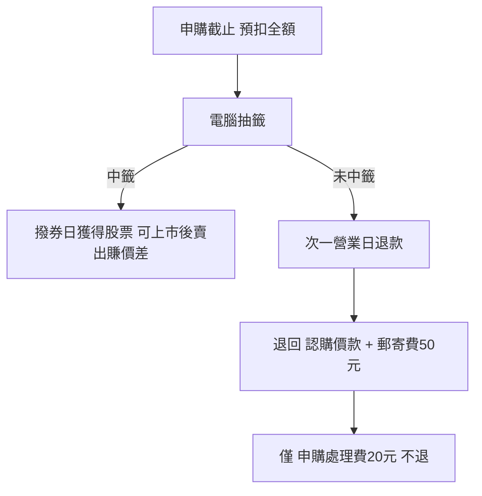

# IPO 公開申購（抽籤）

## 本篇你會學到

- IPO／現金增資公開申購的抽籤機制與門檻
- 申購要預扣哪些錢、未中籤如何退款
- 大型申購案如何造成市場「資金虹吸」與流動性潮汐

!!! note "定位"
    本頁談**初級市場**（新股發行）的參與方式，與次級市場（每日買賣）不同。實際申購規則以**證交所／櫃買中心承銷公告**與券商為準。

## 什麼是公開申購

企業上市櫃或現金增資時，會保留一定額度供公眾**公開申購**。因為承銷價常低於上市後市價，存在價差誘因，故採**電腦隨機抽籤**以求公平。

| 項目 | 規則 |
|------|------|
| 資格 | 須有台股證券交割戶 |
| 防人頭 | **同一身分證字號、同一申購案只能抽一次**，重複申購全部取消資格 |
| 張數 | 不可自選，依承銷公告規定 |
| 公告來源 | [證交所](https://www.twse.com.tw) / [櫃買中心](https://www.tpex.org.tw) 承銷公告 |

## 申購要預扣多少錢

申購截止前，交割帳戶須備足**全額**供銀行預先扣款，包含三部分：

| 項目 | 金額 |
|------|------|
| **認購價款** | 承銷價 × 申購股數 |
| **申購處理費** | 固定 20 元 |
| **中籤通知郵寄工本費** | 50 元 |

## 中籤與退款

- **中籤**：撥券日取得股票，可於集中市場賣出賺價差（中籤率常低於 1%）。
- **未中籤**：抽籤次一營業日退回**認購價款 + 50 元郵寄費**；唯獨 **20 元處理費不退**（行政折耗，也是阻擋無效灌單的「防洪堤」）。

## 資金虹吸與流動性潮汐

大型、價差豐厚的申購案常吸引數十萬至上百萬人參與，**數天內凍結數千億資金**於交割帳戶，無法參與次級市場交易：

| 階段 | 市場影響 |
|------|----------|
| 申購凍結期 | 大盤成交量易萎縮、流動性暫時抽離 |
| 抽籤結束退款 | 龐大資金回流，可能再尋找標的湧入 |

因此把熱門 IPO 申購時程納入觀察，是**預判短期流動性**的線索。

## 常見誤區

| 誤區 | 正確認知 |
|------|----------|
| 申購一定賺 | 須中籤（機率低），且上市後價格未必高於承銷價 |
| 多開帳戶多抽幾次 | 同一身分證同案只算一次，重複會被取消 |
| 帳戶餘額不足也能抽 | 須預扣全額，不足無法參與 |

## 自我檢查

??? question "1.（概念題）未中籤會退回哪些錢、哪一筆不退？"
    參考答案：退回認購價款 + 50 元郵寄工本費；**20 元申購處理費不退**。

??? question "2.（判斷題）用家人帳戶＋自己帳戶抽同一檔，中籤機率加倍？"
    參考答案：各帳戶若為不同身分證可各抽一次；但**同一身分證**同案重複申購會被取消資格。

??? question "3.（情境題）某千億級大型 IPO 開放申購當週，大盤量縮，為什麼？"
    參考答案：大量資金被凍結於交割帳戶參與申購，暫時抽離次級市場 → 流動性潮汐。

## 重點回顧

- 公開申購採隨機抽籤，同一身分證同案限一次。
- 預扣 = 認購價款 + 20 元處理費 + 50 元郵寄費；未中籤僅 20 元不退。
- 大型申購案的資金凍結與回流，是短期流動性的觀察指標。

相關：[股票是什麼](what-is-stock.md) · [交割與費用](settlement-fees.md) · [資料來源](../appendix/data-sources.md#初級市場ipo-公開申購) · [常見問答](../appendix/faq.md)
