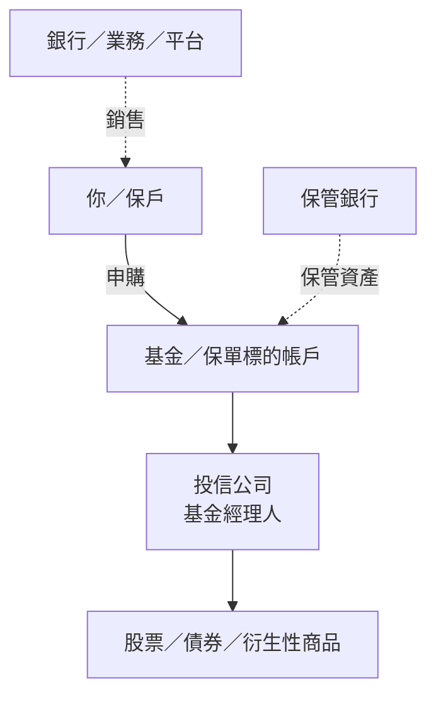
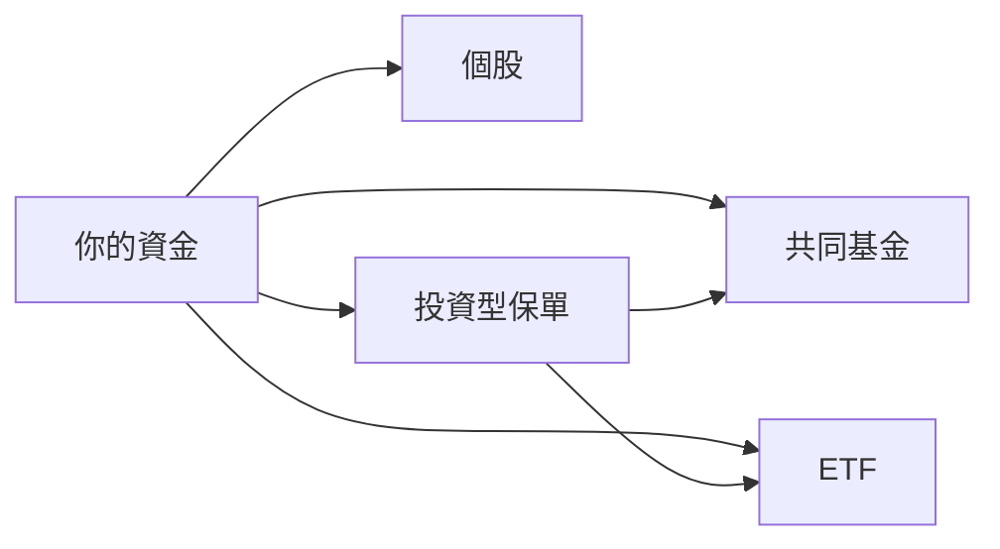
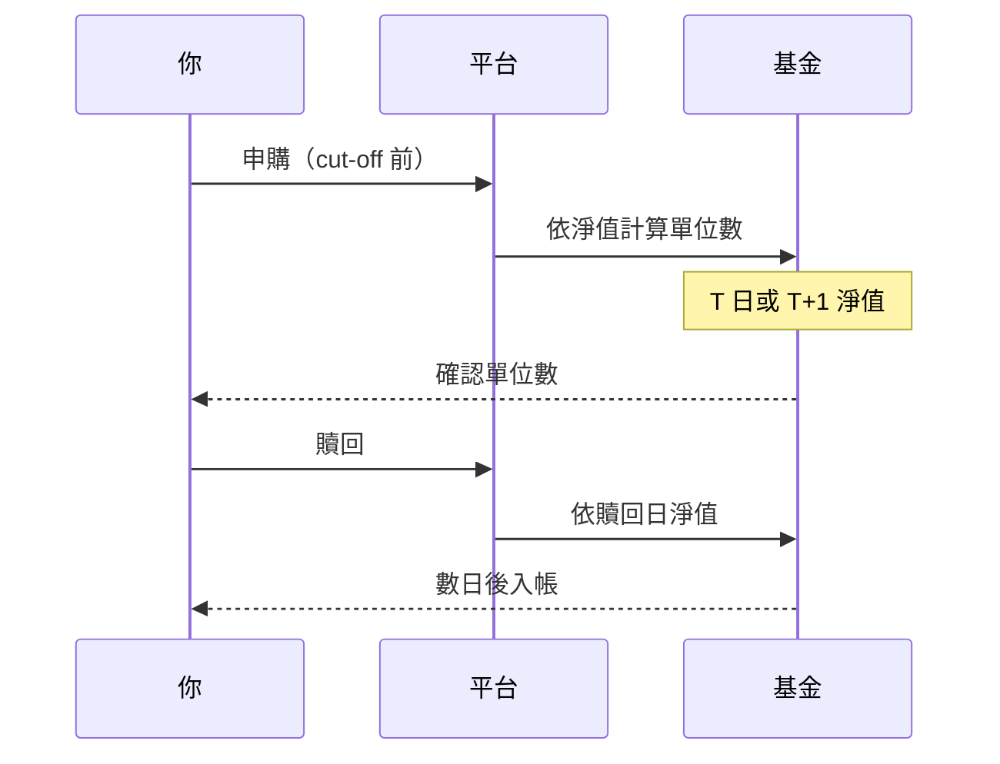
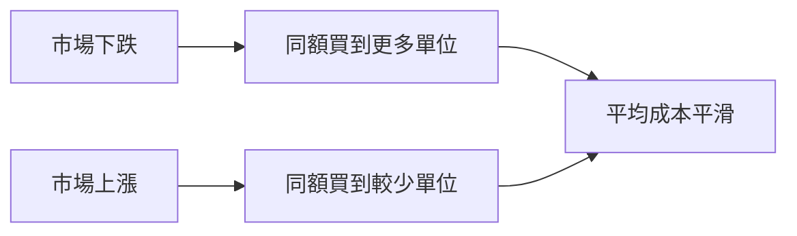
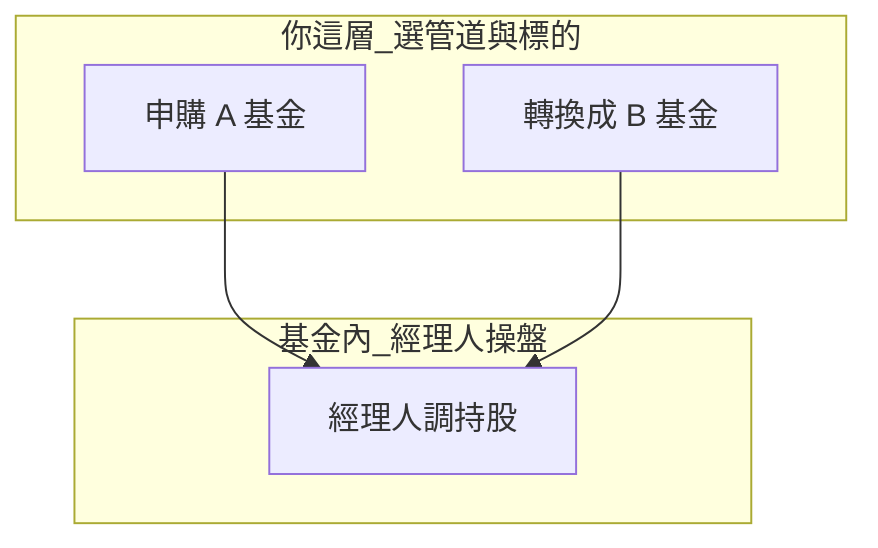
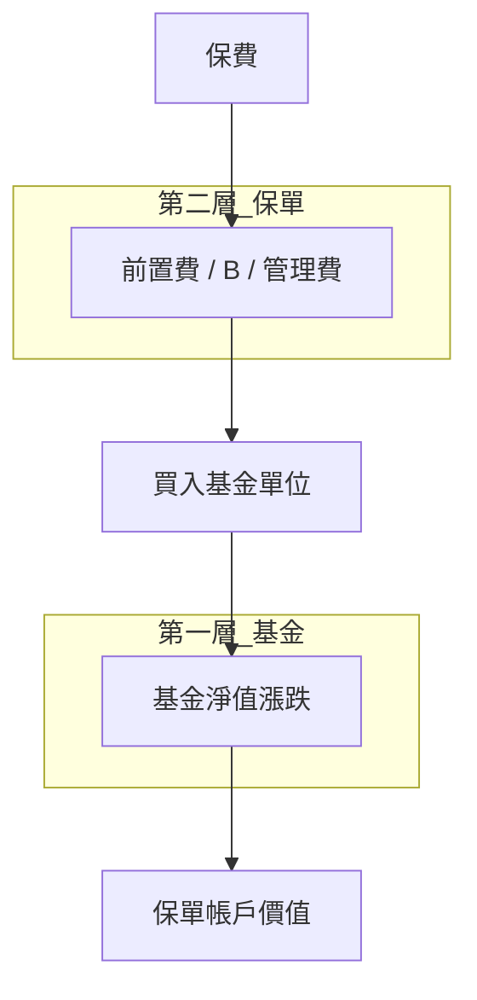
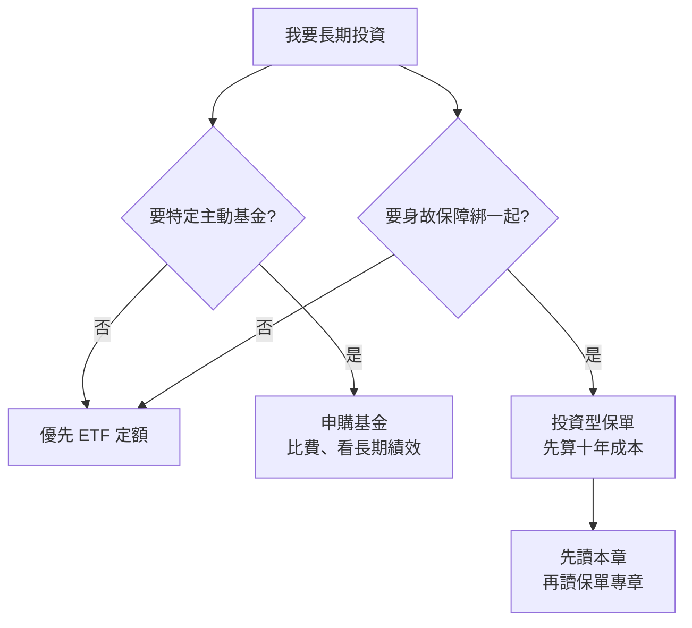

# 共同基金入門

## 本篇你會學到

- **共同基金（開放式基金）** 是什麼、誰在裡面扮演什麼角色
- **淨值、申購、贖回、未知價** 怎麼運作
- 基金**費用**與**數字試算**
- **配息基金**常見陷阱（含為何仍可能虧損）
- **微笑曲線**與定期定額的關係
- **投資型保單**為什麼幾乎都連結基金
- 自己買基金 vs 保單 vs ETF，該怎麼選

[← 入門導覽](index.md) · [ETF 入門](etf-intro.md) · [投資型保單](../08-investing/investment-linked-policy.md)

!!! warning "免責聲明"
    以下為教學整理，**不構成投資建議**，亦不保證任何報酬。

---

## 先講結論

| 問題 | 答案 |
|------|------|
| 基金是什麼？ | 多人集資 → 投信代操一籃子標的 → 你持有**單位**，按**淨值**賺賠 |
| 跟 ETF 差在哪？ | 基金**申購淨值**、常較慢、**申購費+高經理費**；ETF **像股票買**、費用通常較低 |
| 投資型保單買的是？ | **連結同一套共同基金**（或 ETF），但多扣保單前置費、保險成本 B |
| 該買基金還是 ETF？ | **長期大盤、要低成本** → 優先 ETF；**特定主動基金**才考慮申購基金 |

---

## 基金是什麼

**共同基金**（開放式基金）= 把很多投資人的錢**集合成一池**，交給**投信公司**依基金契約投資，你持有的是**基金單位／受益憑證**，不是直接持有某一家公司股票。

| 白話 | 說明 |
|------|------|
| **一籃子** | 一檔基金裡通常有多檔股票、債券等 |
| **專人（或規則）操盤** | 主動型靠經理選股；指數型跟指數 |
| **按淨值買賣** | 不像股票盤中跳價，而是**每日結算淨值** |

### 生態系：誰扮演什麼角色

| 角色 | 做什麼 | 怎麼賺 |
|------|--------|--------|
| **投信（AM）** | 決定（或依指數）怎麼投 | **經理費（內扣）** |
| **保管銀行** | 保管基金資產 | 保管費（多內扣於淨值） |
| **銷售機構** | 銀行、券商、保險公司推申購 | **申購手續費、佣金** |
| **你** | 出資、承擔淨值漲跌 | 淨值增減 − 各項費用 |

台灣投資型保單的標的帳戶，**絕大多數連結這類共同基金**（少數為 ETF、全委託帳戶）。

---

## 基金 vs ETF vs 個股 {#基金-vs-etf-vs-個股}

本站**三方對照以本章為準**；ETF 與個股的入門差異另見 [ETF 入門](etf-intro.md)（不重複此表）。

|  | 共同基金 | ETF | 個股 |
|--|----------|-----|------|
| **怎麼買** | 銀行／投信／平台**申購** | 證券商像**股票**下單 | 證券商買賣 |
| **價格** | **淨值**（每日計算） | 盤中**市價** | 盤中股價 |
| **交易時間** | 申贖依 cut-off，常 **T+1～T+2** 確認 | 盤中即時 | 盤中即時 |
| **典型費用** | 申購／贖回費 + **經理費 1%～2%** | **經理費 0.3%～0.5%** + 低交易費 | 手續費 + 證交稅 |
| **最低入門** | 常數千～數萬起 | 1 張（依股價） | 1 張 |
| **投資型保單** | ✅ **最常見連結標的** | ✅ 部分保單可選 | ❌ 通常不直接連結 |

| 想要… | 優先考慮 |
|--------|----------|
| 台股大盤、長期、少折騰 | **ETF**（如 0050）→ [ETF 入門](etf-intro.md) |
| 特定主動策略、只能買某檔基金 | **共同基金**（本章） |
| 單一公司投資論點（thesis） | **個股** |
| 保障 + 連結基金綁一起 | **投資型保單** → 先讀本章再讀 [專章](../08-investing/investment-linked-policy.md) |

---

## 淨值、申購、贖回

### 淨值（NAV）

| 項目 | 說明 |
|------|------|
| **公式概念** | （基金總資產 − 總負債）÷ 總單位數 |
| **公布時間** | 通常**每營業日**結算後（T 日收盤後算 T 日淨值） |
| **你賺賠** | 持有期間淨值漲跌，**盈虧自負** |

### 申購與贖回流程

| 操作 | 白話 | 注意 |
|------|------|------|
| **申購** | 用錢換基金單位 | 依**申購日淨值**計價 |
| **贖回** | 賣回單位換現金 | 資金常 **T+2～T+7** 才入帳（依基金） |
| **定期定額** | 每月固定日扣款申購 | 銀行／平台常見 |

### 「未知價」申購

| 狀況 | 說明 |
|------|------|
| **你在 cut-off 前下單** | 當天淨值**還沒算出來** |
| **實際成交** | 依**下一個**已公布淨值（或契約規定日）計算 |
| **白話** | 不像股票看即時價；**今天買，用明天或後天的淨值** |

投資型保單內換標的，依保單**資產評價日**結算，邏輯類似——不是台股 T+0。

### 長期持有、變現與手續費 {#長期持有變現與手續費}

| 問題 | 白話答案 |
|------|----------|
| 基金要長期持有才獲利？ | **長期**較能平滑波動，但**不保證**獲利；短期賣出常輸給長抱（尚須扣費） |
| 交易日影響大嗎？ | **定期定額、長抱**下，單次扣款日影響較小；仍須注意 cut-off 與未知價 |
| 變現後再買要重扣手續費？ | **贖回再申購**：可能再收贖回費／申購費（依基金與平台） |
| 保單部分提領呢？ | **不解約**的提領通常**不重扣首年前置費**；轉換、提領仍可能有其他費用 → [保單專章](../08-investing/investment-linked-policy.md#部分提領解約與加籌) |

自己買基金變現 = 贖回；保單變現 = 部分提領或解約——**兩者費用結構不同**，不能混為「都不用再付」。

---

## 微笑曲線與定期定額 {#微笑曲線與定期定額}

業務常說的**「微笑曲線」**，多半指**定期定額**（或逢低加碼）時，你的**平均成本**隨市場起伏形成的曲線：價格低時買到較多單位、價格高時買到較少，長期平均成本常落在波段中間偏下，圖形像微笑。

| 概念 | 說明 |
|------|------|
| **不是保證獲利策略** | 微笑曲線描述的是**進場成本分布**，不是「一定賺」 |
| **適用對象** | 共同基金定期定額、[ETF 定額](../08-investing/etf-passive-dca.md) |
| **前提** | **閒錢**、願意長期持有、標的 thesis 不變 |
| **代價** | 牛市時報酬可能**低於**單筆 All-in（機會成本）；見 [實戰問答](../07-cases/fund-policy-faq.md) |

**微笑曲線 ≠ 投資型保單專利**；用券商買 ETF 定額也能達到類似效果，且費用通常更低。

---

## 基金費用（必看）

### 費用一覽

| 費用 | 外扣／內扣 | 白話 | 教學參考 |
|------|------------|------|----------|
| **申購手續費** | **外扣** | 買入時先扣 | 牌告 **1%～3%**，常可打折 |
| **贖回手續費** | 外扣或內扣 | 部分基金持有未滿 N 年收 | 依公開說明書，可能 **0%** |
| **經理費** | **內扣** | 每天從淨值扣 | **1%～2%／年** |
| **保管費** | 內扣 | 併入營運 | 已反映在淨值 |
| **轉換費** | 外扣 | 同系列基金互轉 | 依平台 |

!!! tip "內扣 vs 外扣"
    **經理費**：淨值曲線**已經扣過**，你看不到帳單，但長期會少賺。  
    **申購費**：買 10 萬、費率 3% → **只有 9.7 萬**進基金。

### 數字試算（教學示意）

假設：申購 **100,000**、申購費 **2%**、經理費 **1.5%／年**、持有 **1 年**、淨值漲 **10%**（假設，非保證）。

| 步驟 | 計算 | 結果 |
|------|------|------|
| 扣申購費 | 100,000 × 98% | 98,000 進場 |
| 淨值 +10% | 98,000 × 1.10 | 107,800 |
| 再扣經理費約 1.5% | 粗略 | 約 **106,200** |
| **實際報酬率** | vs 原本 100,000 | 約 **+6.2%**（不是 +10%） |

若同一標的用 **0050**（申購費極低、經理費 ~0.4%），同樣淨值 +10% 時，**實拿會更接近 10%**（仍扣極低交易費）。

業務講「基金年報酬 30%」——常是**標的淨值故事**；若再包一層 [投資型保單](../08-investing/investment-linked-policy.md)，還要扣 **B、前置費**。

### 跟 ETF 比費用（十年概念）

|  | 主動共同基金 | 0050 類 ETF |
|--|--------------|-------------|
| 進場 | 申購 1%～3% | ~0.04% 量級 |
| 每年 | 經理 1%～2% | ~0.4% |
| **複利效果** | 長期明顯落後 | 多數散戶長期預設 |

---

## 基金類型與風險等級

### 常見類型

| 類型 | 投什麼 | 波動 | 保單常見？ |
|------|--------|------|------------|
| **股票型** | 以股票為主 | 高 | ✅ |
| **平衡型** | 股 + 債混合 | 中 | ✅ |
| **債券型** | 債券為主 | 中低 | ✅ |
| **貨幣型** | 短天期、現金類 | 低 | ✅ 停泊／待機 |
| **指數型** | 追蹤指數 | 依指數 | ✅ |
| **海外型** | 境外市場 | 依市場 + **匯率** | ✅ |

### 風險等級（RR）

公開說明書常標 **RR1～RR5**（數字越大越波動）：

| 等級 | 白話 | 適合 |
|------|------|------|
| RR1～2 | 偏保守 | 短期、低波動需求 |
| RR3 | 股債混合 | 中庸 |
| RR4～5 | 偏股、新興市場等 | 可承受較大回撤 |

**投資型保單不是「有保險就比較穩」**——連結 RR5 基金，帳戶一樣會大跌。

---

## 配息基金：特別要小心 {#配息基金特別要小心}

保單與銀行常推**月配息、季配息**基金；配息**不等於**賺錢。

| 概念 | 說明 |
|------|------|
| **配息從哪來** | 多半來自基金已持有的**利息、股利、或賣資產** |
| **配息後淨值** | 常**相應下降**（除息概念） |
| **本金配息** | 若配息 > 標的賺的 → 其實在**吃本金** |
| **月配 1% 話術** | 要算：**含息報酬** vs **淨值是否創新高** |

| 你要看的 | 不要只看 |
|----------|----------|
| **淨值長期走勢**（3～10 年） | 每月配息數字 |
| **含息 vs 不含息**績效 | 「月配 1% = 年配 12%」 |
| 公開說明書**配息政策** | 業務口述「像薪水」 |

### 配息型基金為何仍可能虧損？ {#配息型基金為何仍可能虧損}

常見疑問：「有配息、又有經理人操盤，怎麼還會負報酬？」

| 原因 | 說明 |
|------|------|
| **配息來自淨值** | 配出去多少，淨值常降多少；標的沒漲 = **把錢從左手換到右手** |
| **本金配息** | 配息 > 標的賺的 → 長期淨值走低，總報酬為負 |
| **經理費內扣** | 每天從淨值扣，配息數字**不會**幫你付經理費 |
| **標的下跌** | 經理人只能**相對**減虧或選股，**不能保證**正報酬 |
| **保單外層** | 若透過投資型保單，還要扣 **B、前置費** → 帳戶更容易負報酬 |

**數字示意（教學，非保證）：**

| 項目 | 結果 |
|------|------|
| 年初淨值 | 100 |
| 全年標的 -10% | 淨值約 90 |
| 期間月配息共領 6 元 | 帳上現金 +6，但淨值已跌 |
| **含息總報酬** | 仍可能 **-4%～-10%** 量級（視配息是否來自本金） |

所以：**配息 ≠ 沒虧**；要看「淨值 + 已領配息」的**總報酬**，不是只看每月入帳金額。

---

## 為什麼還要買賣／轉換基金？ {#為什麼還要買賣轉換基金}

「基金裡已經有投資經理人了，為什麼我還要買賣？」——這裡其實有**兩層不同**的操作：

| 層次 | 誰在買賣 | 在做什麼 |
|------|----------|----------|
| **基金內部** | 投信經理人 | 依契約調整**一籃子股票／債券**（你持有的是基金單位） |
| **你（保戶／投資人）** | 你自己或業務協助 | **申購／贖回**整檔基金，或在保單內**轉換**連結標的 |

| 你的操作 | 為什麼要做 | 費用 |
|----------|------------|------|
| **申購／贖回** | 進場、變現、換策略 | 申購費、贖回費 |
| **保單內轉換標的** | 從平衡型換成股票型等 | 免費次數用盡後常 **NT$500／次** |
| 什麼時候不必你動 | [類全委](../08-investing/investment-linked-policy.md#類全委全權委託投資型保單) 由投信代操配置 | 仍有保單費 + 代操費 |

**白話：** 經理人幫你選**籃子裡的零件**；你（或全委託）決定**買哪一籃**、要不要**換一籃**。兩層都有成本，不能互相抵銷。

---

## 台幣 vs 外幣基金

|  | 台幣計價基金 | 美元等外幣基金 |
|--|--------------|----------------|
| **標的** | 台股、台債等 | 海外股票、債券 |
| **額外風險** | 標的市場 | 標的市場 + **匯率** |
| **保單** | 常見 | 常見（美元保單、美元標的） |

**匯率獨立一層**：海外基金淨值漲 10%，台幣若升值 5%，台幣計價報酬可能只剩約 5% 概念。見 [跨市場分析](../05-analysis/cross-market.md)。

---

## 哪裡可以買基金

| 管道 | 白話 | 申購費 | 跟保單 |
|------|------|--------|--------|
| **銀行** | 臨櫃、網銀 | 較高，可議價 | 無 B |
| **基金平台** | 線上、定額 | 常 0～2% | 無 B |
| **證券戶** | 買 **ETF** 替代指數基金 | 低 | 無 B |
| **投資型保單** | 保費進連結清單 | **前置費 + B + 經理費** | 見 [專章](../08-investing/investment-linked-policy.md) |

### 保單連結基金：清單怎麼讀

| 文件 | 看什麼 |
|------|--------|
| **商品說明書** | 可連結標的全清單、配置比例上限 |
| **各標的基本資料** | 基金類型、RR、經理費、歷史淨值（參考） |
| **類全委帳戶** | 是否代操、撥回是否來自本金 |

**同一投信旗下的基金**，在銀行買 vs 在保單裡買 → **基金淨值邏輯相同**，差在**保單外層多扣什麼**。

---

## 投資型保單與基金：兩層報酬

| 層級 | 你在簡報聽到的 | 你實際關心的 |
|------|----------------|--------------|
| **基金層** | 「這檔漲 30%」 | 連結基金淨值表現 |
| **保單層** | 較少主動講 | **帳戶價值 IRR**（扣完 B 後） |

完整保單結構 → [投資型保單](../08-investing/investment-linked-policy.md)  
**建議閱讀順序：本章（基金）→ 保單專章 → [ETF 定額](../08-investing/etf-passive-dca.md) 對照**

---

## 怎麼讀基金資訊

### 必看文件

| 文件 | 重點 |
|------|------|
| **公開說明書** | 投資目標、RR、費用、持股限制、配息政策 |
| **簡式說明書** | 快速版，仍要看費用 |
| **投資展望／月報** | 經理觀點（**參考**，非保證） |
| **淨值表** | 至少看 **3～10 年** |

### 績效與排名

| 指標 | 用法 |
|------|------|
| **同類排名** | 在同類型中相對位置 |
| **標準差** | 波動大不大 |
| **Sharpe**（若有） | 風險調整後報酬 |
| **追蹤誤差** | 指數型基金專有 |

### 常見誤解

| 誤解 | 實際 |
|------|------|
| 基金漲 30% = 我賺 30% | 扣申購費、經理費；保單還扣 B |
| 配息 = 獲利 | 可能是**本金配息**；總報酬仍可能為負 |
| 有經理人就不會虧 | 經理人調倉**不保證**正報酬 |
| 保單連結 = 報酬加成 | 只是**管道**，通常更貴 |
| 未知價 = 被坑 | 是基金**正常機制** |
| 主動基金一定贏指數 | 長期多數跑輸；見 ETF |

---

## 決策：基金 vs ETF vs 保單

| 情境 | 建議 |
|------|------|
| 台股大盤、長期、低成本 | [0050 定額](../08-investing/etf-passive-dca.md) |
| 只某檔主動基金可接受 | 銀行／平台申購，**議申購費** |
| 業務推保單連結基金 | 問：**同基金我自己買，差哪些費用？** |
| 要月配息現金流 | 先確認**不是本金配息**；ETF 也可配息 |

---

## 三管道完整對照

|  | 自己買基金 | ETF 定額 | 保單連結基金 |
|--|------------|----------|--------------|
| **適合** | 特定主動策略 | 長期大盤 | 已確認要保障+綁定 |
| **進場** | 1%～3% 申購 | 極低 | 前置費 + B |
| **持續** | 1%～2% 經理費 | 0.3%～0.5% | 經理費 + B + 管理費 |
| **流動性** | 贖回數日到帳 | T+2 賣 ETF | 解約成本高 |
| **30% 敘事** | 標的可能，你打折拿 | 接近標的表現 | **最少進帳戶** |

## 自我檢查

??? question "1.（概念題）共同基金申購是看什麼價格？"
    參考答案：**淨值（NAV）**，非盤中即時報價。

??? question "2.（判斷題）配息基金月月配，代表一定賺錢？"
    參考答案：否。要看**淨值有無成長**與含息總報酬；可能是本金配息。

??? question "3.（情境題）業務推投資型保單連結基金，你該問什麼？"
    參考答案：**同基金我自己買，差哪些費用？** 見 [保單專章](../08-investing/investment-linked-policy.md) 與 [實戰問答](../07-cases/fund-policy-faq.md)。

## 重點回顧

- **共同基金** = 集合理財、**淨值**申贖；投信操盤、銷售機構賺申購費。
- **費用** = 外扣申購 + 內扣經理費；長期差 1%～2% 複利差距大。
- **配息基金**要看淨值有沒有長高；**含息總報酬**仍可能為負。
- **微笑曲線** = 定額平均成本概念，不是保證獲利。
- **買賣／轉換基金**是你選標的；**經理人買賣**是籃子內調倉——兩層不同。
- **投資型保單**連結的是同一類基金，但多**保單層**費用；見 [專章](../08-investing/investment-linked-policy.md)。
- **多數長期配置** → [ETF 定額](../08-investing/etf-passive-dca.md)；不必為投資買保單。

相關：[ETF 入門](etf-intro.md) · [投資型保單](../08-investing/investment-linked-policy.md) · [實戰問答](../07-cases/fund-policy-faq.md) · [交易成本](../06-risk/trading-costs.md) · [跨市場](../05-analysis/cross-market.md)
