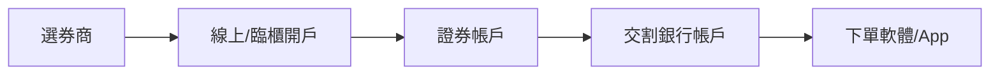

# 開戶與交易資格

## 本篇你會學到

- 台股開戶需要準備什麼
- 現股、當沖、融資融券資格差異

## 開戶基本流程

| 步驟 | 說明 |
|------|------|
| 選擇券商 | 比較手續費、APP、研究、當沖與信用資格 |
| 開立證券帳戶 | 本人身分證、第二證件、銀行帳戶 |
| 綁定交割戶 | 買賣款項透過銀行交割（見 [交易流程](trading-flow.md)） |
| 申請下單 | 網路下單、手機 APP |

## 常見交易資格

| 資格 | 說明 | 申請 |
|------|------|------|
| **現股買賣** | 開戶後基本功能 | 開戶即具備 |
| **現股當沖** | 當日沖銷 | 向券商申請，需符合規定與風險揭露 |
| **融資** | 向券商借錢買股票 | 信用交易帳戶 |
| **融券** | 向券商借券賣出 | 信用交易帳戶 |
| **零股** | 不足 1 張買賣 | 多數券商支援，規則見券商公告 |

## 新手常見問題

| 問題 | 說明 |
|------|------|
| 要多少錢才能開始？ | 1 張 = 股價 × 1,000；可先從流動性好的標的 1 張練習 |
| 當沖一定比較賺？ | 否；時間壓力大、成本占比高，見 [當沖風控案例](../07-cases/day-trade-risk.md) |
| 模擬交易？ | 部分券商或 Stock Bot 提供模擬環境（見 [工具對照](../appendix/stock-tool-map.md)） |

## 重點回顧

- 開戶後先熟悉下單與交割，再談策略。
- 當沖、融資融券需額外申請，槓桿伴隨風險。
- 下一步：[除權息入門](dividend.md) 或 [交易流程](trading-flow.md)。
