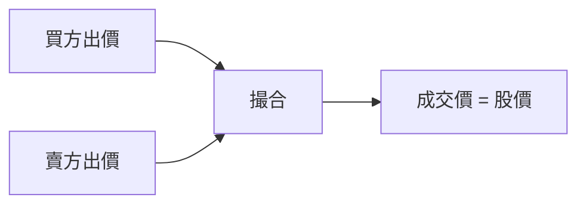

# 股價與市值

## 本篇你會學到

- 股價如何由買賣形成
- 市值、股本、流通股數
- 為什麼同產業兩家公司股價差很多

---

## 股價是怎麼決定的

股價 = **最新一筆成交價**（或盤中即時撮合價），由當下**買方與賣方**對「值多少錢」的共識決定。



| 影響因素（簡化） | 說明 |
|------------------|------|
| 公司獲利與展望 | 基本面預期 |
| 產業景氣 | [類股](../02-glossary/trading-terms.md#類股) |
| 資金多空 | [法人](../02-glossary/chips.md)、散戶情緒 |
| 總經與利率 | [宏觀](../05-analysis/fundamental-framework.md#宏觀層次) |

沒有「官方定價」——只有**市場成交**。

---

## 市值（Market Cap）

```
市值 = 股價 × 流通在外股數
```

| 用語 | 定義 |
|------|------|
| **總股本** | 公司發行在外的總股數 |
| **流通股** | 實際可在市場交易的股數（排除董監、庫藏股等） |
| **市值** | 市場給這家公司的總價格標籤 |

**小例子**：股價 100 元、流通股 10 億股 → 市值約 1,000 億元。

!!! tip "權值股"
    市值大、成交活躍的標的常稱**權值股**（如部分電子龍頭），對加權指數影響大。

---

## 股價高 ≠ 公司大、也≠ 比較貴

| 誤解 | 正確理解 |
|------|----------|
| 1000 元比 50 元貴 | 要看 [PER](../02-glossary/fundamentals.md#per本益比)、每股淨值 |
| 低價股比較划算 | 可能是小型股或獲利差，1 元也能很「貴」 |
| 股價高不能買 | 台股可買**零股**，見 [持倉術語](../02-glossary/position.md#零股) |

比較兩家公司常用 **PER、PBR、殖利率**，見 [估值表](../03-tables/valuation.md)。

---

## 開盤價、收盤價與昨收

| 價格 | 意義 |
|------|------|
| **昨收** | 前一交易日最後成交價，漲跌幅基準 |
| **開盤** | 今日第一筆成交價 |
| **收盤** | 今日最後一筆成交價 |

詳見 [行情術語](../02-glossary/quotes.md) · [報價畫面](quote-screen.md)。

---

## 量與價

| 現象 | 常見解讀 |
|------|----------|
| 價漲量增 | 參與度高，趨勢較有說服力 |
| 價漲量縮 | 動能可能不足，需警惕 |
| 價跌量增 | 賣壓大或換手 |

圖表見 [量價圖](../04-charts/volume-price.md)。

---

## 重點回顧

- 股價是**成交結果**，隨供需變動。
- **市值** = 股價 × 股數，用來衡量公司規模標籤。
- 貴便宜看**估值比率**，不是看股價絕對數字。
- 下一步：[報價畫面](quote-screen.md) · [圖表總覽](../04-charts/index.md)
