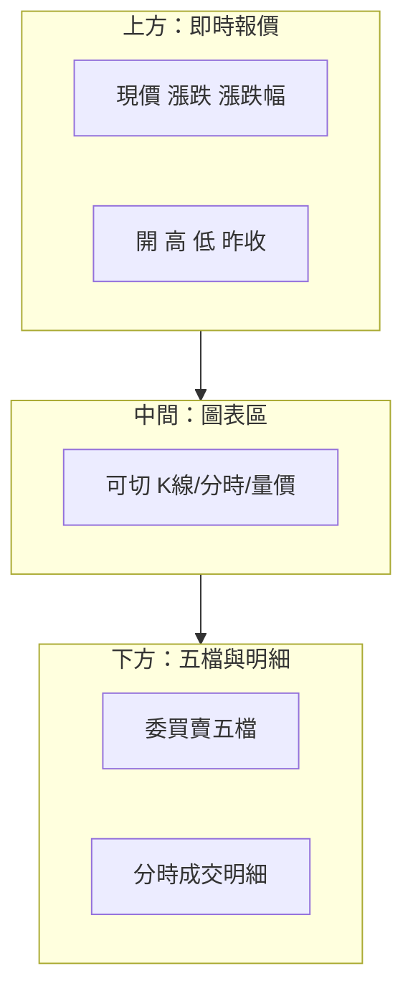
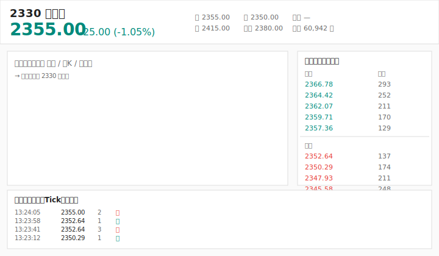
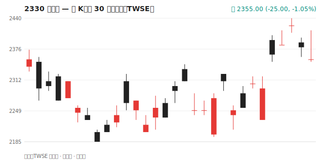
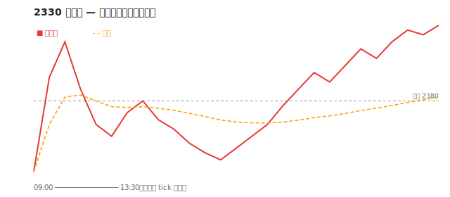
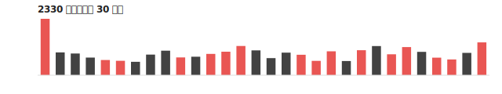
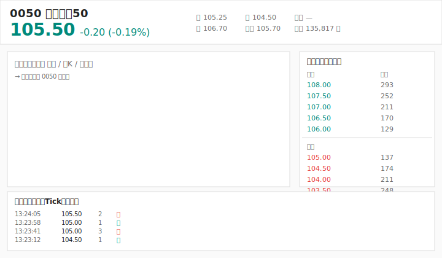
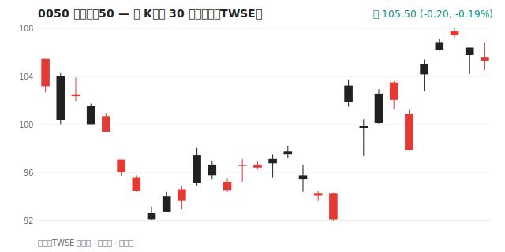
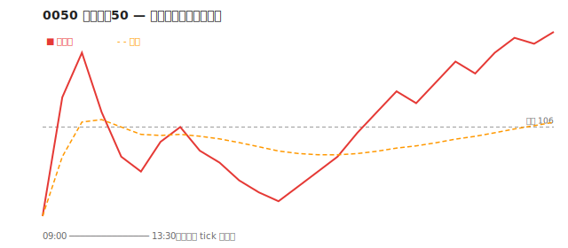
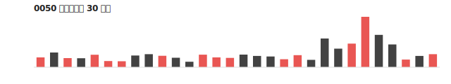

# 報價畫面怎麼看

## 本篇你會學到

- 看盤軟體常見欄位與區塊
- 五檔報價、內外盤、均價的意義
- 報價畫面與各類圖表的關係
- **2330、0050 實例圖**（對照下方圖表閱讀）

---

## 報價畫面典型布局

圖表種類總覽見 **[圖表總覽](../04-charts/index.md)**——K 線只是其中一類。

### 2330 台積電 — 報價畫面示意

下方為**教學用布局圖**：數字來自 TWSE 最近一個交易日收盤價，五檔與 Tick 為**示意**（非即時掛單）。

| 區塊 | 對應本文 |
|------|----------|
| 左上大字 | [上方數字列](#上方數字列) |
| 右側五檔 | [五檔報價](#五檔) |
| 中間圖表 | [切換圖表類型](#切換圖表類型) |
| 下方列表 | [分時成交明細](#分時成交明細tick) |

---

## 上方數字列 {#上方數字列}

| 欄位 | 意義 | 延伸 |
|------|------|------|
| **現價** | 最新成交價 | [開高低收](../02-glossary/quotes.md#開高低收) |
| **漲跌 / 漲跌幅** | 相對昨收 | 紅漲綠跌（台股慣例） |
| **單量** | 最近一筆成交量 | 單筆大小 |
| **總量** | 當日累計成交量 | [成交量](../02-glossary/quotes.md#成交量) |
| **均價** | 當日成交加權平均價 | 當沖常參考 |

---

## 五檔報價 {#五檔}

| 區塊 | 內容 |
|------|------|
| **委賣**（賣方） | 賣方掛單價格與張數，由低到高 |
| **委買**（買方） | 買方掛單價格與張數，由高到低 |
| **價差** | 最佳買價與最佳賣價的差距 |

| 觀察 | 意義（非絕對） |
|------|----------------|
| 委買堆積 | 下方有支撐意願 |
| 委賣堆積 | 上方有壓力 |
| 大單突然消失 | 可能撤單，勿過度解讀 |

**成交**才是真結果；五檔只是**尚未成交**的意願。

!!! tip "看圖對照"
    上圖右側綠字為委賣、紅字為委買；實際軟體配色因券商而異，但**賣低買高排列**邏輯相同。

---

## 內盤與外盤

| 用語 | 定義（常見軟體） |
|------|------------------|
| **外盤** | 以賣方叫價成交 → 主動買進較多 |
| **內盤** | 以買方叫價成交 → 主動賣出較多 |

當沖與短線會參考內外盤比例，但仍需搭配 [量價圖](../04-charts/volume-price.md)。

上圖 Tick 區的「外／內」即此概念（示意）。

---

## 分時成交明細（Tick） {#分時成交明細tick}

逐筆列出：時間、價格、張數、內外盤。

| 用途 | 模式 |
|------|------|
| 觀察大單進出 | [當沖](../08-investing/day-trade.md) |
| 確認突破真假 | [短線](../08-investing/swing-short.md) |

圖形化版本見 [分時與即時圖](../04-charts/intraday-charts.md)。

---

## 切換圖表類型 {#切換圖表類型}

同一檔股票，軟體通常可切：

| 按鈕常見名稱 | 圖表類型 | 專章 | 2330 範例圖 |
|--------------|----------|------|-------------|
| 分時 / 走勢 | 分時圖 | [分時圖](../04-charts/intraday-charts.md) | 見下 |
| K 線 / 蠟燭 | K 線圖 | [K 線基礎](../04-charts/kline-basics.md) | 見下 |
| 美國線 / 線圖 | 線圖 | [線圖](../04-charts/line-charts.md) | — |
| 成交量 | 量柱 | [量價圖](../04-charts/volume-price.md) | 見下 |

!!! tip "新手建議"
    先用**日 K** 看趨勢，再用**分時**看當日；不要只盯一種圖。

---

## 實例圖：2330 台積電（個股） {#實例圖2330-台積電個股}

資料來源：**TWSE 日行情**（近約 30 個交易日）。K 線紅漲黑跌；圖下方註明非即時。

### 日 K

對照：[K 線基礎](../04-charts/kline-basics.md) · 每根 K = 一日 [開高低收](../02-glossary/quotes.md#開高低收)

### 分時走勢（教學示意）

虛線 = **昨收**；橘虛線 = **均價**。此圖為典型走勢**示意**，非歷史 tick 重播。實盤請用券商即時分時。

### 成交量

紅柱 = 收 ≥ 開；黑柱 = 收 < 開。見 [量價圖](../04-charts/volume-price.md)。

---

## 實例圖：0050 元大台灣50（ETF） {#實例圖0050-元大台灣50etf}

ETF 報價欄位與個股相同（代號多為 4～6 碼、盤中像股票買賣）。用 0050 練習可觀察**大盤**節奏。

### 報價布局

### 日 K

延伸：[ETF 入門](etf-intro.md) · [0050 定期定額](../08-investing/etf-passive-dca.md)

### 分時示意

### 成交量

---

## 個股 vs ETF 報價差異

|  | 2330 類個股 | 0050 類 ETF |
|--|-------------|-------------|
| **代號** | 4 碼（如 2330） | 4～6 碼（如 0050、006208） |
| **報價欄位** | 相同 | 相同 |
| **五檔** | 有 | 有 |
| **解讀重點** | 單公司 + 產業 | 大盤 / 50 檔成分綜效 |
| **適合練習** | 看單檔量價 | 看大勢、對照加權指數 |

---

## 圖表如何更新

??? note "圖表來源（維護者）"
    本站範例圖由腳本從 [TWSE 日行情](../appendix/data-sources.md) 抓取後繪製，產圖指令與流程見 [架構說明](../ARCHITECTURE.md)。

---

## 5 分鐘練習

打開任一檔股票的報價畫面，依序找出並說出意義：

1. **上方數字列**：現價、漲跌幅、總量、均價各在哪？
2. **五檔**：最佳買價與最佳賣價差多少？哪邊掛單多？
3. **內外盤**：最近幾筆成交是外盤（主動買）還是內盤（主動賣）多？
4. **切換圖表**：把日 K 切成分時，再切成量柱，看同一檔的三種切面。

做完一次，你就能獨立讀懂任何個股的報價畫面。

## 自我檢查

??? question "1.（概念題）五檔報價代表已成交的價格嗎？"
    參考答案：不是。五檔是**尚未成交**的掛單意願；真正結果看「成交」與 [分時明細](#分時成交明細tick)。

??? question "2.（判斷題）成交多在外盤，代表什麼？"
    參考答案：以**賣方叫價成交**較多 → 主動買進力道較強（非絕對，仍需配合量價）。

??? question "3.（情境題）當沖想看當日平均成本線，該看哪個欄位？"
    參考答案：**均價**（當日成交加權平均價），常作為當沖多空參考。

## 重點回顧

- 報價畫面 = **數字 + 圖表 + 五檔 + 明細**；先用 **2330 示意圖** 對位置。
- 五檔是掛單意願，**成交**與 **Tick** 才是結果。
- **日 K** 看趨勢、**分時** 看當日、**量柱** 看參與度——同一檔股票可切換。
- **0050** 適合練大盤；**2330** 適合練個股。
- K 線是圖表**一大類**，不是全部 → [圖表總覽](../04-charts/index.md)。
