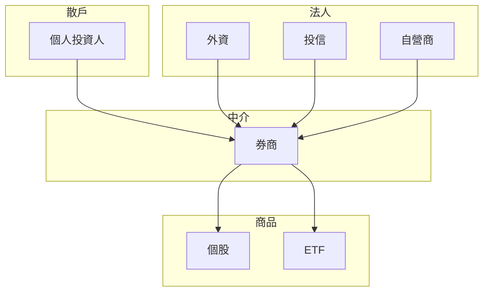

# 市場參與者

## 本篇你會學到

- 散戶、法人、券商各自的角色
- ETF 與個股的關係
- 為什麼要關注「三大法人」

## 參與者一覽

## 散戶

**定義**：一般個人投資人。

| 特徵 | 說明 |
|------|------|
| 資金規模 | 通常小於法人 |
| 資訊 | 依公開資訊、媒體、社群 |
| 優勢 | 船小好轉彎、無龐大部位出場壓力 |
| 劣勢 | 情緒易受影響、易追漲殺跌 |

## 三大法人

每日買賣超資料中常見的三類機構投資人：

| 類型 | 常見角色 | 解讀提示 |
|------|----------|----------|
| **外資** | 國際資金、被動 ETF 再平衡 | 對權值股影響大，留意匯率與國際股市 |
| **投信** | 國內基金 | 中小型股、題材股常見布局 |
| **自營商** | 券商自有部位 | 避險、套利與自營操作並存，需分「自行」與「避險」 |

詳見 [三大法人表](../03-tables/institutional.md) 與 [法人術語](../02-glossary/chips.md)。

## 券商

**功能**：開戶、下單、交割、融資融券、借券等服務。

散戶不直接連交易所，而是透過**證券商**下單。選擇券商時可比較：手續費、APP 體驗、研究報告、當沖與信用交易資格等。

## ETF

**定義**：交易所交易基金，像股票一樣在盤中買賣，但底層是一籃子股票或債券。

| 類型 | 範例概念 |
|------|----------|
| 被動型 | 追蹤指數（如台灣 50） |
| 主動型 | 經理人主動選股，持股會變動 |

ETF 適合分散風險入門；個股則需自行研究公司與產業。主動 ETF 持股變化可當「聰明錢」參考，但非保證獲利。

## 自我檢查

??? question "1.（概念題）散戶下單是連證交所還是透過誰？"
    參考答案：透過**證券商**，不直接連交易所。

??? question "2.（判斷題）法人單日大買超，可以不看連續性就追？"
    參考答案：不行。法人資料宜看**連續多日**趨勢，見 [法人表](../03-tables/institutional.md)。

??? question "3.（概念題）ETF 與「另一種散戶」的差別？"
    參考答案：ETF 是**交易所商品**（一籃子資產），不是市場參與者角色。

## 重點回顧

- 散戶、法人、券商、發行 ETF 的機構，共同構成市場生態。
- 三大法人買賣超是籌碼面重要指標，但要看**連續性**與**股價位置**。
- ETF 是商品，不是「另一種散戶」；理解其追蹤或選股邏輯才有幫助。

## 相關

- [三大法人表](../03-tables/institutional.md) · [法人與籌碼術語](../02-glossary/chips.md) · [ETF 入門](etf-intro.md)
