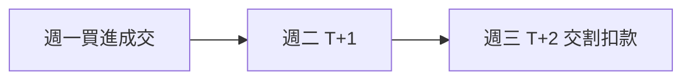

# 交割與稅費

## 本篇你會學到

- T+2 交割是什麼
- 手續費與證交稅怎麼扣
- 當沖與一般交易的稅差

---

## 成交 ≠ 立刻拿到錢或股票

| 階段 | 說明 |
|------|------|
| **成交** | 交易所撮合成功，帳上顯示庫存變動 |
| **交割** | 款項與股票實際交收（台股現股常見 **T+2**） |

**T+2**：成交日後第 2 個營業日完成交割（實際以券商與交易所規則為準）。

!!! note "賣股票"
    賣出後也是 T+2 左右入帳可提領（依券商「交割款」顯示）。

---

## 買進時錢怎麼扣

| 項目 | 說明 |
|------|------|
| 股款 | 成交價 × 股數 |
| **手續費** | 依券商折扣，有最低門檻 |
| **證交稅** | 賣出時課徵（買進時不課） |

因此買進當下主要扣**股款 + 手續費**；賣出時才扣證交稅。

詳細損益平衡見 [交易成本](../06-risk/trading-costs.md)。

---

## 證交稅與手續費（去哪查）

買進主要扣**股款 + 手續費**；**證交稅在賣出時**才課徵。個股、ETF、當沖稅率不同，損益平衡與期望值計算見 **[交易成本與期望值](../06-risk/trading-costs.md#費用結構)**（本站交易稅費表以此為準）。

各環節還有哪些稅費（含除權息、二代健保）、如何試算淨利與實領殖利率 → **[稅費總覽（供成本試算）](../appendix/taxes-for-costing.md)**。

| 延伸 | 章節 |
|------|------|
| ETF 內扣費、三層費用 | [ETF 費用與折溢價](etf-costs-and-premium.md) |
| 當沖資格與規則 | [市場概覽](market-overview.md#當沖當日沖銷) |

---

## 融資融券與交割

| 類型 | 額外注意 |
|------|----------|
| **融資** | 向券商借款，有利息與維持率 |
| **融券** | 借券賣出，須後續買回還券 |

見 [融資融券術語](../02-glossary/chips.md#融資融券)；操作與風控見 [信用交易實務](../06-risk/margin-trading.md)。

---

## 除權息與交割

除息日持有股票才享有股利；股利入帳時間與稅扣依公告。見 [除權息入門](dividend.md)。

---

## 重點回顧

- 台股現股常見 **T+2 交割**，規劃資金要留緩衝。
- 稅率與損益平衡見 [交易成本](../06-risk/trading-costs.md#費用結構)；頻繁交易成本高。
- 當沖須同時懂交割時點與 [當沖模式](../08-investing/day-trade.md)。
