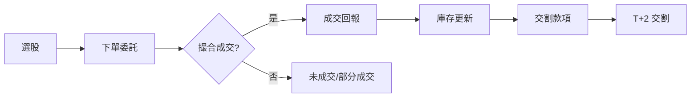

# 一筆交易怎麼完成

## 本篇你會學到

- 從下單到交割的完整流程
- 常見委託類型
- T+2 交割與當沖的關係

## 流程總覽

## 下單與撮合

1. **委託**：透過券商 APP 或下單軟體送出買賣指令。
2. **撮合**：交易所依價格優先、時間優先等規則配對買賣單。
3. **成交**：成交價、數量寫入你的帳戶，成為**庫存**或減少庫存。

### 常見委託類型

| 類型 | 說明 | 適用情境 |
|------|------|----------|
| **限價** | 指定價格，僅在該價或更優價格成交 | 想控制成本、不急著成交 |
| **市價** | 以當下最佳對手價成交 | 求快、流動性好的標的 |
| **IOC** | 立即成交否則取消 | 當沖、短線快速進出 |

## 張數與零股

| 單位 | 說明 |
|------|------|
| **1 張** | 1,000 股 |
| **零股** | 不足 1 張的買賣，盤中零股交易時段與規則請以券商公告為準 |

範例：股價 500 元，買 2 張需準備約 500 × 1,000 × 2 = **100 萬元**（不含手續費；融資融券另計）。

## 交割（T+2）

台股現股買賣，款項與股票通常在成交後 **第 2 個營業日** 完成交割（T+2）。

| 情境 | 說明 |
|------|------|
| 一般買進 | 成交日 T，T+2 扣款並入帳股票 |
| 一般賣出 | T+2 股票交出手續完成、款項入帳 |
| **當日沖銷** | 當日買賣相抵，不需實際持有過夜，但帳戶仍須有足夠交割能力 |

!!! warning "資金不足"
    若 T+2 無法完成交割，可能面臨違約處分。即使做當沖，也應維持足夠可動用資金。

## 成本構成

一筆完整交易需考慮：

| 項目 | 說明 |
|------|------|
| 手續費 | 買賣各收一次，依券商費率（常見約 0.1425% 打折後） |
| 證交稅 | 賣出時課徵；當沖與一般賣出稅率不同 |
| **淨利** | 價差扣掉上述成本後的實際損益（見 [損益術語](../02-glossary/pnl.md)） |

## 重點回顧

- 交易 = 委託 → 撮合 → 成交 → 庫存變動 → 交割。
- 1 張 = 1,000 股；計算資金時別忘了乘上股數。
- 當沖雖不留倉，仍須理解 T+2 與帳戶交割能力。
- 評估損益要用**淨利**，不是只看股價漲跌。
