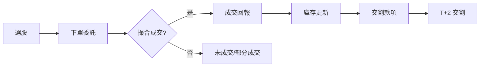

# 一筆交易怎麼完成

## 本篇你會學到

- 從下單到交割的完整流程
- 常見委託類型
- T+2 交割與當沖的關係

## 流程總覽

## 下單與撮合

1. **委託**：透過券商 APP 或下單軟體送出買賣指令。
2. **撮合**：交易所依價格優先、時間優先等規則配對買賣單。
3. **成交**：成交價、數量寫入你的帳戶，成為**庫存**或減少庫存。

### 常見委託類型

| 類型 | 說明 | 適用情境 |
|------|------|----------|
| **限價** | 指定價格，僅在該價或更優價格成交 | 想控制成本、不急著成交 |
| **市價** | 以當下最佳對手價成交 | 求快、流動性好的標的 |
| **IOC** | 立即成交否則取消 | 當沖、短線快速進出 |

## 張數與零股 {#零股}

| 單位 | 說明 |
|------|------|
| **1 張** | 1,000 股 |
| **零股** | 不足 1 張（1～999 股）的買賣 |

範例：股價 500 元，買 2 張需準備約 500 × 1,000 × 2 = **100 萬元**（不含手續費；融資融券另計）。

### 零股怎麼買（小資族重點）

高價股一張動輒數十萬，**零股**讓你用小錢參與。台股零股有兩個時段：

| 時段 | 大致時間 | 特性 |
|------|----------|------|
| **盤中零股** | 與普通盤同步（每隔數分鐘集合競價） | 較即時，流動性較盤後好 |
| **盤後零股** | 收盤後一段時間 | 一次集合競價成交 |

（實際時間與撮合頻率以**券商與交易所公告**為準。）

零股實務注意：

1. **流動性較差**：冷門股零股可能掛單少、買賣價差大，未必買得到理想價。
2. **手續費有低消**：多數券商每筆有最低手續費（如 1 元或 20 元），買太零碎會被低消吃掉成本。
3. **適合定期定額**：用零股分批買 0050 等 ETF，是小資長期投資的常見做法，見 [0050 與定期定額](../08-investing/etf-passive-dca.md)。

詞條定義見 [零股術語](../02-glossary/position.md#零股)。

## 交割（T+2）

台股現股買賣，款項與股票通常在成交後 **第 2 個營業日** 完成交割（T+2）。

| 情境 | 說明 |
|------|------|
| 一般買進 | 成交日 T，T+2 扣款並入帳股票 |
| 一般賣出 | T+2 股票交出手續完成、款項入帳 |
| **當日沖銷** | 當日買賣相抵，不需實際持有過夜，但帳戶仍須有足夠交割能力 |

!!! warning "資金不足"
    若 T+2 無法完成交割，可能面臨違約處分。即使做當沖，也應維持足夠可動用資金。

## 成本構成

一筆完整交易需考慮：

| 項目 | 說明 |
|------|------|
| 手續費 | 買賣各收一次，依券商費率（常見約 0.1425% 打折後） |
| 證交稅 | 賣出時課徵；當沖與一般賣出稅率不同 |
| **淨利** | 價差扣掉上述成本後的實際損益（見 [損益術語](../02-glossary/pnl.md)） |

## 自我檢查

??? question "1.（概念題）「1 張」是多少股？買 2 張 300 元的股票約需多少錢？"
    參考答案：1 張 = 1,000 股；2 張 × 300 × 1,000 = 約 60 萬元（未含手續費）。

??? question "2.（判斷題）零股流動性一定和整張一樣好，對嗎？"
    參考答案：不對。零股（尤其冷門股）掛單較少、買賣價差可能較大，且每筆常有最低手續費。

??? question "3.（情境題）你每月有 5,000 元想長期投資 0050，該用整張還是零股？"
    參考答案：整張 0050 數萬元，5,000 元適合用**零股／定期定額**分批買，見 [0050 與定期定額](../08-investing/etf-passive-dca.md)。

## 重點回顧

- 交易 = 委託 → 撮合 → 成交 → 庫存變動 → 交割。
- 1 張 = 1,000 股；計算資金時別忘了乘上股數。
- 零股讓小資族用小錢參與，但留意流動性與手續費低消。
- 當沖雖不留倉，仍須理解 T+2 與帳戶交割能力。
- 評估損益要用**淨利**，不是只看股價漲跌。
