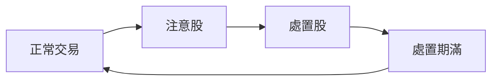

# 處置股、注意股與全額交割

## 本篇你會學到

- 注意股、處置股、全額交割各代表什麼
- 對下單、融資融券、流動性有什麼影響
- 實盤前該在哪裡查

[← 市場概覽](market-overview.md) · [交易流程](trading-flow.md)

!!! warning "免責聲明"
    處置與限制規則依**證交所／櫃買中心公告**隨時調整，以下為學員版整理。實際能否下單、能否融資，以券商 APP 與當日公告為準。

---

## 為什麼要認識這些標記

同一檔股票在「正常」與「處置中」時，你可能遇到：

- 下單方式改變（例如改為**分時撮合**、撮合間隔拉長）
- **無法融資融券**或僅能現股當沖
- 必須**全額交割**（不能信用交易）
- 流動性變差、買賣價差拉大

短線與當沖族若忽略標記，常出現「想買買不到、想賣賣不掉」。

---

## 一頁對照

| 標記 | 英文 gloss | 通常代表 | 對散戶的影響 |
|------|------------|----------|--------------|
| **注意股** | Attention stock | 股價或成交量異常，需提高警覺 | 資訊揭露增加；可能邁向處置 |
| **處置股** | Disposal / restricted stock | 進入處置措施，交易受限 | 撮合方式改變、可能禁融資券 |
| **全額交割** | Full cash settlement | 買進須全額付清，不得信用 | 不能融資買、不能先賣後買的信用模式 |
| **分時撮合** | Periodic matching | 非連續撮合，固定間隔才成交 | 滑價、追價難度上升 |

---

## 注意股

| 項目 | 說明 |
|------|------|
| **定義** | 因股價、成交量、週轉率等指標異常，被列為**注意**之標的 |
| **在哪裡看到** | 看盤軟體標記「注意股」、證交所／櫃買公告 |
| **常見誤解** | 注意股 = 必跌；可能是題材炒作，也可能是資訊不透明 |
| **小例子** | 連續漲停 + 成交量暴增 → 常先列注意，再視情況進入處置 |

**實務**：注意股本身未必不能交易，但應**提高風控**——縮小部位、拉寬停損、確認消息來源。

---

## 處置股

| 項目 | 說明 |
|------|------|
| **定義** | 異常持續或達一定標準後，交易所實施**處置措施** |
| **常見措施（教學用）** | ① **分時撮合**（如每 5 分鐘撮合一次，非逐筆連續） ② 限制**融資融券** ③ 當沖資格可能受影響 |
| **在哪裡看到** | 券商 APP 商品標記、交易所處置公告 |
| **常見誤解** | 處置期間仍可當一般股追價——實際可能**無法即時成交** |
| **小例子** | 熱門股進入處置 → 開盤想追漲停，但分時撮合下委託排隊更久 |

---

## 全額交割

| 項目 | 說明 |
|------|------|
| **定義** | 該標的買進時須**全額**支付價款，**不得**以融資等信用方式交割 |
| **與一般交割差別** | 一般現股仍可能搭配融資（若標的允許）；全額交割 = 信用管道關閉 |
| **在哪裡看到** | 商品基本資料、券商「全額交割」標記 |
| **常見誤解** | 只是提醒沒差別——實際會限制**槓桿與資金排程** |
| **小例子** | 想融資 200 萬買進 → 全額交割標的只能自備 200 萬 |

常與處置、注意、或特定類股（如部分新上市、問題公司）同時出現。詳情以公告為準。

---

## 實盤前檢查清單

下單前（尤其短線、融資、當沖）建議確認：

| # | 檢查項 | 去哪看 |
|---|--------|--------|
| 1 | 是否注意股／處置股 | 看盤軟體標記、交易所公告 |
| 2 | 是否全額交割 | 券商商品資訊 |
| 3 | 撮合方式 | 連續 vs 分時 |
| 4 | 能否融資／融券／當沖 | 券商信用交易資格頁 |
| 5 | 漲跌停與流動性 | [報價畫面](quote-screen.md)、五檔 |

---

## 與投資模式的關係

| 模式 | 建議 |
|------|------|
| [當沖](../08-investing/day-trade.md) | 處置、分時撮合時**風險極高**，宜避開或大幅減碼 |
| [隔日沖](../08-investing/overnight.md) | 注意隔日流動性與能否正常賣出 |
| [存股](../08-investing/dividend-investing.md) | 問題公司可能先上注意／處置，基本面需重評 |
| [融資](../06-risk/margin-trading.md) | 處置期常**禁止融資**，勿假設可槓桿 |

---

## 重點回顧

- **注意股** = 異常警訊；**處置股** = 交易規則改變；**全額交割** = 信用關閉。
- 短線最忌忽略標記——流動性與撮合方式會直接影響能否出場。
- 規則以**當日交易所／券商公告**為準，本頁僅供事前建立概念。

相關：[市場概覽](market-overview.md) · [信用交易實務](../06-risk/margin-trading.md) · [當沖風控案例](../07-cases/day-trade-risk.md)
