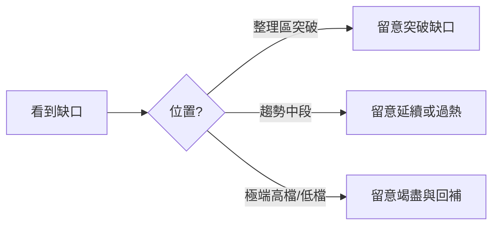

# 市場進階術語

## 本篇你會學到

- 跳空、缺口、軋空、填息等進階市場用語
- 每個詞在圖表與新聞裡怎麼辨識

!!! note "前置"
    建議先讀 [行情與報價](quotes.md) 與 [除權息入門](../01-basics/dividend.md)。

---

## 跳空（Gap） {#跳空}

| 項目 | 說明 |
|------|------|
| **英文** | Gap（opening gap） |
| **定義** | 今日開盤價與昨日收盤價之間**沒有成交**，K 線圖上出現「斷層」；開盤 > 昨收為向上跳空（常見於利多、財報優於預期、法人大買），開盤 < 昨收為向下跳空（常見於利空、法說展望轉弱） |
| **在哪裡看到** | 日 K 線圖、開盤價欄、盤中新聞標題「跳空開高」 |
| **常見誤解** | 跳空一定會繼續漲／跌；實務上可能**回補缺口**（價格回到缺口區間內成交） |
| **小例子** | 昨收 100、今開 108 且整日未回到 100 → 向上跳空 |

---

## 缺口（Price Gap） {#缺口}

| 項目 | 說明 |
|------|------|
| **英文** | Price gap |
| **定義** | 兩根 K 線（或連續價格區間）之間未成交的價格帶 |
| **在哪裡看到** | 週線、日線長期圖；[K 線基礎](../04-charts/kline-basics.md) 的連續 K 棒 |
| **常見誤解** | 所有缺口都會回補；實務上突破缺口未必短期回補 |
| **小例子** | 股價在 100～105 元橫盤三週，某日放量開在 108 元且整日未回到 105 以下 → 105～108 之間形成向上缺口 |

**缺口類型**：

| 類型 | 說明 |
|------|------|
| 突破缺口 | 趨勢突破整理區時出現，量常放大 → 有時代表新趨勢起點 |
| 逃逸缺口 | 趨勢中段加速，多頭或空頭力道強 |
| 竭盡缺口 | 趨勢末端、情緒極端時出現，有時預示反轉（需搭配量與位置） |

---

## 回補缺口（Gap Fill） {#回補缺口}

| 項目 | 說明 |
|------|------|
| **英文** | Gap fill |
| **定義** | 股價後續走勢**進入**先前缺口的價格區間 |
| **在哪裡看到** | 日線、週線缺口區；[突破與假突破案例](../07-cases/gap-breakout.md) |
| **常見誤解** | 回補一定看空／看多；可能是洗盤、假突破，或趨勢正常修正 |
| **小例子** | 以「突破缺口」進場，回補至缺口下緣常作為**停損參考**之一 |

---

## 軋空（Short Squeeze） {#軋空}

| 項目 | 說明 |
|------|------|
| **英文** | Short squeeze |
| **定義** | 空頭（常透過**融券**或借券）被迫買回平倉，推升股價的連鎖反應；典型條件：融券餘額高、籌碼集中、利多或法人大買觸發 |
| **在哪裡看到** | [融資融券表](../03-tables/margin.md)、新聞「融券回補」、鉅額買超 |
| **常見誤解** | 融券多就一定會軋空；還需看**借券成本、大戶是否願意續借、基本面是否支撐** |
| **小例子** | 融券餘額高 + 法人大買 → 空頭被迫回補 → 股價連鎖推升 |

!!! warning "風險"
    軋空行情波動劇烈，追高易在回檔時大幅虧損。相關案例：[軋空與融券](../07-cases/short-squeeze.md)。

---

## 填息（Dividend Gap Fill） {#填息}

| 項目 | 說明 |
|------|------|
| **英文** | Dividend gap fill（填權：Rights gap fill） |
| **定義** | 除息後股價從「調整後低點」回升，**收復**約當於所配現金股利的水準；填權則為除權（股票股利）後股價回升至除權前參考水準 |
| **在哪裡看到** | [除權息日程表](../03-tables/dividend-schedule.md)、個股日 K、殖利率欄 |
| **常見誤解** | 領息就穩賺；須考量稅負、過戶費與股價波動 |
| **小例子** | 填息率（教學概念）≈ 已回升幅度 ÷ 現金股利 × 100% |

**填息現象解讀**（非保證）：

| 現象 | 可能解讀 |
|------|----------|
| 快速填息 | 市場認同配息品質、籌碼穩定 |
| 長期未填息 | 景氣、獲利或產業疑慮；存股族需重估 |
| 除息前漲、除息後跌 | 常見「息落股價跌」；不等於公司變差 |

!!! warning "注意"
    參與除權息須考量**稅負、過戶費、股價波動**，並非「領息就穩賺」。詳見 [除權息參與案例](../07-cases/dividend-play.md)。

---

## 漲停鎖死 / 跌停鎖死（Limit Up / Down Lock） {#漲跌停鎖}

| 項目 | 說明 |
|------|------|
| **英文** | Limit up lock / Limit down lock |
| **定義** | 股價觸及 ±10%（或特殊標的不同幅度）後，委買或委賣堆積，難以成交 |
| **在哪裡看到** | 一字線 K 棒、五檔單邊掛滿 |
| **常見誤解** | 鎖死代表方向確定；隔日開盤常再跳空，仍有變數 |
| **小例子** | 漲停鎖死想買買不到、跌停鎖死想賣賣不掉 |

---

## 多頭 / 空頭市場（Bull / Bear Market） {#多頭空頭}

| 項目 | 說明 |
|------|------|
| **英文** | Bull market / Bear market |
| **定義** | 多頭市場（牛市）投資人普遍看好、做多者多，大盤明顯上漲；空頭市場（熊市）投資人普遍看淡、賣壓重，大盤明顯走低 |
| **在哪裡看到** | 新聞「牛市」「熊市」、大盤月線趨勢 |
| **常見誤解** | 多頭中每檔股都會漲；產業與個股分化仍常見 |
| **小例子** | 大盤月線連續走高、創新高 → 多頭格局 |

參考：[HiStock 名詞大彙集](../appendix/video-resources.md#histock-嗨投資-名詞大彙集)

---

## 資金行情（Liquidity-Driven Rally） {#資金行情}

| 項目 | 說明 |
|------|------|
| **英文** | Liquidity-driven rally |
| **定義** | 市場**資金充裕**（如低利率），稍有利多即吸引大量資金進場推升大盤；外資大幅流入也常助長此行情 |
| **在哪裡看到** | 低利率環境、外資連續買超、成交量放大 |
| **常見誤解** | 資金行情永遠不會結束；緊縮或風險偏好下降時，估值可能快速修正 |
| **小例子** | 低利 + 外資大買 → 大盤量增價漲 |

資金行情背後的利率與升降息機制，見 [總經與利率術語](macro.md)。

相關：[總經與利率](macro.md) · [基本面框架](../05-analysis/fundamental-framework.md#宏觀層次) · [跨市場](../05-analysis/cross-market.md)

---

## 盤堅 / 盤軟（Grinding Up / Down） {#盤堅盤軟}

| 項目 | 說明 |
|------|------|
| **英文** | Grinding up / Grinding down |
| **定義** | 盤堅：股價穩定、緩步向上；盤軟：股價緩步走弱、缺乏支撐 |
| **在哪裡看到** | 個股日 K 緩斜走勢 |
| **常見誤解** | 與大盤多頭空頭混用；盤堅／盤軟多用於**個股**，屬不同層次 |
| **小例子** | 個股每日小漲、週線緩升 → 盤堅 |

---

## 打底（Bottoming） {#打底}

| 項目 | 說明 |
|------|------|
| **英文** | Bottoming |
| **定義** | 股價在底部區間反覆震盪——反彈時有套牢與獲利了結賣壓，再跌時又有買盤承接；多次來回後，籌碼趨穩、價格逐步墊高 |
| **在哪裡看到** | 日線、週線底部區間箱型 |
| **常見誤解** | 打底一定成功；若基本面惡化，可能變成「盤跌」而非打底 |
| **小例子** | 低檔反覆震盪數月後低點墊高 → 打底有成 |

---

## 破底（Breakdown to New Low） {#破底}

| 項目 | 說明 |
|------|------|
| **英文** | Breakdown to new low |
| **定義** | 股價跌破先前重要的**支撐低點**（前低），空方力道大於多方 |
| **在哪裡看到** | 日線跌破前低、支撐線 |
| **常見誤解** | 破底一定續跌；亦可能假跌破後反彈，需搭配量能確認 |
| **小例子** | 跌破半年來最低點且放量 → 破底 |

相關：[支撐與壓力](technical.md#支撐--壓力) · [前低](quotes.md#前高前低)

---

## 主力、坐轎、抬轎（Big Player） {#主力抬轎}

| 項目 | 說明 |
|------|------|
| **英文** | Big player（market mover）；抬轎／坐轎：riding the move |
| **定義** | 主力：資金規模足以影響個股股價的投資人（常見法人、大戶）；坐轎：主力低檔佈局後享受上漲；抬轎：散戶追高推升股價，實質利於先佈局者 |
| **在哪裡看到** | 分點進出、籌碼集中度、量價異常 |
| **常見誤解** | 有主力就一定會漲；主力亦可能出貨 |
| **小例子** | 大戶低檔買進 → 散戶追高抬轎 → 主力坐轎獲利 |

---

## 利多 / 利空出盡（Buy the Rumor, Sell the News） {#利多利空出盡}

| 項目 | 說明 |
|------|------|
| **英文** | Buy the rumor, sell the news |
| **定義** | 利多或利空消息在市場上流傳已久，股價已提前反應；**正式公布當下**反而不漲或反向走勢 |
| **在哪裡看到** | 重大消息公布日的反向走勢 |
| **常見誤解** | 出利多就該追；消息落地時常已反映完畢 |
| **小例子** | 財報利多公布當天反而下跌 → 利多出盡 |

**教學連結**：[好公司 ≠ 好股票](../05-analysis/fundamental-framework.md#好公司好股票)

---

## 洗盤（Shakeout） {#洗盤}

| 項目 | 說明 |
|------|------|
| **英文** | Shakeout |
| **定義** | 主力在拉抬過程中，故意製造震盪或短期下跌，使信心不足者賣出；主力再於相對低點回補籌碼 |
| **在哪裡看到** | 上漲趨勢中的急殺後迅速拉回 |
| **常見誤解** | 把所有下跌都當洗盤；洗盤帶有**刻意震出散戶**意圖，與正常回檔難以 100% 辨識 |
| **小例子** | 上升趨勢中單日急殺隔日收復 → 疑似洗盤 |

---

## 量價背離（Price-Volume Divergence） {#量價背離}

| 項目 | 說明 |
|------|------|
| **英文** | Price-volume divergence |
| **定義** | 價格創新高（或新低），但**成交量未同步放大**（或萎縮） |
| **在哪裡看到** | [技術面術語](technical.md)、[MACD 背離案例](../07-cases/macd-divergence.md) |
| **常見誤解** | 背離立刻反轉；僅為警訊，需其他指標確認 |
| **小例子** | 上漲但量縮 → 動能可能減弱 |

---

## 重點回顧

- **跳空**是開盤與昨收的斷層；**缺口**是圖上未成交的價格帶，兩者常一起出現。
- **多頭／空頭**看大盤；**盤堅／盤軟**看個股；**打底／破底**看底部結構。
- **軋空**與融券、籌碼結構有關；**洗盤**與**利多出盡**需搭配價格位置判斷。
- **填息**是除權息後的價格修復現象，須搭配基本面與稅費評估。
- 影片對照：[影片資源索引](../appendix/video-resources.md)
