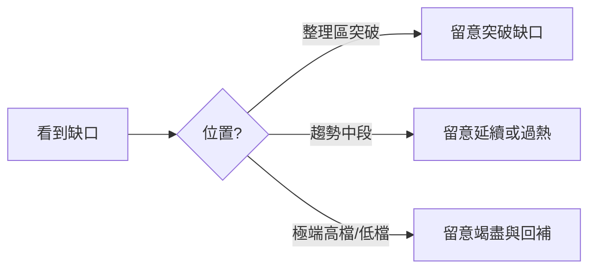

# 市場進階術語

## 本篇你會學到

- 跳空、缺口、軋空、填息等進階市場用語
- 每個詞在圖表與新聞裡怎麼辨識

!!! note "前置"
    建議先讀 [行情與報價](quotes.md) 與 [除權息入門](../01-basics/dividend.md)。

---

## 跳空 {#跳空}

| 項目 | 說明 |
|------|------|
| **定義** | 今日開盤價與昨日收盤價之間**沒有成交**，K 線圖上出現「斷層」 |
| **向上跳空** | 開盤 > 昨收，常見於利多、財報優於預期、法人大買 |
| **向下跳空** | 開盤 < 昨收，常見於利空、法說展望轉弱 |
| **在哪裡看到** | 日 K 線圖、開盤價欄、盤中新聞標題「跳空開高」 |

**常見誤解**：跳空一定會繼續漲／跌。實務上可能**回補缺口**（價格回到缺口區間內成交）。

---

## 缺口 {#缺口}

| 項目 | 說明 |
|------|------|
| **定義** | 兩根 K 線（或連續價格區間）之間未成交的價格帶 |
| **突破缺口** | 趨勢突破整理區時出現，量常放大 → 有時代表新趨勢起點 |
| **逃逸缺口** | 趨勢中段加速，多頭或空頭力道強 |
| **竭盡缺口** | 趨勢末端、情緒極端時出現，有時預示反轉（需搭配量與位置） |
| **在哪裡看到** | 週線、日線長期圖；[K 線基礎](../04-charts/kline-basics.md) 的連續 K 棒 |

**小例子**：股價在 100～105 元橫盤三週，某日放量開在 108 元且整日未回到 105 以下 → 105～108 之間形成向上缺口。

---

## 回補缺口 {#回補缺口}

| 項目 | 說明 |
|------|------|
| **定義** | 股價後續走勢**進入**先前缺口的價格區間 |
| **意義** | 不一定看空／看多；可能是洗盤、假突破，或趨勢正常修正 |
| **交易啟示** | 若以「突破缺口」進場，回補至缺口下緣常作為**停損參考**之一 |

相關案例：[突破與假突破](../07-cases/gap-breakout.md)。

---

## 軋空 {#軋空}

| 項目 | 說明 |
|------|------|
| **定義** | 空頭（常透過**融券**或借券）被迫買回平倉，推升股價的連鎖反應 |
| **典型條件** | 融券餘額高、籌碼集中、利多或法人大買觸發 |
| **在哪裡看到** | [融資融券表](../03-tables/margin.md)、新聞「融券回補」、鉅額買超 |
| **風險** | 軋空行情波動劇烈，追高易在回檔時大幅虧損 |

**常見誤解**：融券多就一定會軋空。還需看**借券成本、大戶是否願意續借、基本面是否支撐**。

相關案例：[軋空與融券](../07-cases/short-squeeze.md)。

---

## 填息 {#填息}

| 項目 | 說明 |
|------|------|
| **定義** | 除息後股價從「調整後低點」回升，**收復**約當於所配現金股利的水準 |
| **填息率** | 簡化：已回升幅度 ÷ 現金股利 × 100%（教學用概念，非官方指標） |
| **填權** | 除權（股票股利）後股價回升至除權前參考水準 |
| **在哪裡看到** | [除權息日程表](../03-tables/dividend-schedule.md)、個股日 K、殖利率欄 |

| 現象 | 可能解讀（非保證） |
|------|-------------------|
| 快速填息 | 市場認同配息品質、籌碼穩定 |
| 長期未填息 | 景氣、獲利或產業疑慮；存股族需重估 |
| 除息前漲、除息後跌 | 常見「息落股價跌」；不等於公司變差 |

!!! warning "注意"
    參與除權息須考量**稅負、過戶費、股價波動**，並非「領息就穩賺」。詳見 [除權息參與案例](../07-cases/dividend-play.md)。

---

## 漲停鎖死 / 跌停鎖死 {#漲跌停鎖}

| 項目 | 說明 |
|------|------|
| **定義** | 股價觸及 ±10%（或特殊標的不同幅度）後，委買或委賣堆積，難以成交 |
| **意義** | 極端供需；隔日開盤常再跳空 |
| **風險** | 想賣賣不掉（跌停）、想買買不到（漲停） |

---

## 多頭 / 空頭市場 {#多頭空頭}

| 用語 | 定義 |
|------|------|
| **多頭市場（牛市）** | 投資人普遍看好，做多者較多，大盤呈現明顯上漲趨勢 |
| **空頭市場（熊市）** | 投資人普遍看淡，賣壓較重，大盤指數明顯走低 |

**在哪裡看到**：新聞「牛市」「熊市」、大盤月線趨勢。

**常見誤解**：多頭中每檔股都會漲。產業與個股分化仍常見。

參考：[HiStock 名詞大彙集](../appendix/video-resources.md#histock-嗨投資-名詞大彙集)

---

## 資金行情 {#資金行情}

**定義**：市場**資金充裕**（如低利率），稍有利多即吸引大量資金進場，推升大盤；外資大幅流入也常助長此行情。

**常見誤解**：資金行情永遠不會結束。緊縮或風險偏好下降時，估值可能快速修正。

相關：[基本面框架](../05-analysis/fundamental-framework.md#宏觀層次) · [跨市場](../05-analysis/cross-market.md)

---

## 盤堅 / 盤軟 {#盤堅盤軟}

| 用語 | 定義 |
|------|------|
| **盤堅** | 個股股價穩定、緩步向上 |
| **盤軟** | 個股股價緩步走弱、缺乏支撐 |

多用於**個股**描述，與大盤多頭空頭不同層次。

---

## 打底 {#打底}

**定義**：股價在底部區間反覆震盪——反彈時有套牢與獲利了結賣壓，再跌時又有買盤承接；多次來回後，籌碼趨穩、價格逐步墊高。

**常見誤解**：打底一定成功。若基本面惡化，可能變成「盤跌」而非打底。

---

## 破底 {#破底}

**定義**：股價跌破先前重要的**支撐低點**（前低），空方力道大於多方。

相關：[支撐與壓力](technical.md#支撐--壓力) · [前低](quotes.md#前高前低)

---

## 主力、坐轎、抬轎 {#主力抬轎}

| 用語 | 定義 |
|------|------|
| **主力** | 資金規模足以影響個股股價的投資人（常見於法人、大戶） |
| **坐轎** | 主力在低檔佈局後，享受股價上漲成果 |
| **抬轎** | 散戶在消息刺激下追高，推升股價，實質利於先佈局者 |

**常見誤解**：有主力就一定會漲。主力亦可能出貨。

---

## 利多 / 利空出盡 {#利多利空出盡}

**定義**：利多或利空消息在市場上流傳已久，股價已提前反應；**正式公布當下**反而不漲或反向走勢。

**教學連結**：[好公司 ≠ 好股票](../05-analysis/fundamental-framework.md#好公司好股票)

---

## 洗盤 {#洗盤}

**定義**：主力在拉抬過程中，故意製造震盪或短期下跌，使信心不足者賣出；主力再於相對低點回補籌碼。

**與回檔的差異**：回檔是趨勢中正常修正；洗盤帶有**刻意震出散戶**意圖（實務上難以 100% 辨識）。

---

## 量價背離（入門） {#量價背離}

| 項目 | 說明 |
|------|------|
| **定義** | 價格創新高（或新低），但**成交量未同步放大**（或萎縮） |
| **常見用法** | 上漲但量縮 → 動能可能減弱，需其他指標確認 |
| **詳見** | [技術面術語](technical.md)、[MACD 背離案例](../07-cases/macd-divergence.md) |

---

## 重點回顧

- **跳空**是開盤與昨收的斷層；**缺口**是圖上未成交的價格帶，兩者常一起出現。
- **多頭／空頭**看大盤；**盤堅／盤軟**看個股；**打底／破底**看底部結構。
- **軋空**與融券、籌碼結構有關；**洗盤**與**利多出盡**需搭配價格位置判斷。
- **填息**是除權息後的價格修復現象，須搭配基本面與稅費評估。
- 影片對照：[影片資源索引](../appendix/video-resources.md)
