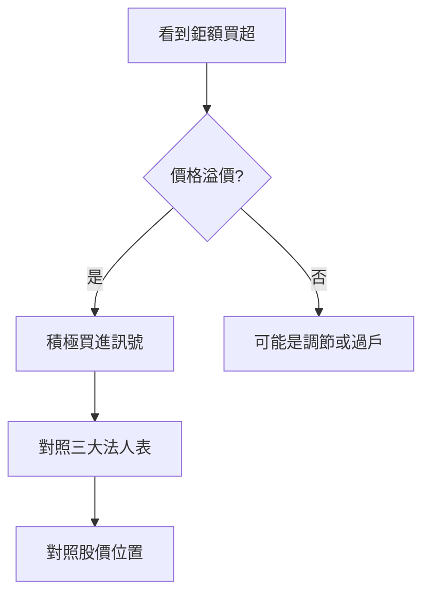

# 鉅額交易表怎麼看

## 本篇你會學到

- 鉅額交易是什麼
- 日程表欄位與籌碼意義

## 什麼是鉅額交易

**鉅額交易**（Block Trade）是單筆數量或金額達到一定門檻的成交，常見於法人或大戶透過特定機制買賣，避免在一般市場造成過大衝擊。

| 特點 | 說明 |
|------|------|
| 與一般盤中撮合 | 分開統計，但反映大戶意圖 |
| 公布時間 | 盤後或次日可查（依資料源） |
| 用途 | 輔助判斷是否有大單進出 |

## 示意表

| 日期 | 代號 | 買賣 | 成交價 | 張數 | 金額(百萬) | 相對昨收% |
|------|:----:|:----:|-------:|-----:|-----------:|----------:|
| D0 | 2330 | 買 | 848 | 500 | 424 | +0.2 |
| D0 | 3711 | 賣 | 178 | 200 | 178 | -1.5 |
| D-1 | 2454 | 買 | 920 | 150 | 138 | 平盤 |

## 欄位解讀

| 欄位 | 意義 |
|------|------|
| **買 / 賣** | 鉅額買進或賣出 |
| **成交價** | 該筆鉅額成交價格 |
| **張數** | 規模大小 |
| **金額** | 張數 × 價格 × 1000，衡量影響力 |
| **相對昨收%** | 溢價買（正）或折價賣（負）的參考 |

## 怎麼讀

| 情境 | 簡化解讀 |
|------|----------|
| 鉅額買 + 溢價 | 大戶願意較高價買進 |
| 鉅額賣 + 折價 | 大戶願意較低價賣出 |
| 單日一筆特大 | 可能是 ETF 再平衡、調整，非趨勢定論 |
| 連續多日同向 | 較單日更有參考價值 |

## 與三大法人的差異

| 項目 | 三大法人 | 鉅額交易 |
|------|----------|----------|
| 統計對象 | 外資/投信/自營商分類 | 單筆大額成交 |
| 常見用途 | 籌碼趨勢 | 大單事件 |
| 搭配 | 兩者一起看較完整 |

詳見 [三大法人表](institutional.md) 與 [籌碼圖表](../04-charts/chips-charts.md)。

## 常見誤區

- **單筆鉅額買就追**：可能是過戶或特定結構，非看多。
- **忽略股價位置**：高檔鉅額買可能是短線過熱。
- **與一般成交量混淆**：鉅額是子集，要看整體量價。

## 重點回顧

- 鉅額表記錄「大單事件」，要連續性與價格位置一起看。
- 搭配法人、融資與 K 線，勿單獨下結論。

相關：[法人術語](../02-glossary/chips.md#三大法人)
