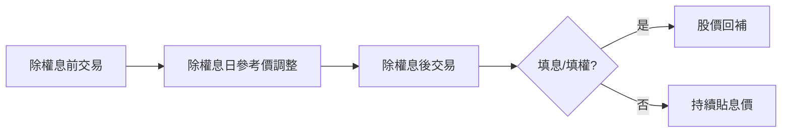

# 除權息日程表怎麼看

## 本篇你會學到

- 除權息日程表常見欄位
- 參與配息與股價調整的關係

建議先讀 [除權息入門](../01-basics/dividend.md)。

## 示意表

| 代號 | 名稱 | 除權息日 | 類型 | 現金(元) | 股票(元) | 最後過戶日 | 殖利率% |
|:----:|------|----------|------|--------:|--------:|------------|--------:|
| 2330 | 台積電 | 2025/03/18 | 除息 | 11.0 | — | 2025/03/14 | 1.8 |
| 2454 | 聯發科 | 2025/06/20 | 除息 | 55.0 | — | 2025/06/16 | 2.5 |
| 2881 | 富邦金 | 2025/07/15 | 除權息 | 3.0 | 0.5 | 2025/07/11 | 4.2 |

!!! note "說明"
    教學示意，非即時公告。請以 [公開資訊觀測站](https://mops.twse.com.tw) 或券商為準。

## 欄位解讀

| 欄位 | 意義 | 怎麼用 |
|------|------|--------|
| **除權息日** | 權利剛性切分日 | 這天起買進不享有本次股利 |
| **類型** | 除息 / 除權 / 除權息 | 現金、股票或兩者皆有 |
| **現金股利** | 每股配發現金 | 算殖利率分子 |
| **股票股利** | 每股配發股票（元為面額概念） | 影響除權參考價 |
| **最後過戶日** | 須完成過戶才能領息 | 買進截止日通常在此前 |
| **殖利率** | 股利 / 股價 | 見 [估值表](valuation.md) |

## 在哪裡看到

| 來源 | 路徑 |
|------|------|
| 公開資訊觀測站（MOPS） | 股利分派、除權息預告 |
| 券商看盤軟體 | 個股「除權息」分頁、行事曆 |
| 財經網站 | 除權息行事曆、殖利率排行 |

資料源細節見 [資料來源](../appendix/data-sources.md)。日程以**交易所與公司公告**為準。

## 手算一例 {#手算一例}

以示意表 **2330** 反推除息前參考殖利率（現金股利 ÷ 股價）：

```
殖利率% = 現金股利 ÷ 股價 × 100
股價 ≈ 現金股利 ÷ 殖利率% = 11.0 ÷ 1.8% ≈ 611 元
```

解讀：表中殖利率 1.8% 隱含除息前股價約 611 元；除息日開盤約調降 11 元屬**技術性調整**，不代表公司變差。完整公式見 [估值表](valuation.md)。

## 除權息日前後股價



| 現象 | 解讀 |
|------|------|
| 除息後開盤跳空下跌 | 常為**調整**而非利空（約減去現金股利） |
| 快速填息 | 市場認為股利有吸引力或法人護盤 |
| 長期未填息 | 可能反映獲利或前景疑慮 |

## 閱讀步驟

1. **確認類型**：純除息、純除權或兩者。
2. **算調整**：除息約減現金股利；除權依公式調整（以交易所公告為準）。
3. **看時程**：最後過戶日與你的買進日。
4. **交叉驗證**：高殖利率是否 [估值陷阱](../07-cases/valuation-trap.md)？

## 常見誤區

| 誤區 | 說明 |
|------|------|
| 除息前最後一天買就賺股利 | 股價通常已反映，且須過戶 |
| 殖利率排行直接買 | 忽略營收與股價趨勢 |
| 把除息跳空當利空 | 多為技術性調整 |

## 讀完請做

走一遍 [除權息參與與填息案例](../07-cases/dividend-play.md)：把「確認類型 → 算調整 → 看時程 → 查填息」流程套到一檔實際除息股上。

## 重點回顧

- 除權息是權利分配，股價會相應調整。
- 日程表回答「何時、配多少」，不回答「配後會不會漲」。
- 相關：[除權息入門](../01-basics/dividend.md) · [基本面術語](../02-glossary/fundamentals.md#殖利率)
