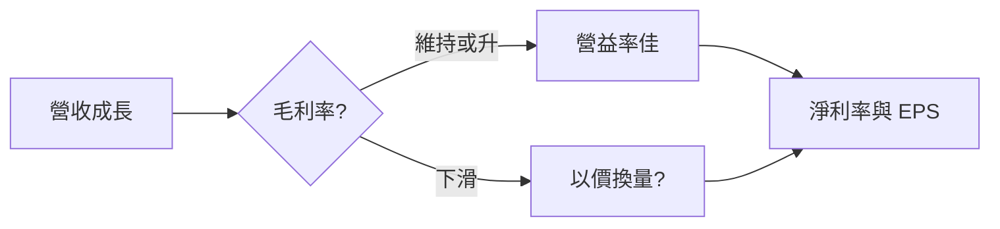
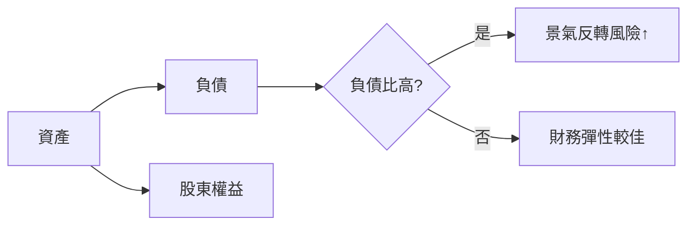

# 財報摘要表怎麼看

## 本篇你會學到

- 季報常見欄位：EPS、三率
- 資產負債表與現金流量表的重點欄位
- 存股族如何用現金流判斷配息是否可持續
- 單季 vs 累計的讀法

## 示意表（單季）

| 季度 | 營收 | 毛利率% | 營益率% | 淨利率% | EPS |
|------|-----:|--------:|--------:|--------:|----:|
| 2024 Q4 | 5,000 | 45.2 | 38.0 | 35.1 | 12.5 |
| 2025 Q1 | 4,800 | 44.0 | 36.5 | 33.8 | 11.2 |
| 2025 Q2 | 5,200 | 46.1 | 39.2 | 36.0 | 13.0 |

## 欄位解讀

| 欄位 | 意義 |
|------|------|
| **營收** | 當季營業收入 |
| **毛利率** | (營收 - 營業成本) / 營收 |
| **營益率** | 營業利益 / 營收 |
| **淨利率** | 淨利 / 營收 |
| **EPS** | 當季每股盈餘 |
| **ROE** | 淨利 / 股東權益，用股東的錢賺錢的效率 → [ROE 術語](../02-glossary/fundamentals.md#roe股東權益報酬率) |

## 在哪裡看到

| 來源 | 路徑 |
|------|------|
| 公開資訊觀測站（MOPS） | 財務報表（損益表、資產負債表、現金流量表） |
| 券商看盤軟體 | 個股「財務／財報」分頁 |
| 財經網站 | 季度財報摘要、三率與 ROE 走勢 |

季報依法定時限公布。資料源細節見 [資料來源](../appendix/data-sources.md)。

## 三率連動



- **毛利率升 + 營收升**：產品力或結構佳。
- **營收升但毛利率降**：競爭或成本壓力。
- **營益率遠低於毛利率**：費用控管問題。

## 單季 vs 累計

| 類型 | 用途 |
|------|------|
| 單季 | 看最新動能、季節性 |
| 累計（YTD） | 看年度進度 |
| 同比（YoY） | 同季比較，排除季節 |

## 與月營收的關係

- **月營收**：較快、較粗略。
- **季報**：含成本與費用，看真實獲利。

月營收轉弱若持續 2–3 月，下一季 EPS 可能下修。

---

## 資產負債表：體質與槓桿 {#資產負債表}

損益表回答「賺不賺」；**資產負債表**回答「家底厚不厚、債多不多」。

| 欄位 | 意義 | 怎麼讀（入門） |
|------|------|----------------|
| **現金及約當現金** | 可動用現金 | 景氣差時的緩衝；不宜單看絕對值，要看占資產比例 |
| **總負債 / 總資產** | 負債比（Debt ratio） | 越高代表槓桿越大；景氣循環、重資產產業常較高 |
| **流動資產 / 流動負債** | 流動比（Current ratio） | 短期償債能力；&lt; 1 需留意短期資金壓力 |
| **股東權益** | 淨資產 | 與 [PBR](../02-glossary/fundamentals.md#pbr股價淨值比) 的每股淨值相關 |



| 情境 | 可能意義 |
|------|----------|
| EPS 創高但負債比升 | 靠舉債擴張？需看投資計畫與現金流 |
| 殖利率高 + 負債比高 | 配息可能來自舉債，非本業現金 |
| 現金充裕 + 低負債 | 抗跌與配息能力通常較穩（仍要看本業獲利） |

---

## 現金流量表：錢真的進來了嗎 {#現金流量表}

EPS 來自**應計制**損益；**現金流量表**看實際現金進出。口訣：**獲利看損益，體質看現金流**。

| 類別 | 英文 | 白話 |
|------|------|------|
| **營運現金流** | Operating cash flow (OCF) | 本業日常經營流入／流出 |
| **投資現金流** | Investing cash flow | 買設備、併購、處分資產等 |
| **籌資現金流** | Financing cash flow | 借還款、增減資、配息等 |

| 欄位／概念 | 意義 |
|------------|------|
| **營運現金流 &gt; 0 且 ≥ 淨利** | 獲利品質較佳（獲利有現金支撐） |
| **營運現金流長期為負** | 本業可能「賺帳面、缺現金」，需查原因 |
| **自由現金流（FCF）** | 營運現金流 − 必要資本支出；可視為「扣掉維運後剩多少現金」 |

---

## 配息永續性：存股族快查 {#配息永續性}

[存股](../08-investing/dividend-investing.md) 不只看 [殖利率](../02-glossary/fundamentals.md#殖利率)，還要看**現金從哪來**。

| 檢查項 | 較健康的訊號 | 需提高警覺 |
|--------|--------------|------------|
| 營運現金流 vs 現金股利 | OCF 長期 ≥ 配息總額 | 靠賣資產、舉債配息 |
| 三率趨勢 | 毛利率、營益率穩定或升 | 獲利結構惡化仍高配 |
| 負債比 | 同業合理、未急升 | 槓桿升 + 高配息 |
| 一次性項目 | EPS 來自本業 | 處分利益、匯兌一次性拉高 EPS |

**小例子（概念）**：

- 公司 A：EPS 5 元、配 3 元、營運現金流每股 6 元 → 配息有本業現金支撐
- 公司 B：EPS 4 元、配 4 元、營運現金流每股 1 元、負債比升 → 宜查是否「借錢配息」

交叉驗證：[除權息日程表](dividend-schedule.md) · [估值表](valuation.md) · [除權息入門](../01-basics/dividend.md)

## 手算一例 {#手算一例}

以示意表 **2025 Q2** 驗證淨利率（淨利 ÷ 營收）：

```
淨利 ≈ 營收 × 淨利率% = 5,200 × 36.0% ≈ 1,872（百萬）
```

解讀：當季每 100 元營收約留下 36 元淨利；若下季營收升但淨利率下滑，代表成本或費用吃掉成長。公式對照 [公式速查](../appendix/formulas.md)。

## 常見誤區

| 誤區 | 正確做法 |
|------|----------|
| EPS 成長就等於公司變強 | 對照營運現金流；應收墊高、存貨積壓時 EPS 可能虛胖 |
| 只看單季 EPS 新高 | 查是否有一次性收益、匯兌或處分利益 |
| 負債比低就一定安全 | 同業結構不同；要看趨勢與資金用途 |
| 高配息 + 高負債比 | 宜查配息是否靠舉債，見上方配息永續性快查 |

## 閱讀步驟

1. **看損益**：三率與 EPS 的趨勢（賺多少、結構好不好）。
2. **看現金流**：營運現金流是否跟得上淨利（賺到的是不是現金）。
3. **看體質**：負債比、ROE 是否健康，ROE 高是否靠高負債撐。
4. **交叉月營收**：季報落後，月營收先行，見 [月營收表](revenue.md)。

## 讀完請做

走一遍 [月營收轉折案例](../07-cases/revenue-turn.md)：把月營收與季財報三率串起來，判斷一檔公司是否真的由弱轉強。

## 重點回顧

- 三率拆解「賺多少」的結構；**現金流**拆解「錢是不是真的進來」。
- EPS 要搭配股本變化、一次性項目與**營運現金流**。
- 存股看配息：OCF、負債比、三率一起讀，勿只看殖利率。
- 與 [月營收表](revenue.md)、[估值表](valuation.md) 交叉驗證。

相關：[三率術語](../02-glossary/fundamentals.md#三率) · [營運現金流](../02-glossary/fundamentals.md#營運現金流)
