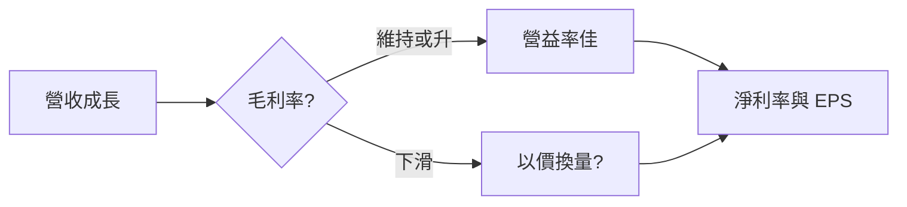

# 財報摘要表怎麼看

## 本篇你會學到

- 季報常見欄位：EPS、三率
- 單季 vs 累計的讀法

## 示意表（單季）

| 季度 | 營收 | 毛利率% | 營益率% | 淨利率% | EPS |
|------|-----:|--------:|--------:|--------:|----:|
| 2024 Q4 | 5,000 | 45.2 | 38.0 | 35.1 | 12.5 |
| 2025 Q1 | 4,800 | 44.0 | 36.5 | 33.8 | 11.2 |
| 2025 Q2 | 5,200 | 46.1 | 39.2 | 36.0 | 13.0 |

## 欄位解讀

| 欄位 | 意義 |
|------|------|
| **營收** | 當季營業收入 |
| **毛利率** | (營收 - 營業成本) / 營收 |
| **營益率** | 營業利益 / 營收 |
| **淨利率** | 淨利 / 營收 |
| **EPS** | 當季每股盈餘 |

## 三率連動

- **毛利率升 + 營收升**：產品力或結構佳。
- **營收升但毛利率降**：競爭或成本壓力。
- **營益率遠低於毛利率**：費用控管問題。

## 單季 vs 累計

| 類型 | 用途 |
|------|------|
| 單季 | 看最新動能、季節性 |
| 累計（YTD） | 看年度進度 |
| 同比（YoY） | 同季比較，排除季節 |

## 與月營收的關係

- **月營收**：較快、較粗略。
- **季報**：含成本與費用，看真實獲利。

月營收轉弱若持續 2–3 月，下一季 EPS 可能下修。

## 重點回顧

- 三率拆解「賺多少」的結構。
- EPS 要搭配股本變化與一次性項目。
- 與 [月營收表](revenue.md)、[估值表](valuation.md) 交叉驗證。

相關：[三率術語](../02-glossary/fundamentals.md#三率)
