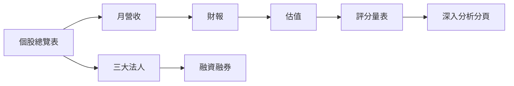

# 怎麼看表總覽

## 本篇你會學到

- 看盤軟體與公開資料裡有哪些**關鍵表格**
- 每張表回答什麼問題、適合哪種投資模式
- 建議的閱讀順序

!!! tip "圖看趨勢，表看數字"
    圖表回答「型態與走勢」，表格回答「精確數字」。兩者宜對照，見 [圖表總覽](../04-charts/index.md)。

---

## 表格分類

| 表格 | 回答的問題 | 專章 |
|------|------------|------|
| **個股總覽表** | 一檔股票的快照長怎樣？ | [個股總覽表](watchlist.md) |
| **深入分析分頁** | 同一檔的各切面在哪看？ | [分頁地圖](deep-dive-tabs.md) |
| **月營收表** | 營收趨勢轉強或轉弱？ | [月營收表](revenue.md) |
| **三大法人表** | 法人在買還是賣？ | [三大法人表](institutional.md) |
| **融資融券表** | 散戶槓桿與多空結構？ | [融資融券表](margin.md) |
| **估值表** | 現在貴還是便宜？ | [估值表](valuation.md) |
| **財報摘要表** | 公司賺不賺錢、體質如何？ | [財報摘要表](financials.md) |
| **評分量表** | 把多個因子濃縮成分數 | [評分量表](scoring.md) |
| **除權息日程表** | 何時除息、何時填息？ | [除權息日程表](dividend-schedule.md) |
| **鉅額交易表** | 有沒有大單默默成交？ | [鉅額交易表](block-trade.md) |

---

## 建議閱讀順序

1. 先用 [個股總覽表](watchlist.md) 建立一檔股票的全貌。
2. 基本面三張：[月營收](revenue.md) → [財報](financials.md) → [估值](valuation.md)。
3. 籌碼兩張：[三大法人](institutional.md) → [融資融券](margin.md)。
4. 想濃縮判斷時看 [評分量表](scoring.md)，逐檔細查用 [深入分析分頁](deep-dive-tabs.md)。

---

## 依投資模式選表

| 模式 | 優先表格 |
|------|----------|
| [當沖](../08-investing/day-trade.md) · [隔日沖](../08-investing/overnight.md) | 三大法人、融資融券、鉅額交易 |
| [短線](../08-investing/swing-short.md) · [中線](../08-investing/swing-mid.md) | 月營收、三大法人、評分量表 |
| [長線](../08-investing/long-term.md) · [存股](../08-investing/dividend-investing.md) | 財報、估值、除權息日程 |

---

## 重點回顧

- 表格看**精確數字**，與 [圖表](../04-charts/index.md) 的趨勢互相對照。
- 從 [個股總覽表](watchlist.md) 入門，再依模式深入各表。
- 下一步：依上表進入對應專章，或用 [評分量表](scoring.md) 濃縮判斷。
