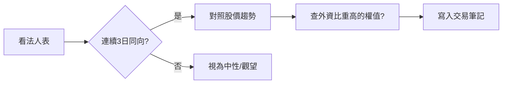

# 三大法人買賣超表

## 本篇你會學到

- 外資、投信、自營商欄位
- 單日 vs 連續買賣超的讀法

## 示意表（單日）

| 代號 | 外資買賣超(張) | 投信 | 自營商 | 合計 | 收盤漲跌% |
|:----:|---------------:|-----:|-------:|-----:|----------:|
| 2330 | +2,500 | +100 | -50 | +2,550 | +0.8 |
| 3711 | +800 | +200 | +30 | +1,030 | +2.3 |
| 6789 | -1,200 | -50 | +20 | -1,230 | -1.5 |

## 欄位解讀

| 欄位 | 意義 |
|------|------|
| **外資** | 國際資金淨買賣張數 |
| **投信** | 國內投信淨買賣 |
| **自營商** | 券商自有部位；進階可拆「自行買賣」與「避險」 |
| **合計** | 三者加總，快速看當日方向 |

## 在哪裡看到

| 來源 | 路徑 |
|------|------|
| 台灣證券交易所 / 櫃買中心 | 三大法人買賣超（T+1 公布） |
| 券商看盤軟體 | 個股「籌碼／法人」分頁 |
| 財經網站 | 法人買賣超排行、連續買賣超統計 |

資料 **T+1** 公布，非即時。資料源細節見 [資料來源](../appendix/data-sources.md)。

## 連續性表格（建議自製）

| 日期 | 外資累計(5日) | 股價 vs MA20 |
|------|--------------|--------------|
| D-4 ~ D | +5,000 張 | 站上 |
| 前一周 | -3,000 張 | 跌破 |

**原則**：連續買超 + 價格配合 → 籌碼較健康；買超但股價跌 → 可能有更大賣壓。

## 閱讀步驟

1. 資料 **T+1** 公布，無法當沖當下即時用昨日法人。
2. 外資對權值股影響大；投信常見中小型股。
3. 自營商單日波動大，宜看趨勢或拆細項。

## 常見誤區

| 誤區 | 說明 |
|------|------|
| 單日大買超就追 | 可能是指數調整或被動基金再平衡 |
| 忽略股價位置 | 高檔買超可能是短線過熱 |
| 只看合計 | 外資與投信方向相反時要拆解 |

## 讀完請做

走一遍 [三大法人連續買超案例](../07-cases/institutional-flow.md)：把「連續 3 日同向 → 對照股價趨勢 → 寫入筆記」流程實際套用一次。

## 重點回顧

- 法人表回答「誰在買賣」，不回答「明天漲跌」。
- 連續性比單日極端值重要。
- 搭配 [法人案例](../07-cases/institutional-flow.md)。

相關：[三大法人術語](../02-glossary/chips.md#三大法人)
