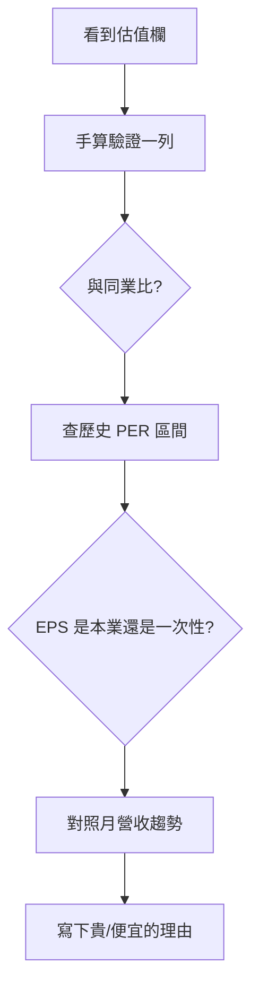

# 估值表怎麼看

## 本篇你會學到

- PER、PBR、殖利率三個欄位的意義與公式
- 怎麼從看盤軟體**找到**這些數字、怎麼**手算**驗證
- 用「同業、歷史、獲利品質」三個角度判斷貴或便宜
- 估值的常見陷阱與下一步該做什麼

## 示意表

| 代號 | 股價 | EPS(TTM) | PER | 每股淨值 | PBR | 殖利率% |
|:----:|-----:|---------:|----:|---------:|----:|--------:|
| 2330 | 850 | 42 | 20.2 | 180 | 4.7 | 1.8 |
| 3711 | 180 | 12 | 15.0 | 95 | 1.9 | 3.2 |
| 6789 | 55 | 2 | 27.5 | 40 | 1.4 | 5.5 |

!!! note "說明"
    上表為**教學示意**（合成數據），非即時行情，亦非投資建議。

**TTM**：Trailing Twelve Months，過去四季合計 EPS。

## 欄位解讀

| 指標 | 公式 | 適合判斷 | 怎麼用 |
|------|------|----------|--------|
| **PER 本益比** | 股價 ÷ EPS | 獲利穩定的成熟股 | 願意為每 1 元盈餘付多少價 |
| **PBR 股價淨值比** | 股價 ÷ 每股淨值 | 資產型、金融股 | 股價相對「家底」貴不貴 |
| **殖利率** | 現金股利 ÷ 股價 | 存股、現金流需求 | 帳面現金回報率（未扣稅費） |

## 在哪裡看到

| 來源 | 路徑 |
|------|------|
| 看盤軟體「個股深入分析」 | KPI／估值分頁，見 [深入分析分頁地圖](deep-dive-tabs.md) |
| 公開資訊觀測站（MOPS） | 財報、每股淨值、股利資料 |
| 財經網站（Yahoo 股市、CMoney、Goodinfo 等） | PER／PBR／殖利率現成欄位 |

不同網站的 PER 可能用「近四季」或「預估」EPS，數字會略有差異——**比較時固定同一來源**。資料源細節見 [資料來源](../appendix/data-sources.md)。

## 官方計算與防呆 {#官方計算與防呆}

TWSE／TPEx 對三大指標有明確公式與防呆規則，了解後較不會被第三方平台誤導：

| 指標 | 官方邏輯 |
|------|----------|
| **本益比** | 收盤價 ÷ 最近 **4 季** EPS 滾動值（TTM）。**EPS ≤ 0（虧損）時不計算，顯示空值（N/A）**，避免誤導為「極度低估」 |
| **股價淨值比** | 收盤價 ÷ 每股淨值；獲利衰退、PER 失效時作為資產防禦力參考 |
| **殖利率** | 每股股利 ÷ 收盤價 × 100%；股利採**前一年度已公告**之現金＋盈餘轉增資股票股利，股本變動時官方不主動調整 |

!!! tip "看到本益比 N/A 不是資料缺失"
    多半是該公司近四季 EPS 加總為負，官方防呆機制不計算。除權息旺季前，殖利率宜再用董事會最新宣告的股利政策修正。

程式自動化可用 TWSE OpenAPI 端點 `/exchangeReport/STOCK_DAY_AVG_ALL` 取得每日 PER／PBR／殖利率，見 [資料來源 OpenAPI](../appendix/data-sources.md#twse-openapi自動化串接)。

## 手算一例 {#手算一例}

以示意表 **3711** 這一列，把三個數字算給自己看：

| 指標 | 代入 | 結果 |
|------|------|------|
| PER | 股價 180 ÷ EPS 12 | **15.0 倍** |
| PBR | 股價 180 ÷ 每股淨值 95 | **1.9 倍** |
| 殖利率 | 假設配 5.76 元 ÷ 股價 180 | **3.2%** |

看到軟體上的數字，能自己回推一次，就不容易被「便宜／貴」的標題牽著走。完整公式見 [公式速查](../appendix/formulas.md)。

## 同業比較：估值是相對的

PER 高低**只在同產業內**才有比較意義。假設三檔同為半導體封測：

| 代號 | PER | 解讀（需再查原因） |
|------|----:|--------------------|
| A | 15 | 低於同業，可能成長放緩或有風險 |
| B | 22 | 接近族群中位 |
| C | 30 | 市場給較高成長預期 |

A 的「便宜」可能是陷阱（獲利要衰退），C 的「貴」可能反映真實成長。**不能拿封測的 15 倍去跟金融股的 10 倍比**——產業獲利結構不同。

## 閱讀步驟

1. **手算驗證**：先確認自己看懂數字（上方手算一例）。
2. **同業比較**：PER 低於同業？問為什麼（成長差或風險高）。
3. **歷史區間**：個股過去 5 年 PER 常見區間在哪，現在偏高或偏低。
4. **獲利品質**：EPS 來自本業還是一次性收益？見 [財報摘要表](financials.md)。
5. **交叉月營收**：營收連續走弱時，低 PER 可能只是「EPS 即將下修」的假象。

## 常見誤區

| 誤區 | 正確做法 |
|------|----------|
| PER 15 就是便宜 | 沒有萬用門檻；要比同業與自身歷史 |
| 負 EPS 看 PER | 官方防呆顯示 N/A（非資料缺失），改看 PBR、營收 |
| 景氣循環股 PER 低就買 | 高點 EPS 高→PER 看似低，恰是賣點（陷阱） |
| 高殖利率一定好 | 可能是股價大跌「被動墊高」殖利率 |
| 跨產業比 PER | 科技、金融、循環股估值結構不同，不可直接比 |

## 讀完請做

走一遍 [估值陷阱（高殖利率）案例](../07-cases/valuation-trap.md)：用一檔股價下跌、殖利率被動拉高的標的，把本頁的「同業 + 歷史 + 獲利品質」流程實際套用一次。

## 重點回顧

- 估值是**相對**概念，需同業、歷史、成長一起比。
- 先**手算**驗證，再判斷貴或便宜，避免被標題誤導。
- 低 PER / 高殖利率可能是陷阱，務必對照 [月營收](revenue.md) 與 [財報](financials.md)。

## 相關

- [基本面術語](../02-glossary/fundamentals.md#per本益比) · [財報摘要表](financials.md) · [本益比怎麼讀](../05-analysis/fundamental-framework.md#本益比怎麼讀) · [估值陷阱案例](../07-cases/valuation-trap.md)
