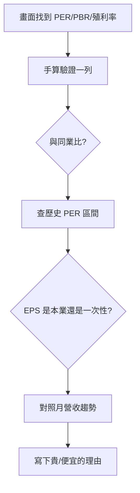

# 估值表怎麼看

## 本篇你會學到

- 五分鐘內看懂 PER、PBR、殖利率各代表什麼
- 從 Yahoo 股市（或同類網站）**點到哪裡、看哪一格**
- 用 **2330 台積電**走一輪：畫面數字 → 手算 → 判斷貴不貴
- 同業、歷史、獲利品質三個角度與常見陷阱

!!! note "完全不認識 EPS？"
    請先看 [財報摘要表](financials.md) 的 EPS 欄，或 [基本面術語](../02-glossary/fundamentals.md#eps每股盈餘)。本頁假設你已知道「EPS = 公司賺多少分給每一股」。

---

## 五分鐘快讀 {#五分鐘快讀}

讀完這張表，你至少能回答三個問題：

| 欄位 | 白話一句 | 常見誤解 |
|------|----------|----------|
| **PER 本益比** | 市場願意用幾年的獲利，買你這檔股票 | 「PER 15 就便宜」——沒有萬用門檻，要比**同業** |
| **PBR 股價淨值比** | 股價是每股淨值的幾倍（家底貴不貴） | 只看 PBR 忽略獲利；景氣循環股 PER 失效時才特別有用 |
| **殖利率** | 若照去年股利配，帳面年化報酬率（**未扣稅**） | 「殖利率 8% 必買」——可能是股價大跌被動墊高 |

**記住**：估值表不是告訴你「買或賣」，而是告訴你「市場現在怎麼定價這家公司」——還要搭配 [月營收](revenue.md)、[財報](financials.md) 交叉確認。

---

## 畫面導覽：Yahoo 股市為例 {#畫面導覽}

以下以 [Yahoo 股市](https://tw.stock.yahoo.com) 為例；券商 APP、Goodinfo、CMoney 欄位名稱類似，差在分頁位置。

| 步驟 | 你要做什麼 | 會看到什麼 |
|:----:|------------|------------|
| 1 | 搜尋代號（例：**2330**）→ 進入個股頁 | 股價、漲跌幅 |
| 2 | 點 **「基本資料」** 或 **「分析」** 分頁 | 本益比、股價淨值比、殖利率等欄位 |
| 3 | 對照 **EPS（近四季）**、**每股淨值**、**現金股利** | 手算 PER／PBR／殖利率 的原材料 |
| 4 | 若本益比顯示 **「--」或 N/A** | 近四季 EPS 加總 ≤ 0（虧損），見下方 [官方防呆](#官方計算與防呆) |

!!! tip "券商「深入分析」介面"
    若你用券商研究工具，估值常在 **基本面** 分頁；分頁地圖見 [深入分析分頁地圖](deep-dive-tabs.md#在哪裡看到全站樞紐)。

| 來源 | 路徑 |
|------|------|
| 看盤軟體「個股深入分析」 | KPI／估值或基本面分頁 |
| 公開資訊觀測站（MOPS） | 財報、每股淨值、股利公告 |
| 財經網站（Yahoo、CMoney、Goodinfo 等） | PER／PBR／殖利率現成欄位 |

不同網站的 PER 可能用「近四季」或「預估」EPS，數字會略有差異——**比較時固定同一來源**。資料源細節見 [資料來源](../appendix/data-sources.md)。

---

## 完整走讀一例（2330 台積電） {#完整走讀一例}

以下數字為**教學示意**（與下方示意表 2330 列一致），方便你對照畫面欄位；非即時行情，亦非投資建議。

### 第一步：在畫面上找到四個數

| 你在畫面找 | 示意值 | 意思 |
|------------|-------:|------|
| 股價（收盤） | 850 | 市場現在願意付的價 |
| EPS（近四季 TTM） | 42 | 過去四季每股賺 42 元 |
| 每股淨值 | 180 | 帳上淨資產分攤到每一股 |
| 現金股利（去年已公告） | 約 15.3 | 用來算殖利率（示意） |

### 第二步：自己算三個指標

| 指標 | 代入 | 結果 | 和軟體對一下 |
|------|------|------|--------------|
| PER | 850 ÷ 42 | **20.2 倍** | 軟體本益比應接近此數 |
| PBR | 850 ÷ 180 | **4.7 倍** | 股價是淨值的 4.7 倍 |
| 殖利率 | 15.3 ÷ 850 × 100% | **約 1.8%** | 帳面現金回報（未扣稅） |

算完代表你**真的看懂欄位**，不是只看標題。

### 第三步：這樣算「貴」還是「便宜」？

| 問題 | 你該怎麼想（示意） |
|------|-------------------|
| PER 20 倍貴嗎？ | **不能單看數字**。要和**同業半導體**比——若同業多在 15～25 倍，20 倍可能是「合理區間」，不是撿便宜 |
| PBR 4.7 倍高嗎？ | 科技股淨值常低估無形資產，PBR 參考價值有限；重點仍是獲利與成長 |
| 殖利率 1.8% 低嗎？ | 台積電偏成長股，殖利率本來就不高；**存股族**會更在意 [股利日程](dividend-schedule.md) |

**結論（教學用）**：走完這三步行，你應能說出——「2330 的 PER 約 20 倍，我手算對上了；要和封測／晶圓同業比才知道貴不貴，不能跟金融股 10 倍直接比。」

若 2330 太複雜，可改練示意表 **3711** 那一列（數字較小），見 [手算一例](#手算一例)。

---

## 示意表

| 代號 | 股價 | EPS(TTM) | PER | 每股淨值 | PBR | 殖利率% |
|:----:|-----:|---------:|----:|---------:|----:|--------:|
| 2330 | 850 | 42 | 20.2 | 180 | 4.7 | 1.8 |
| 3711 | 180 | 12 | 15.0 | 95 | 1.9 | 3.2 |
| 6789 | 55 | 2 | 27.5 | 40 | 1.4 | 5.5 |

!!! note "說明"
    上表為**教學示意**（合成數據），非即時行情，亦非投資建議。

**TTM**：Trailing Twelve Months，過去四季合計 EPS。

## 欄位解讀

| 指標 | 公式 | 適合判斷 | 怎麼用 |
|------|------|----------|--------|
| **PER 本益比** | 股價 ÷ EPS | 獲利穩定的成熟股 | 願意為每 1 元盈餘付多少價 |
| **PBR 股價淨值比** | 股價 ÷ 每股淨值 | 資產型、金融股 | 股價相對「家底」貴不貴 |
| **殖利率** | 現金股利 ÷ 股價 | 存股、現金流需求 | 帳面現金回報率（未扣稅費） |

## 官方計算與防呆 {#官方計算與防呆}

TWSE／TPEx 對三大指標有明確公式與防呆規則，了解後較不會被第三方平台誤導：

| 指標 | 官方邏輯 |
|------|----------|
| **本益比** | 收盤價 ÷ 最近 **4 季** EPS 滾動值（TTM）。**EPS ≤ 0（虧損）時不計算，顯示空值（N/A）**，避免誤導為「極度低估」 |
| **股價淨值比** | 收盤價 ÷ 每股淨值；獲利衰退、PER 失效時作為資產防禦力參考 |
| **殖利率** | 每股股利 ÷ 收盤價 × 100%；股利採**前一年度已公告**之現金＋盈餘轉增資股票股利，股本變動時官方不主動調整 |

!!! tip "看到本益比 N/A 不是資料缺失"
    多半是該公司近四季 EPS 加總為負，官方防呆機制不計算。除權息旺季前，殖利率宜再用董事會最新宣告的股利政策修正。

程式自動化可用 TWSE OpenAPI 端點 `/exchangeReport/STOCK_DAY_AVG_ALL` 取得每日 PER／PBR／殖利率，見 [資料來源 OpenAPI](../appendix/data-sources.md#twse-openapi自動化串接)。

## 手算一例 {#手算一例}

以示意表 **3711** 這一列，把三個數字算給自己看：

| 指標 | 代入 | 結果 |
|------|------|------|
| PER | 股價 180 ÷ EPS 12 | **15.0 倍** |
| PBR | 股價 180 ÷ 每股淨值 95 | **1.9 倍** |
| 殖利率 | 假設配 5.76 元 ÷ 股價 180 | **3.2%** |

看到軟體上的數字，能自己回推一次，就不容易被「便宜／貴」的標題牽著走。完整公式見 [公式速查](../appendix/formulas.md)。

## 同業比較：估值是相對的

PER 高低**只在同產業內**才有比較意義。假設三檔同為半導體封測：

| 代號 | PER | 解讀（需再查原因） |
|------|----:|--------------------|
| A | 15 | 低於同業，可能成長放緩或有風險 |
| B | 22 | 接近族群中位 |
| C | 30 | 市場給較高成長預期 |

A 的「便宜」可能是陷阱（獲利要衰退），C 的「貴」可能反映真實成長。**不能拿封測的 15 倍去跟金融股的 10 倍比**——產業獲利結構不同。

## 閱讀步驟

1. **畫面導覽**：先找到欄位（上方 [Yahoo 步驟](#畫面導覽)）。
2. **手算驗證**：對照 [2330 走讀](#完整走讀一例) 或 [3711 手算](#手算一例)。
3. **同業比較**：PER 低於同業？問為什麼（成長差或風險高）。
4. **歷史區間**：個股過去 5 年 PER 常見區間在哪，現在偏高或偏低。
5. **獲利品質**：EPS 來自本業還是一次性收益？見 [財報摘要表](financials.md)。
6. **交叉月營收**：營收連續走弱時，低 PER 可能只是「EPS 即將下修」的假象。

## 常見誤區

| 誤區 | 正確做法 |
|------|----------|
| PER 15 就是便宜 | 沒有萬用門檻；要比同業與自身歷史 |
| 負 EPS 看 PER | 官方防呆顯示 N/A（非資料缺失），改看 PBR、營收 |
| 景氣循環股 PER 低就買 | 高點 EPS 高→PER 看似低，恰是賣點（陷阱） |
| 高殖利率一定好 | 可能是股價大跌「被動墊高」殖利率 |
| 跨產業比 PER | 科技、金融、循環股估值結構不同，不可直接比 |

## 讀完請做

1. 打開 Yahoo 股市任選一檔你關注的股票，找到 PER／PBR／殖利率，用本頁公式**手算對一次**。
2. 走一遍 [估值陷阱（高殖利率）案例](../07-cases/valuation-trap.md)：把「同業 + 歷史 + 獲利品質」流程實際套用。

## 自我檢查

??? question "1.（手算題）股價 180、EPS 12，PER 多少？"
    參考答案：180 ÷ 12 = **15.0 倍**。

??? question "2.（概念題）本益比顯示 N/A 通常代表什麼？"
    參考答案：近四季 EPS 加總 ≤ 0（虧損），官方防呆不計算；見 [官方計算與防呆](#官方計算與防呆)。

??? question "3.（情境題）殖利率從 3% 突然跳到 8%，第一個該懷疑什麼？"
    參考答案：股價是否大跌導致「被動墊高」；見 [估值陷阱案例](../07-cases/valuation-trap.md)。

## 重點回顧

- 先從**畫面找到欄位**，再**手算驗證**，最後才談貴或便宜。
- 估值是**相對**概念，需同業、歷史、成長一起比。
- 低 PER / 高殖利率可能是陷阱，務必對照 [月營收](revenue.md) 與 [財報](financials.md)。

## 相關

- [基本面術語](../02-glossary/fundamentals.md#per本益比) · [財報摘要表](financials.md) · [本益比怎麼讀](../05-analysis/fundamental-framework.md#本益比怎麼讀) · [估值陷阱案例](../07-cases/valuation-trap.md)
