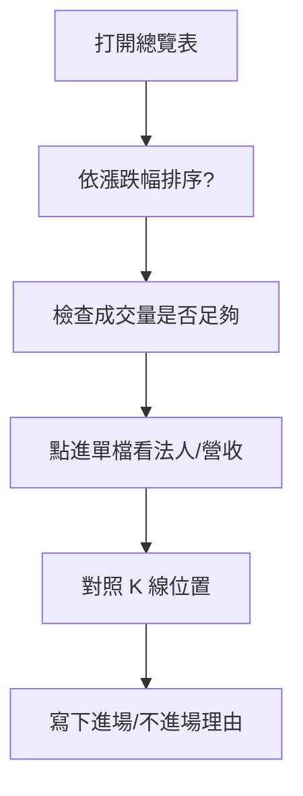

# 個股總覽表怎麼看

## 本篇你會學到

- 報價列表常見欄位
- 如何用表格快速篩選標的

## 示意表（教學用）

| 代號 | 名稱 | 收盤 | 漲跌幅% | 成交量(張) | 評分 | 備註 |
|:----:|------|-----:|--------:|-----------:|-----:|------|
| 2330 | 台積電 | 850 | +1.2 | 45,000 | 72 | 權值、法人關注 |
| 3711 | 日月光投控 | 180 | +3.5 | 12,000 | 65 | 短線量能增 |
| 6789 | 範例電子 | 55 | -2.1 | 800 | 41 | 量縮下跌 |

!!! note "說明"
    上表為**教學示意**，非即時行情，亦非投資建議。

## 欄位解讀

| 欄位 | 意義 | 怎麼用 |
|------|------|--------|
| **代號** | 4 碼股票代碼 | 查公告、法人表時的 key |
| **收盤 / 現價** | 最新或當日收盤價 | 搭配漲跌幅看位置 |
| **漲跌幅%** | 相對昨收變化 | 篩選強勢股、弱勢股 |
| **成交量** | 成交張數 | 確認突破或下跌是否有人參與 |
| **評分** | 多因子加權分數（若工具提供） | 粗篩用，非買賣指令 |
| **備註** | 自訂標籤 | 產業、事件、觀察理由 |

## 在哪裡看到

| 來源 | 路徑 |
|------|------|
| 券商看盤軟體 | 自選股清單、報價列表、排行榜 |
| 財經網站 | 漲跌幅排行、成交量排行 |
| 公開資訊觀測站 | 個股基本資料對照 |

資料源細節見 [資料來源](../appendix/data-sources.md)。

## 手算一例

以示意表 **3711** 這一列，驗證「漲跌幅」：若昨收 173.9、現價 180，則

```
漲跌幅 = (180 − 173.9) ÷ 173.9 × 100% ≈ +3.5%
```

公式對照 [公式速查](../appendix/formulas.md)。能自己回推，就不會把「漲很多」與「該追」畫上等號。

## 閱讀步驟



1. **先定目的**：當沖找量能、波段找趨勢、存股找基本面。
2. **過濾流動性**：成交量過低，進出成本高、滑價大。
3. **漲跌幅 + 量**：漲多量增 vs 漲多量縮，意義不同。
4. **評分當參考**：高分不代表今天該買，低分可能是已反映利空。

## 常見誤區

| 誤區 | 正確做法 |
|------|----------|
| 只看漲幅排行追強勢 | 看是否已接近壓力、法人是否賣超 |
| 忽略上櫃小成交量 | 小票波動大，停損要更嚴 |
| 評分高就全買 | 分散標的、控制單筆曝險 |

## 讀完請做

挑 [三大法人連續買超案例](../07-cases/institutional-flow.md)：示範如何從總覽表的候選，進一步點進單檔驗證籌碼與趨勢。

## 重點回顧

- 總覽表是**篩選器**，決策需進一步看表（營收、法人）與圖（K 線）。
- 成交量與漲跌幅要一起看。
- 每檔標的應能寫出一句「為什麼在清單上」。

相關：[行情術語](../02-glossary/quotes.md) · [K 線基礎](../04-charts/kline-basics.md)
