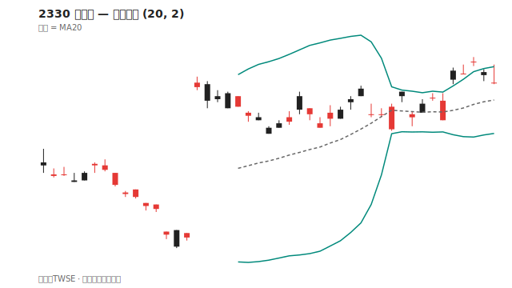
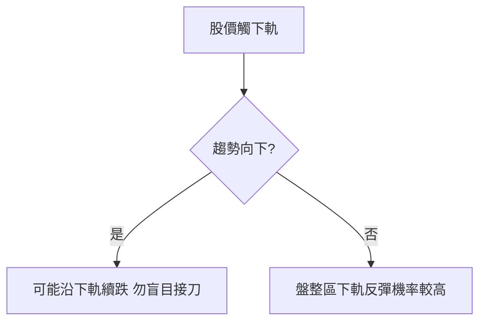

# 布林通道

## 本篇你會學到

- 上中下軌的意義
- 收口、擴口與觸軌

## 定義

| 軌道 | 計算（常見） |
|------|--------------|
| **中軌** | N 日移動平均（常見 20 日） |
| **上軌** | 中軌 + k × 標準差（常見 k=2） |
| **下軌** | 中軌 − k × 標準差 |

股價約 95% 時間在 ±2 標準差內波動（統計假設，實務非絕對）。

## 讀圖方式

| 現象 | 解讀 |
|------|------|
| 觸上軌 | 短線偏強或過熱 |
| 觸下軌 | 短線偏弱或超賣 |
| 通道收口 | 波動變小，可能即將變盤 |
| 通道擴口 | 波動變大，趨勢或劇烈行情 |
| 沿上軌走 | 強勢多頭 |
| 沿下軌走 | 強勢空頭 |

## 趨勢 vs 盤整

## 常見誤用

- 「觸下軌必買」→ 下跌趨勢會一路貼下軌。
- 忽略中軌方向 → 中軌向上時下軌支撐較有效。

## 讀圖三步驟

1. **通道寬度**：收口（波動變小）還是擴口（波動變大）？
2. **觸軌**：股價貼上軌、下軌或沿中軌走？
3. **趨勢**：中軌（MA20）向上還是向下？

## 搭配確認

| 現象 | 解讀 |
|------|------|
| 收口後擴口向上 | 常伴突破，看量確認 |
| 下跌趨勢貼下軌 | 勿盲目「觸軌必買」 |
| 盤整觸下軌反彈 | 短線區間操作參考 |

## 自我檢查

??? question "1.（概念題）布林通道中軌通常是什麼？"
    參考答案：常見為 **20 日移動平均**（即 [MA20](ma.md)）。

??? question "2.（判斷題）股價觸下軌就該抄底？"
    參考答案：不一定。**下跌趨勢**會一路貼下軌，勿盲目接刀。

??? question "3.（情境題）通道由收口轉擴口，代表什麼？"
    參考答案：波動變大，常伴隨較大行情；**方向**需另用趨勢工具與量確認。

## 重點回顧

- 布林通道描述**波動範圍**，不是固定支撐壓力。
- 收口後的擴口常伴隨較大行情，方向需另用趨勢工具判斷。
- 速查：[指標速查表](indicator-quickref.md) · 中軌即 [MA20](ma.md)

相關：[布林通道術語](../02-glossary/technical.md#布林通道)
