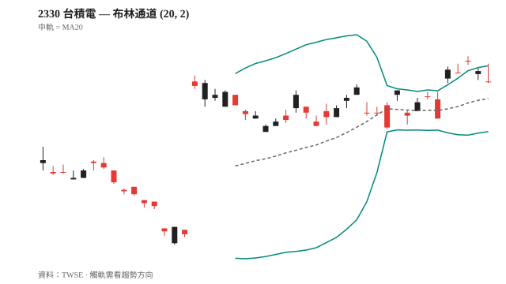
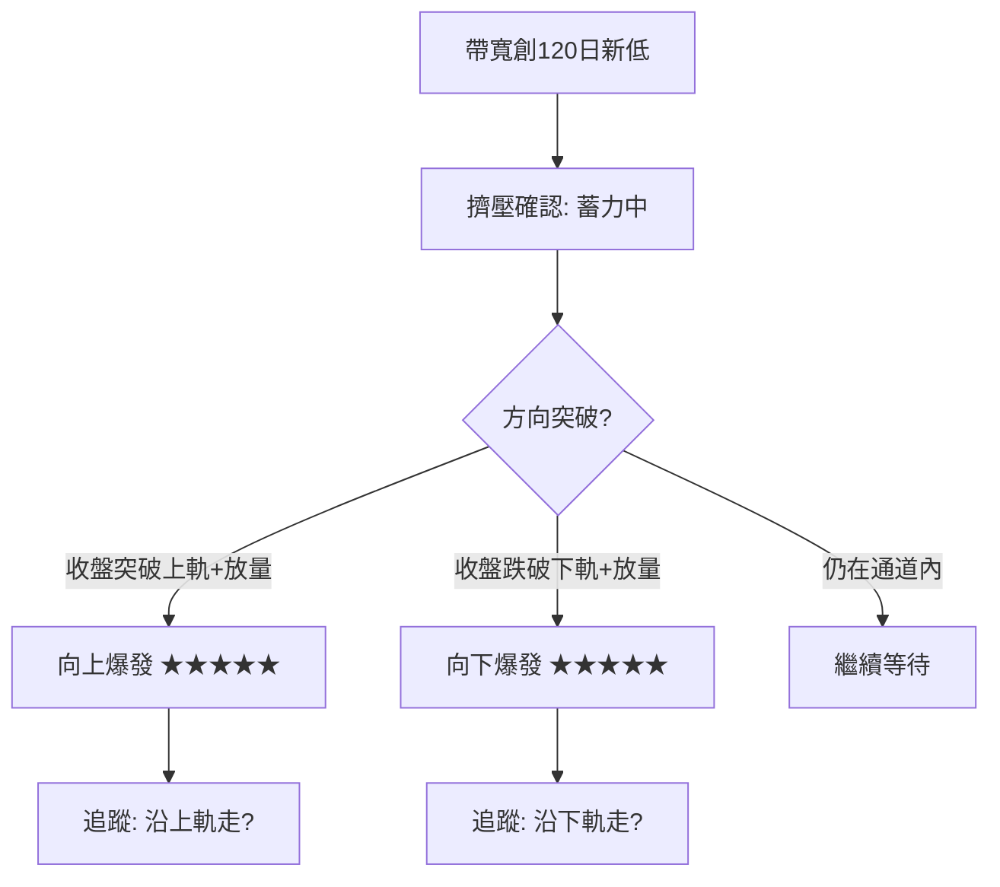
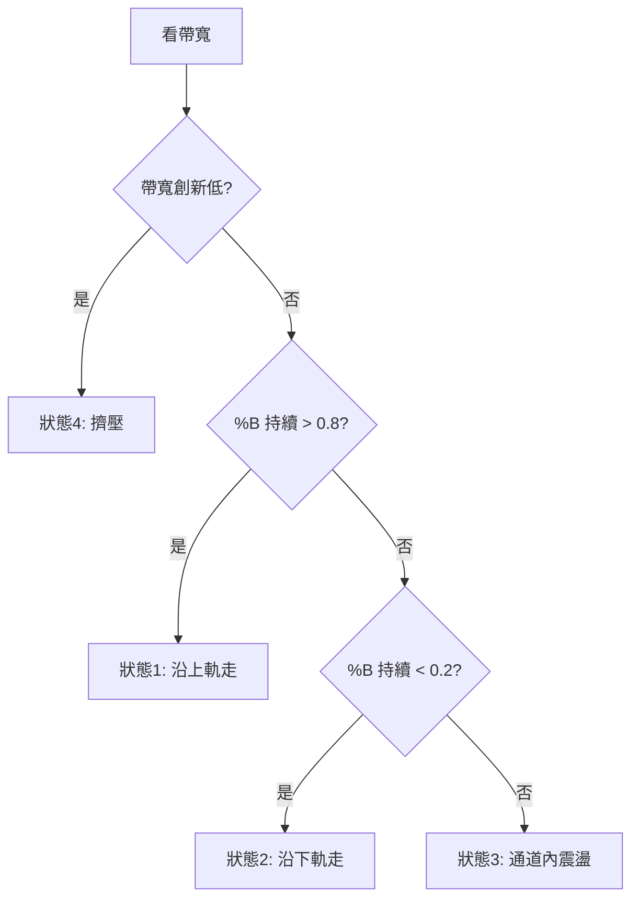

# 布林通道（Bollinger Bands）

## 本篇你會學到

- 上中下軌的意義與統計原理
- **%B 指標**：股價在通道中的精確位置
- **帶寬（Bandwidth）**：波動收縮與擴張的量化
- **擠壓戰法（Squeeze）**：辨識大行情前的蓄力訊號
- 布林通道的四種市場狀態與信號分級
- 系統性評估方法

## 定義與統計原理

| 軌道 | 計算（常見） | 意義 |
|------|-------------|------|
| **中軌** | N 日移動平均（常見 20 日） | 趨勢方向（= [MA20](ma.md)） |
| **上軌** | 中軌 + k × 標準差（常見 k=2） | 波動上界 |
| **下軌** | 中軌 − k × 標準差 | 波動下界 |

!!! tip "統計意義"
    ±2 標準差理論上涵蓋約 95% 的資料點。白話：「股價大部分時間在通道內，突破通道是**異常事件**」。但金融市場非常態分布，實務上約有 5–10% 的 K 線會突出通道。

---

## %B 指標：精確位置 {#percent-b}

**%B** 將股價在布林通道中的位置量化為 0–1 之間的數值：

$$\%B = \frac{\text{收盤價} - \text{下軌}}{\text{上軌} - \text{下軌}}$$

| %B 值 | 位置意義 | 參考 |
|-------|---------|------|
| %B > 1.0 | 突破上軌 | 極強勢或過熱 |
| %B = 1.0 | 剛好在上軌 | 偏強 |
| %B = 0.5 | 在中軌（MA20） | 中性 |
| %B = 0.0 | 剛好在下軌 | 偏弱 |
| %B < 0.0 | 跌破下軌 | 極弱勢或超賣 |

### %B 的判讀價值

| 現象 | 判讀 |
|------|------|
| %B 持續 > 0.8 | 強勢多頭（沿上軌走） |
| %B 由 <0 回升突破 0.5 | 可能反轉向上 |
| %B 持續 < 0.2 | 弱勢空頭（沿下軌走） |
| %B 由 >1 回落跌破 0.5 | 可能反轉向下 |

---

## 帶寬（Bandwidth）：波動量化 {#帶寬}

**帶寬** 量化通道的寬窄程度：

$$Bandwidth = \frac{\text{上軌} - \text{下軌}}{\text{中軌}} \times 100\%$$

| 帶寬狀態 | 意義 | 操作含義 |
|---------|------|---------|
| 帶寬**創近期新低** | 波動極度收縮 | ⚠️ 大行情即將到來（方向未定） |
| 帶寬**遞減** | 波動正在收縮 | 盤整蓄力中 |
| 帶寬**突然放大** | 波動爆發 | 趨勢已經啟動 |
| 帶寬**持續寬闊** | 高波動延續 | 趨勢市或劇烈行情中 |

---

## 擠壓戰法（Squeeze）{#擠壓}

布林通道最有價值的應用：**辨識大行情前的蓄力期**。

### 擠壓的定義

當帶寬收縮至**近 N 期最窄**（通常 120–150 日最窄），代表市場處於極度低波動的「蓄力」狀態。歷史經驗顯示，低波動之後常跟著高波動行情。

### 擠壓判讀流程

```mermaid
flowchart TD
    A[帶寬創120日新低] --> B[擠壓確認: 蓄力中]
    B --> C{方向突破?}
    C -->|收盤突破上軌+放量| D[向上爆發 ★★★★★]
    C -->|收盤跌破下軌+放量| E[向下爆發 ★★★★★]
    C -->|仍在通道內| F[繼續等待]
    D --> G[追蹤: 沿上軌走?]
    E --> H[追蹤: 沿下軌走?]
```

### 擠壓信號評估

| 條件 | 符合時加分 |
|------|-----------|
| 帶寬創 120 日以上新低 | ★★ |
| 突破日成交量 > 20 日均量 1.5 倍 | ★★ |
| 突破方向與中軌（MA20）斜率一致 | ★ |
| [MACD](macd.md) 柱狀圖同方向確認 | ★ |
| K 線為大紅/大黑突破 | ★ |

| 總分 | 爆發可信度 | 操作 |
|------|-----------|------|
| 5–7 | **高** | 積極跟進突破方向 |
| 3–4 | **中** | 小量跟進，嚴格停損 |
| 1–2 | **低** | 可能假突破，觀望 |

---

## 布林通道四種市場狀態 {#四種狀態}

| 狀態 | 特徵 | 操作策略 |
|------|------|---------|
| **1. 沿上軌走（Walking the Upper Band）** | 股價持續貼上軌，%B > 0.8，帶寬擴口 | 強勢多頭，持有，回測中軌可加碼 |
| **2. 沿下軌走（Walking the Lower Band）** | 股價持續貼下軌，%B < 0.2，帶寬擴口 | 強勢空頭，不做多，不接刀 |
| **3. 通道內震盪（Mean Reversion）** | 股價在上下軌之間來回，帶寬穩定或中等 | 觸下軌買、觸上軌賣（區間操作） |
| **4. 擠壓蓄力（Squeeze）** | 帶寬極窄，股價貼近中軌 | 等待突破，突破後跟進 |

### 判斷當前狀態的流程

```mermaid
flowchart TD
    A[看帶寬] --> B{帶寬創新低?}
    B -->|是| C[狀態4: 擠壓]
    B -->|否| D{%B 持續 > 0.8?}
    D -->|是| E[狀態1: 沿上軌走]
    D -->|否| F{%B 持續 < 0.2?}
    F -->|是| G[狀態2: 沿下軌走]
    F -->|否| H[狀態3: 通道內震盪]
```

---

## 布林通道信號評估表 {#信號評估}

| 評估項目 | 看漲 (+2) | 偏看漲 (+1) | 中性 (0) | 偏看跌 (−1) | 看跌 (−2) |
|---------|-----------|------------|---------|------------|-----------|
| %B 位置 | <0（超賣破下軌） | 0–0.3 偏低 | 0.3–0.7 | 0.7–1.0 偏高 | >1（超買破上軌） |
| 中軌方向 | 斜率向上 | 走平偏上 | 走平 | 走平偏下 | 斜率向下 |
| 帶寬狀態 | 擠壓後向上突破 | 擴口向上 | 穩定 | 擴口向下 | 擠壓後向下跌破 |
| 趨勢環境 | 盤整觸下軌+鎚子 | 回測中軌守住 | 通道內中段 | 反彈觸上軌受阻 | 趨勢貼下軌走 |

| 總分 | 判定 | 操作建議 |
|------|------|---------|
| +5 以上 | 看漲 | 進場或加碼 |
| +2 ~ +4 | 偏看漲 | 小量試單 |
| −1 ~ +1 | 中性 | 觀望 |
| −4 ~ −2 | 偏看跌 | 減碼或不做多 |
| −5 以下 | 看跌 | 空手 |

!!! warning "重要前提"
    上表中 %B 超賣（<0）在「沿下軌走」的環境中是**持續弱勢**而非買訊。必須先判斷當前是哪種市場狀態，再套用對應策略。

---

## 搭配確認

| 布林信號 | 搭配條件 | 綜合評估 |
|---------|---------|---------|
| 擠壓後上軌突破 | [MACD 金叉](macd.md) + 放量 | ★★★★★ 大行情啟動 |
| 盤整觸下軌 | RSI 超賣 + 鎚子 | ★★★★ 短線反彈 |
| 沿上軌走 + 回測中軌 | 中軌守住 + 縮量回測 | ★★★★ 趨勢買點 |
| 高檔觸上軌 + 帶寬極寬 | RSI 超買 + 量縮 | ★★★ 可能修正 |
| 沿下軌走 | 均線空頭 + MACD 死叉 | 不做多，等止穩 |

---

## 常見誤用

| 誤用 | 正確認知 |
|------|----------|
| 觸下軌必買 | 趨勢空頭時會沿下軌走，接刀會被割 |
| 觸上軌必賣 | 強勢多頭時會沿上軌走，賣出會錯失大漲 |
| 不看帶寬 | 帶寬是布林最有價值的信號（擠壓預判大行情） |
| 忽略中軌方向 | 中軌 = MA20，方向代表趨勢 |
| 盤整策略用在趨勢 | 「觸軌反向」只在盤整（狀態3）有效 |

---

## 讀圖五步驟（評估流程）

1. **帶寬**：通道寬窄？是否擠壓？→ 判斷是否即將有大行情
2. **中軌方向**：MA20 向上/走平/向下？→ 定趨勢方向
3. **%B 位置**：收盤在通道哪個位置？→ 量化超買超賣
4. **市場狀態**：四種狀態中的哪一種？→ 選對應策略
5. **搭配**：MACD/RSI/成交量是否確認？→ 綜合評分

---

## 自我檢查

??? question "1.（概念題）布林通道中軌通常是什麼？%B = 0.5 代表什麼位置？"
    參考答案：中軌為 **20 日移動平均**。%B = 0.5 代表收盤**剛好在中軌位置**（通道正中間）。

??? question "2.（判斷題）股價觸下軌就該抄底？"
    參考答案：不一定。先判斷是「沿下軌走」（空頭趨勢）還是「通道內震盪」（盤整）。只有盤整環境中觸下軌才適合短線反向操作。

??? question "3.（情境題）帶寬創 120 日新低後，股價放量突破上軌 + MACD 金叉，你怎麼評估？"
    參考答案：**擠壓爆發** + 多指標確認，信號極強（★★★★★）。可積極跟進做多，停損設在突破 K 低點或中軌。

??? question "4.（進階題）什麼情況下「觸上軌」不是賣出信號？"
    參考答案：**沿上軌走（Walking the Upper Band）** 狀態——強勢多頭會持續貼上軌，%B > 0.8 只代表趨勢強，不代表過熱。此時回測中軌反而是加碼點。

---

## 重點回顧

- 布林通道描述**波動範圍**，不是固定支撐壓力。
- **%B** 精確量化位置，**帶寬**量化波動收縮程度。
- **擠壓**（帶寬新低）是布林最有價值的信號——預判大行情即將到來。
- 先辨識四種市場狀態，再選對應策略，避免「盤整策略用在趨勢市」。
- 速查：[指標速查表](indicator-quickref.md) · 中軌即 [MA20](ma.md)

相關：[布林通道術語](../02-glossary/technical.md#布林通道) · [圖表綜合評估](chart-evaluation.md)
