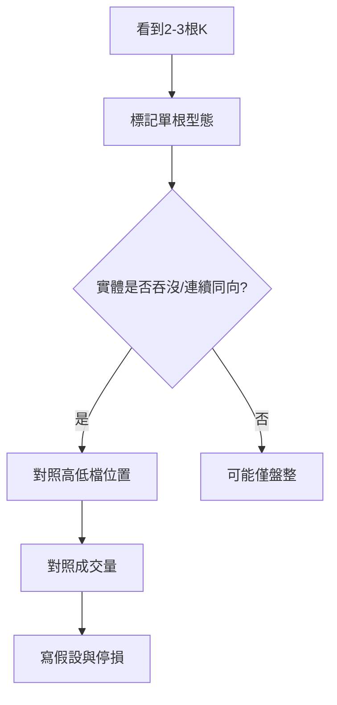

# K 線組合型態（進階）

## 本篇你會學到

- 兩根以上 K 線形成的常見組合
- 與單根 [16 種型態](candle-patterns.md) 的差異

!!! note "前置"
    請先掌握 [K 線基礎](kline-basics.md) 與 [16 種單根型態](candle-patterns.md)。組合型態參考量化通 K 棒型態學延伸框架。

## 為什麼要看組合

單根 K 只描述**一個時段**的拔河結果；兩根以上連續排列，可看出多空力道是否**轉折**或**延續**。

| 類型 | 意義 |
|------|------|
| 反轉組合 | 趨勢可能改變方向 |
| 延續組合 | 原趨勢可能加速 |

## 反轉組合

### 吞噬（Engulfing）

| 項目 | 內容 |
|------|------|
| **定義** | 後一根 K 的實體完全包住前一根實體 |
| **看漲吞噬** | 前黑後紅，出現在低檔 → 多方反攻 |
| **看跌吞噬** | 前紅後黑，出現在高檔 → 空方反攻 |
| **位置** | 低檔看漲、高檔看跌較有意義 |
| **確認** | 放量優於縮量；次日不立刻反向 |

- 
- 

### 晨星 / 暮星（三根）

| 項目 | 內容 |
|------|------|
| **晨星（看漲）** | 長黑 → 短實體（星）→ 長紅；低檔常見 |
| **暮星（看跌）** | 長紅 → 短實體 → 長黑；高檔常見 |
| **中間星線** | 可為十字、小紅或小黑，代表猶豫 |
| **誤用** | 盤整區三根排列可能只是噪音 |

- 
- 

### 烏雲蓋頂 / 刺透

| 組合 | 說明 |
|------|------|
| **烏雲蓋頂** | 長紅後開高，黑K 收進紅K 實體一半以上（高檔偏空） |
| **刺透** | 長黑後開低，紅K 收進黑K 實體一半以上（低檔偏多） |

## 延續組合

### 三白兵 / 三黑鴉

| 組合 | 說明 |
|------|------|
| **三白兵** | 連續三根長紅，低檔或突破後 → 多頭強勢 |
| **三黑鴉** | 連續三根長黑，高檔或跌破後 → 空頭強勢 |
| **注意** | 每根宜有適量實體；第三根若長上影需警惕 |

### 上升 / 下降三法

中間數根小 K 橫盤整理，前後各一根大 K 同向 → 趨勢延續（較少見於短線當沖）。

## 判讀步驟

## 與單根型態的關係

| 單根 | 組合加強 |
|------|----------|
| 低檔紅K鎚子 | 次日長紅吞噬 → 反轉確認增強 |
| 高檔倒鎚 | 次日長黑吞噬 → 見頂風險增強 |
| 十字線 | 晨星/暮星中間星 → 變盤訊號 |

## 重點回顧

- 組合型態比單根可靠度通常更高，但仍非保證。
- 必須搭配位置、量、[均線](ma.md)。
- 單根查表：[型態速查表](candle-quickref.md)

相關：[鎚子線案例](../07-cases/hammer-ma.md) · [三招讀懂 K 線](kline-reading.md)
