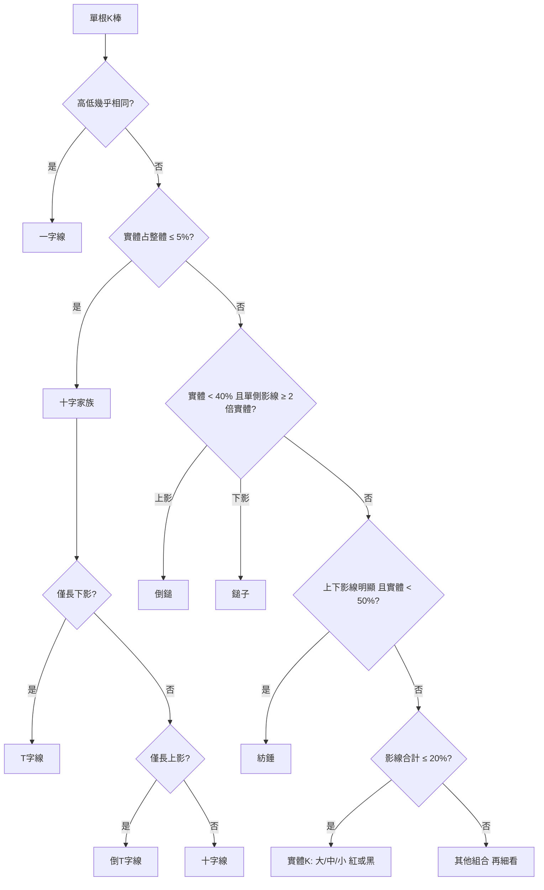
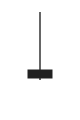
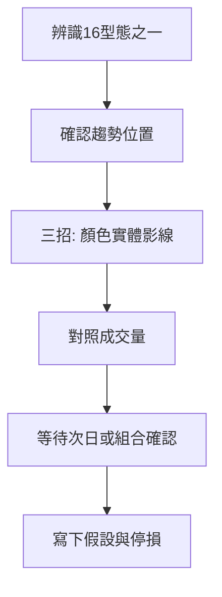

# 16 種 K 棒型態

## 本篇你會學到

- 16 種單根 K 棒的正式定義與量化門檻
- 每種型態的市場訊號、位置與常見誤用
- 如何搭配成交量與均線確認

型態分類參考 [量化通 K 棒型態學](https://quantpass.org/kbar-pattern-1/)，量化門檻與相鄰 Stock Bot 的 K 線看板標記邏輯一致（白話呈現，不含程式名）。

建議閱讀順序：[K 線基礎](kline-basics.md) → [三招讀懂 K 線](kline-reading.md) → 本篇 → [型態速查表](candle-quickref.md)。

## 辨識決策樹

## 量化門檻速覽

| 規則 | 白話門檻 |
|------|----------|
| 實體 K 線 | 上下影線合計 ≤ 整體長度 **20%** |
| 十字家族 | 實體 ≤ 整體長度 **5%**（開盤 ≈ 收盤） |
| 鎚子 / 倒鎚 | 實體 < **40%**；單側影線 ≥ **2 倍**實體；另一側影線極短 |
| 紡錘 | 上下影線皆明顯；實體 < **50%** |
| 大 / 中 / 小實體 | 相對近 **20 根**平均實體；或實體占收盤價约 **4% / 1.5%** |

## 分類總覽

| 類別 | 型態 |
|------|------|
| 實體 K 線 | 大/中/小 紅K、大/中/小 黑K |
| 上影線 | 倒鎚紅K、倒鎚黑K |
| 下影線 | 紅K鎚子、黑K鎚子 |
| 上下影線 | 紡錘紅K、紡錘黑K |
| 十字線 | 十字線、T字線、倒T字線、一字線 |

---

## 1. 實體 K 線（6 種）

影線合計 ≤ 整體長度 20%，以實體為主。

### 大紅K {#大紅k}

| 欄位 | 內容 |
|------|------|
| **定義** | 收盤遠高於開盤；實體較長（相對近期平均 ≥ 1.3 倍，或占收盤價 ≥ 4%）；影線合計 ≤ 20% |
| **外觀示意** |  |
| **市場訊號** | 多頭強勢，大量買方進駐，後市偏多 |
| **適用位置** | 突破、起漲段；高檔大紅可能是加速末段 |
| **常見誤用** | 高檔追大紅不設 [停損](../06-risk/stop-loss.md) |
| **搭配確認** | 放量、站回 [均線](ma.md)、次日不立刻長黑 |

### 中紅K {#中紅k}

| 欄位 | 內容 |
|------|------|
| **定義** | 收盤高於開盤；實體介於大紅與小紅之間；影線 ≤ 20% |
| **外觀示意** |  |
| **市場訊號** | 買方明顯占優（未到大紅程度），有時視為趨勢延續或轉折 |
| **適用位置** | 趨勢中段、盤整突破初期 |
| **常見誤用** | 忽略 [成交量](../02-glossary/quotes.md#成交量) 是否配合 |
| **搭配確認** | 中紅 + 放量 + 法人買超較一致 |

### 小紅K {#小紅k}

| 欄位 | 內容 |
|------|------|
| **定義** | 收盤略高於開盤；實體較短（≤ 近期平均 0.6 倍或占收盤 ≤ 1.5%）；影線 ≤ 20% |
| **外觀示意** |  |
| **市場訊號** | 買方略勝賣方，力道偏弱，常見於盤整 |
| **適用位置** | 橫盤區、趨勢中的小幅回檔尾聲 |
| **常見誤用** | 當成強烈買進訊號 |
| **搭配確認** | 需連續多根或搭配型態組合 |

### 大黑K {#大黑k}

| 欄位 | 內容 |
|------|------|
| **定義** | 收盤遠低於開盤；長黑實體；影線 ≤ 20% |
| **外觀示意** |  |
| **市場訊號** | 空頭強勢，大量賣壓，後市偏空 |
| **適用位置** | 跌破支撐、起跌段 |
| **常見誤用** | 低檔大黑盲目放空（可能最後一跌） |
| **搭配確認** | 大黑 + 放量跌破均線較危險 |

### 中黑K {#中黑k}

| 欄位 | 內容 |
|------|------|
| **定義** | 收盤低於開盤；實體介於大黑與小黑之間；影線 ≤ 20% |
| **外觀示意** |  |
| **市場訊號** | 賣方明顯占優（未到大黑程度），有時視為反轉或延續 |
| **適用位置** | 下跌趨勢中段、反彈失敗 |
| **常見誤用** | 盤整區單根中黑就認定趨勢反轉 |
| **搭配確認** | 連續兩根以上黑K 或跌破支撐 |

### 小黑K {#小黑k}

| 欄位 | 內容 |
|------|------|
| **定義** | 收盤略低於開盤；短黑實體；影線 ≤ 20% |
| **外觀示意** |  |
| **市場訊號** | 賣方略勝買方，力道弱，常見於盤整 |
| **適用位置** | 橫盤、多頭趨勢中的小回檔 |
| **常見誤用** | 單根小黑就恐慌賣出 |
| **搭配確認** | 觀察是否連續出現或量縮 |

---

## 2. K 線帶上影線（2 種）

### 倒鎚紅K（墓碑線－上漲） {#倒鎚紅k}

| 欄位 | 內容 |
|------|------|
| **定義** | 收盤略高於開盤；短實體；幾乎無下影線；上影線長度 ≥ 實體 **2 倍** |
| **外觀示意** |  |
| **市場訊號** | 開盤強勢但被賣壓壓回，未能突破，潛在反轉 |
| **適用位置** | **高檔**、壓力區 |
| **常見誤用** | 低檔出現就做空 |
| **搭配確認** | 次日長黑或跌破短均線 |

### 倒鎚黑K（墓碑線－下跌） {#倒鎚黑k}

| 欄位 | 內容 |
|------|------|
| **定義** | 收盤略低於開盤；短實體；幾乎無下影線；上影線 ≥ 2 倍實體 |
| **外觀示意** |  |
| **市場訊號** | 盤中拉高後收跌，後續下跌可能性增 |
| **適用位置** | 反彈高點、壓力區 |
| **常見誤用** | 忽略大盤與產業 |
| **搭配確認** | 高檔 + 量縮上影較可信 |

---

## 3. K 線帶下影線（2 種）

### 紅K鎚子（吊人線－上漲） {#紅k鎚子吊人線上漲}

| 欄位 | 內容 |
|------|------|
| **定義** | 收盤略高於開盤；短實體；幾乎無上影線；下影線 ≥ 實體 **2 倍** |
| **外觀示意** |  |
| **市場訊號** | 開盤殺低後被買盤承接，收高於開盤，後續上漲可能性增 |
| **適用位置** | **低檔**、支撐區 |
| **常見誤用** | 高檔出現仍當買點（高檔稱吊人線） |
| **搭配確認** | 見 [鎚子線案例](../07-cases/hammer-ma.md)；放量、站回 MA |

### 黑K鎚子（吊人線－下跌） {#黑k鎚子}

| 欄位 | 內容 |
|------|------|
| **定義** | 收盤略低於開盤；短黑實體；幾乎無上影線；下影線 ≥ 2 倍實體 |
| **外觀示意** |  |
| **市場訊號** | 開盤強勢下殺，雖有承接但空方仍勝，收低於開盤 |
| **適用位置** | 弱勢反彈、下跌趨勢中 |
| **常見誤用** | 與紅K鎚子混淆 |
| **搭配確認** | 低檔黑鎚需更多確認才做多 |

---

## 4. K 線帶上下影線（2 種）

### 紡錘紅K {#紡錘紅k}

| 欄位 | 內容 |
|------|------|
| **定義** | 收盤高於開盤；上下影線皆明顯；實體 < 整體 **50%** |
| **外觀示意** |  |
| **市場訊號** | 多空交戰後買方小勝；實體越短越勢均力敵 |
| **適用位置** | 趨勢末端、盤整 |
| **常見誤用** | 單獨當強烈反轉訊號 |
| **搭配確認** | 觀察次日是否選方向 |

### 紡錘黑K {#紡錘黑k}

| 欄位 | 內容 |
|------|------|
| **定義** | 收盤低於開盤；上下影線皆明顯；實體 < 50% |
| **外觀示意** |  |
| **市場訊號** | 多空交戰後賣方小勝；實體越短越均衡 |
| **適用位置** | 趨勢末端猶豫 |
| **常見誤用** | 忽略整體趨勢方向 |
| **搭配確認** | 紡錘後常需等突破 |

---

## 5. 十字線家族（4 種）

實體 ≤ 整體長度 **5%**（開盤 ≈ 收盤）。

### 十字線 {#十字線}

| 欄位 | 內容 |
|------|------|
| **定義** | 開盤 ≈ 收盤；上下影線皆有且明顯 |
| **外觀示意** |  |
| **市場訊號** | 多空勢均力敵；高檔可能轉空、低檔可能轉多 |
| **適用位置** | 高檔 / 低檔關鍵區 |
| **常見誤用** | 不論位置一律解讀相同 |
| **搭配確認** | 次日方向確認 |

### T 字線（蜻蜓十字） {#t字線}

| 欄位 | 內容 |
|------|------|
| **定義** | 開盤 ≈ 收盤 ≈ 最高；長下影線；上影線極短 |
| **外觀示意** |  |
| **市場訊號** | 開低被買盤拉回；低檔空方可能力竭 |
| **適用位置** | 低檔偏多；高檔代表買方疲乏 |
| **常見誤用** | 高檔 T 字仍看多 |
| **搭配確認** | 低檔 + 支撐 + 放量 |

### 倒 T 字線（墓碑十字） {#倒t字線}

| 欄位 | 內容 |
|------|------|
| **定義** | 開盤 ≈ 收盤 ≈ 最低；長上影線；下影線極短 |
| **外觀示意** |  |
| **市場訊號** | 拉高後大量賣壓壓回；高檔多頭可能力竭 |
| **適用位置** | 高檔、壓力區 |
| **常見誤用** | 低檔出現就認定見頂 |
| **搭配確認** | 高檔 + 法人賣超 |

### 一字線 {#一字線}

| 欄位 | 內容 |
|------|------|
| **定義** | 開盤 = 最高 = 最低 = 收盤 |
| **外觀示意** |  |
| **市場訊號** | 極端行情：漲停、跌停或無量 |
| **適用位置** | 漲跌停鎖死 |
| **常見誤用** | 一般盤勢過度解讀 |
| **搭配確認** | 看是否連續一字、封單量 |

---

## 判讀流程

## 與 Stock Bot K 線看板

若使用相鄰 `stock` 專案的 **K 線看板**，單根 K 棒會自動標記為上述 16 種型態之一，判斷規則與本篇量化門檻一致。詳見 [工具對照](../appendix/stock-tool-map.md)。

## 重點回顧

- 16 種型態是**描述語言**，不是買賣指令。
- 反轉型態（鎚子、倒鎚、十字）特別依賴**高低檔位置**。
- 搭配 [三招讀懂 K 線](kline-reading.md)、[均線](ma.md)、[成交量](../02-glossary/quotes.md#成交量)。
- 速查：[型態速查表](candle-quickref.md)

相關：[K 線基礎](kline-basics.md) · [鎚子線案例](../07-cases/hammer-ma.md)
