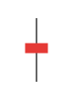
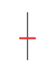

# 16 種 K 棒型態速查表

## 本篇你會學到

- 16 種型態一頁總覽
- 快速連結至各型態詳細說明

完整定義與圖示見 [16 種 K 棒型態](candle-patterns.md)。量化門檻見該頁「量化門檻速覽」。

## 總表

| # | 名稱 | 類別 | 定義一句 | 市場訊號 | 適用位置 | 詳細 |
|:-:|------|------|----------|----------|----------|------|
| 1 | 大紅K | 實體 | 長紅實體，影線 ≤ 20% | 多頭強勢 | 突破、起漲 | [連結](candle-patterns.md#大紅k) |
| 2 | 中紅K | 實體 | 中等紅實體，影線 ≤ 20% | 買方占優 | 趨勢中段 | [連結](candle-patterns.md#中紅k) |
| 3 | 小紅K | 實體 | 短紅實體，影線 ≤ 20% | 買方略勝 | 盤整 | [連結](candle-patterns.md#小紅k) |
| 4 | 大黑K | 實體 | 長黑實體，影線 ≤ 20% | 空頭強勢 | 跌破支撐 | [連結](candle-patterns.md#大黑k) |
| 5 | 中黑K | 實體 | 中等黑實體，影線 ≤ 20% | 賣方占優 | 下跌中段 | [連結](candle-patterns.md#中黑k) |
| 6 | 小黑K | 實體 | 短黑實體，影線 ≤ 20% | 賣方略勝 | 盤整 | [連結](candle-patterns.md#小黑k) |
| 7 | 倒鎚紅K | 上影線 | 短實體，長上影 ≥ 2×實體 | 潛在反轉偏空 | 高檔 | [連結](candle-patterns.md#倒鎚紅k) |
| 8 | 倒鎚黑K | 上影線 | 短黑實體，長上影 | 拉高收跌 | 壓力區 | [連結](candle-patterns.md#倒鎚黑k) |
| 9 | 紅K鎚子 | 下影線 | 短實體，長下影 ≥ 2×實體 | 潛在反轉偏多 | 低檔 | [連結](candle-patterns.md#紅k鎚子吊人線上漲) |
| 10 | 黑K鎚子 | 下影線 | 短黑實體，長下影 | 空方仍勝 | 弱勢反彈 | [連結](candle-patterns.md#黑k鎚子) |
| 11 | 紡錘紅K | 上下影線 | 上下影明顯，實體 < 50% | 買方小勝 | 盤整末端 | [連結](candle-patterns.md#紡錘紅k) |
| 12 | 紡錘黑K | 上下影線 | 上下影明顯，短黑實體 | 賣方小勝 | 猶豫 | [連結](candle-patterns.md#紡錘黑k) |
| 13 | 十字線 | 十字線 | 開 ≈ 收，上下影皆有 | 勢均力敵 | 高低檔 | [連結](candle-patterns.md#十字線) |
| 14 | T 字線 | 十字線 | 開收在最高，長下影 | 低檔可能轉多 | 支撐區 | [連結](candle-patterns.md#t字線) |
| 15 | 倒 T 字線 | 十字線 | 開收在最低，長上影 | 高檔可能轉空 | 壓力區 | [連結](candle-patterns.md#倒t字線) |
| 16 | 一字線 | 十字線 | 開高低收相同 | 極端供需 | 漲跌停 | [連結](candle-patterns.md#一字線) |

## 圖示縮圖

| 實體 K | 上影線 | 下影線 | 紡錘 | 十字 |
|--------|--------|--------|------|------|
|  |  |  |  |  |

## 三招快速複習

1. **顏色** → 方向
2. **實體** → 強度
3. **影線** → 交戰

詳見 [三招讀懂 K 線](kline-reading.md)。

## 自我檢查

??? question "1.（概念題）讀 K 棒三招是什麼？"
    參考答案：**顏色→方向、實體→強度、影線→交戰**。

??? question "2.（判斷題）低檔出現紅K鎚子，可以單靠型態全倉買？"
    參考答案：不行。型態需搭配**位置、量、均線**；完整定義見 [16 種型態](candle-patterns.md)。

??? question "3.（情境題）不確定倒鎚與墓碑線差別，該去哪查？"
    參考答案：回 [candle-patterns](candle-patterns.md) 各型態錨點；本表僅速查連結。

## 重點回顧

- 本表供查閱；交易前請回 [16 種型態](candle-patterns.md) 看完整定義與誤用提醒。
- 型態需搭配位置、量、均線，不可單獨下單。

相關：[K 線基礎](kline-basics.md) · [鎚子線案例](../07-cases/hammer-ma.md)
