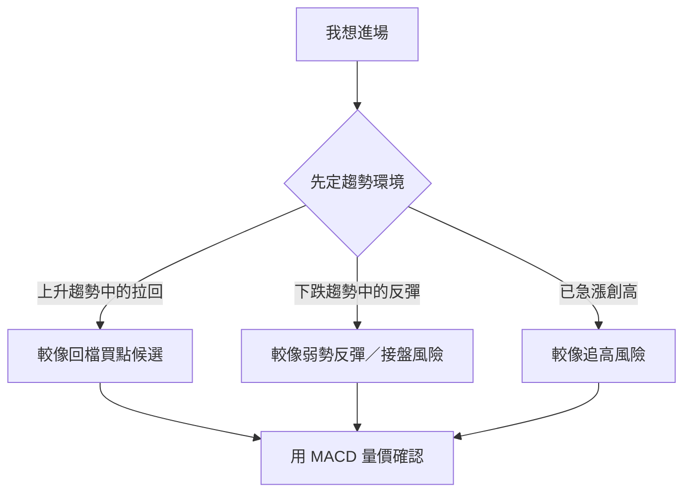
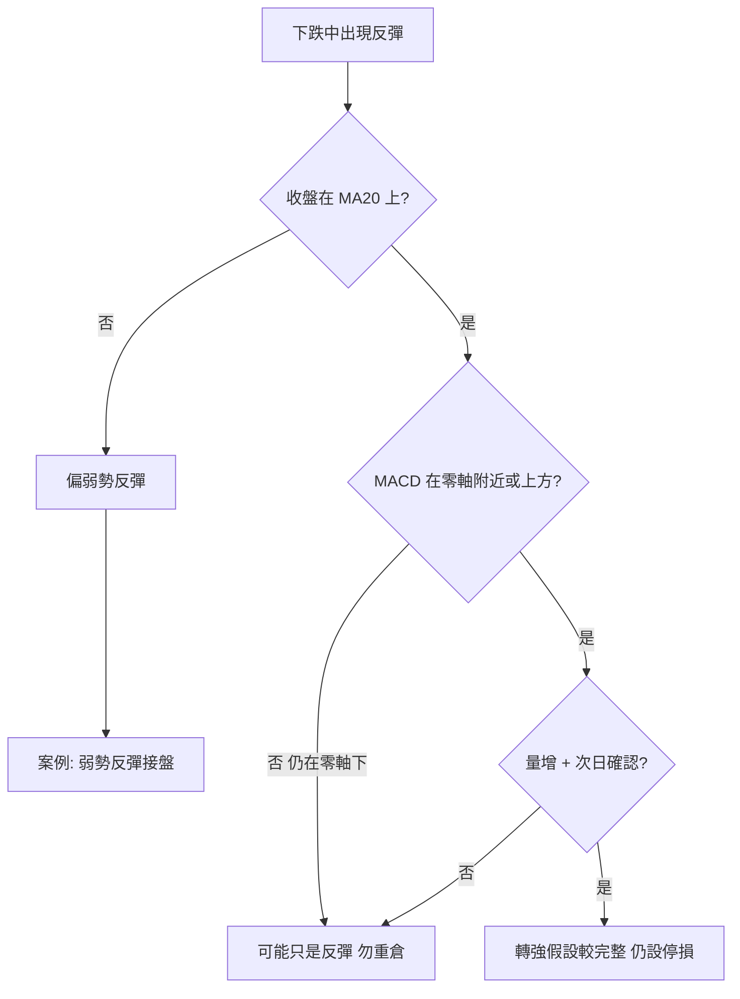

# 接盤還是追高？指標綜合判讀

## 本篇你會學到

- 「接盤」（低接抄底）與「追高」在圖表上長什麼樣子
- 用 **MA + MACD + 量價**（必要時加 RSI／KD／布林）做綜合判讀
- 何時偏「趨勢延續」、何時偏「弱勢反彈／高檔過熱」
- 一套可帶走的盤前檢查清單（非買賣訊號）

!!! warning "免責聲明"
    本篇是**判讀框架**教學，不是預測公式。單一指標無法保證分辨接盤或追高；實務請搭配 [停損](../06-risk/stop-loss.md) 與 [投資模式](../08-investing/index.md)。

---

## 先對齊兩個名詞

| 白話 | 對應術語 | 圖表上常見長相 |
|------|----------|----------------|
| **接盤／接刀** | [抄底](../02-glossary/trading-terms.md#抄底)、逆勢低接 | 下跌趨勢中出現反彈紅 K、超賣指標回升，以為「到底了」 |
| **追高** | [追高殺低](../02-glossary/trading-terms.md#追高殺低) 的追高端 | 已大幅上漲、情緒熱、突破或創高時才進場 |

關鍵不是「漲多少／跌多少」，而是：**你站在什麼趨勢環境、動能是否支持這次進出**。

---

## 四層判讀（由粗到細）

不要一打開 APP 就盯 MACD 交叉。建議固定順序：

| 順序 | 看什麼 | 回答的問題 | 主要工具 |
|:----:|--------|------------|----------|
| 1 | **趨勢環境** | 現在偏多、偏空，還是盤整？ | [均線 MA](ma.md)、價格結構（高低點） |
| 2 | **動能** | 這波漲／跌有沒有力道？ | [MACD](macd.md)（零軸、交叉、柱狀） |
| 3 | **冷熱與位置** | 短線是否過熱或過冷？ | [RSI](rsi.md)、[KD](kd.md)、[布林](bollinger.md) |
| 4 | **量價確認** | 突破／反彈有沒有人跟？ | [量價圖](volume-price.md) |

!!! tip "一句口訣"
    **先環境、再動能、再冷熱、最後看量。** 四層同向才提高信心；互相打架就降倉或觀望。

---

## 情境 A：會不會是接盤？（下跌中的反彈）

### 較像「弱勢反彈／接盤風險」

| 檢查項 | 偏接盤的長相 |
|--------|--------------|
| 均線 | 收盤在 MA20／MA60 **下方**，且均線仍向下 |
| MACD | **零軸下方**金叉；柱狀由負轉正但很快縮回 |
| RSI／KD | 超賣回升，但 RSI 過不了 50；KD 低檔金叉後再度下彎 |
| 布林 | 一路貼下軌，或觸下軌反彈不過中軌 |
| 量價 | 反彈縮量、再跌放量 |
| 價格結構 | 反彈高點低於前高（持續做更低的高點） |

### 較像「止跌轉強候選」（仍須確認）

| 檢查項 | 偏轉強的長相 |
|--------|--------------|
| 均線 | 站回 MA20，且 MA20 斜率走平轉上 |
| MACD | 金叉後柱狀**連續擴大**，並朝零軸靠近或站上 |
| RSI | 由 30 下回升並站穩 50 上方 |
| 量價 | 止跌日與站回均線日**放量** |
| K 線 | 低檔鎚子／吞噬後，隔日收盤確認（見 [鎚子案例](../07-cases/hammer-ma.md)） |

完整演練見案例：[弱勢反彈接盤陷阱](../07-cases/weak-rebound-trap.md)。

---

## 情境 B：會不會是追高？（上漲中的追價）

### 較像「追高風險」

| 檢查項 | 偏追高的長相 |
|--------|--------------|
| 位置 | 已遠離 MA20／MA60，短線乖離大 |
| MACD | [頂背離](macd.md#背離進階)：價新高、DIF 未新高；或高檔死叉 |
| RSI／KD | 長期 > 70／> 80 後開始回落；高檔死叉 |
| 量價 | **價漲量縮**、突破不放量（假突破警訊） |
| 籌碼輔助 | 融資大增、法人轉賣（見 [融資](../03-tables/margin.md)、[法人](../03-tables/institutional.md)） |
| 情緒 | 新聞熱、社群喊「不追會後悔」——見 [FOMO](../10-persona/active.md#⑧-fomo-追風族) |

### 較像「趨勢延續／回檔買點候選」

| 檢查項 | 偏延續的長相 |
|--------|--------------|
| 均線 | 上升趨勢中**拉回** MA20 附近不破 |
| MACD | **零軸上方**金叉或柱狀縮後再擴；非頂背離 |
| 量價 | 拉回縮量、再攻放量 |
| K 線 | 回檔後出現支撐型態，而非高檔倒鎚追價 |

高檔動能衰竭的完整演練：[MACD 頂背離](../07-cases/macd-divergence.md)；假突破：[突破缺口](../07-cases/gap-breakout.md)。

---

## MACD 速查：同一金叉，兩種故事

這是學員最常問的點——「金叉了到底能不能買？」

| MACD 現象 | 較常見解讀 | 接盤／追高含義 |
|-----------|------------|----------------|
| 零軸**上**金叉 + 量增 | 趨勢中回檔結束機率較高 | 較不像盲目接盤；仍避免乖離過大時追價 |
| 零軸**下**金叉 | 常是弱勢反彈 | **接盤風險偏高** |
| 零軸上死叉 | 多頭中的修正警訊 | 已持倉宜防回檔；空手勿急著追反彈高點 |
| 頂背離 | 上漲動能衰竭 | **追高風險偏高** |
| 底背離 | 下跌動能衰竭 | 止跌候選，仍須均線／量確認，非立刻重倉抄底 |

細節與讀圖三步驟見 [MACD 專章](macd.md)。

---

## 五分鐘盤前檢查清單

複製到筆記本，進場前打勾：

1. [ ] **環境**：收盤在 MA20 上還是下？MA20 斜率向上／向下／走平？
2. [ ] **MACD**：DIF 在零軸上還是下？剛金叉還是死叉？柱狀擴大還是縮短？
3. [ ] **背離**：近兩次高低點，價格與 MACD 是否同向創高／創低？
4. [ ] **冷熱**：RSI／KD 是否極端？若極端，是「強勢鈍化」還是「即將回落」？（對照趨勢）
5. [ ] **量**：這次突破／反彈有沒有量？還是價漲量縮？
6. [ ] **假設一句話**：我認為這是「回檔買點／弱勢反彈／突破延續／高檔過熱」中的哪一種？
7. [ ] **若錯了**：停損價寫在哪？見 [停損三層](../06-risk/stop-loss.md)

四層打架（例如均線空、MACD 金叉）→ 預設**觀望或極小部位**，不要硬編故事。

---

## 常見誤區

| 誤區 | 較妥當做法 |
|------|------------|
| 跌很多＝便宜，MACD 超賣就抄 | 先看是否仍在下跌趨勢；零軸下金叉多為反彈 |
| 金叉／突破就追 | 看零軸位置、量、是否頂背離 |
| 指標全部偏多就全倉 | 指標滯後；仍要位置與停損 |
| 只用一個指標下結論 | 至少 MA + MACD + 量 |
| 把警訊當賣出指令 | 背離／死叉是降風險訊號，不是保證反轉 |

---

## 自我檢查

??? question "1.（概念題）判讀接盤／追高建議的四層順序是什麼？"
    參考答案：**趨勢環境 → 動能（MACD）→ 冷熱（RSI／KD／布林）→ 量價確認**。

??? question "2.（判斷題）MACD 在零軸下方金叉，代表趨勢已反轉可以重倉？"
    參考答案：不行。零軸下金叉常是**弱勢反彈**，接盤風險偏高；需均線與量確認。見 [弱勢反彈案例](../07-cases/weak-rebound-trap.md)。

??? question "3.（情境題）股價創波段新高，但 DIF 未創高且量縮，你怎麼標記這筆想法？"
    參考答案：標成**頂背離＋量縮 → 追高風險偏高**；宜守停利、不加碼。見 [MACD 頂背離](../07-cases/macd-divergence.md)。

## 重點回顧

- 接盤與追高是**位置＋趨勢＋動能**問題，不是單一交叉訊號。
- **零軸下金叉**多想接盤風險；**頂背離／高檔量縮**多想追高風險。
- 先寫假設與停損，再決定要不要進場。

## 相關

- [MACD](macd.md) · [指標速查表](indicator-quickref.md) · [均線 MA](ma.md)
- [弱勢反彈接盤陷阱](../07-cases/weak-rebound-trap.md) · [MACD 頂背離](../07-cases/macd-divergence.md) · [假突破](../07-cases/gap-breakout.md)
- [抄底](../02-glossary/trading-terms.md#抄底) · [追高殺低](../02-glossary/trading-terms.md#追高殺低)
