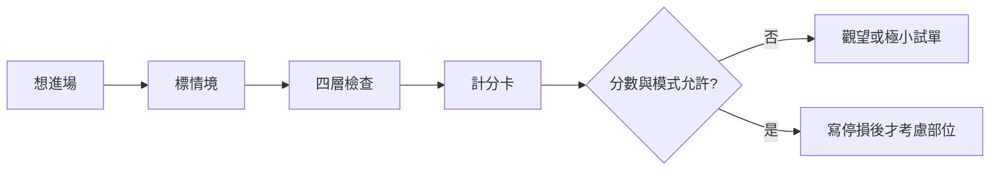
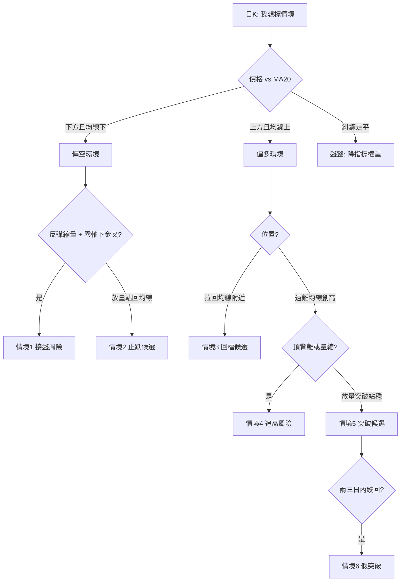

# 接盤還是追高？完整判讀手冊

## 本篇你會學到

- 用白話對齊：**接盤／接刀、抄底、弱勢反彈、回檔買點、追高、假突破**
- 在看盤軟體**哪裡看**（K 線指標、量價、籌碼）
- **六大情境矩陣**＋完整決策樹（不只兩種）
- **技術＋籌碼＋基本面**三支柱怎麼一起用
- **0～10 計分卡**、依投資模式怎麼降權重
- 標完假設之後**該做／不該做**什麼（含停損）

!!! warning "免責聲明"
    本篇是**判讀框架**與風險標記教學，**不是**預測或下單公式。通過計分也不等於該買；實務請搭配 [停損](../06-risk/stop-loss.md) 與你的 [投資模式](../08-investing/index.md)。

---

## 一、先對齊名詞（避免自說自話）

| 白話／標籤 | 對應術語 | 一句話 | 典型誤解 |
|------------|----------|--------|----------|
| **接盤／接刀** | 近似 [抄底](../02-glossary/trading-terms.md#抄底) | 下跌趨勢裡搶反彈，結果接到更低的賣壓 | 「跌很多＝便宜」 |
| **弱勢反彈** | [反彈](../02-glossary/trading-terms.md#反彈) | 空頭裡的暫時回升，常不過前高／均線 | 「反彈＝落底」 |
| **回檔買點** | [回檔](../02-glossary/trading-terms.md#回檔) | 多頭趨勢中的健康拉回後再攻 | 「一拉回就是轉空」 |
| **追高** | [追高殺低](../02-glossary/trading-terms.md#追高殺低) | 已急漲、情緒熱、位置差才進場 | 「熱度＝安全」 |
| **假突破** | [缺口／突破](../02-glossary/market-terms.md#缺口) | 突破後站不穩、量不足、快速跌回 | 「突破必追」 |
| **頂／底背離** | [MACD 背離](macd.md#背離進階) | 價創高／低但動能未跟 | 「背離＝立刻反轉」 |

核心原則：**先標「你站在哪種情境」**，再決定要不要進場；不要先下單再找理由。

---

## 二、在哪裡看到（看盤軟體）

對照常見個股分頁（布局因券商而異，名稱可能略不同）：

| 你要的資訊 | 常見分頁／位置 | 站內對應 |
|------------|----------------|----------|
| 日 K、均線、MACD／KD／RSI／成交量 | **K 線**（副圖可切 KD MACD、VOL RSI 等） | [MACD](macd.md)、[指標速查](indicator-quickref.md) |
| 五檔、大戶／散戶力道、分價量 | **行情** | [報價畫面](../01-basics/quote-screen.md)、[量價](volume-price.md) |
| 法人、融資、大戶籌碼 | **籌碼** | [籌碼圖](chips-charts.md)、[法人表](../03-tables/institutional.md)、[融資](../03-tables/margin.md) |
| 營收、本益比、財報 | **基本／財務** | [營收](../03-tables/revenue.md)、[估值](../03-tables/valuation.md) |
| 分頁總地圖 | 深入分析 | [深入分析分頁](../03-tables/deep-dive-tabs.md) |

!!! tip "操作建議"
    判讀接盤／追高時，至少同時開：**日 K（含 MA＋MACD＋量）** 與 **籌碼**。只看行情分時很容易被當下情緒帶著跑。

閱讀步驟（每次固定）：

1. 切到 **日 K**（短線可輔 60 分／週 K，見 [多週期](../09-advanced/multi-timeframe.md)）。
2. 疊 **MA5／10／20**（中線加 MA60）。
3. 副圖開 **MACD**，確認零軸、金叉／死叉、柱狀是否連續擴大。
4. 看 **成交量** 是否配合。
5. 需要時切 **籌碼**：法人連續方向、融資是否暴增。
6. 把結論寫成一句假設（見下方計分卡）。

---

## 三、四層判讀（技術面骨架）

| 順序 | 層 | 問題 | 工具 |
|:----:|----|------|------|
| 1 | **趨勢環境** | 偏多、偏空、盤整？ | 高低點結構、[MA](ma.md) |
| 2 | **動能** | 這波有沒有力？ | [MACD](macd.md) 零軸／交叉／柱 |
| 3 | **冷熱** | 過熱或過冷？ | [RSI](rsi.md)、[KD](kd.md)、[布林](bollinger.md) |
| 4 | **量價** | 有沒有人跟？ | [量價圖](volume-price.md) |

口訣：**先環境、再動能、再冷熱、最後看量。** 四層打架 → 降倉或觀望。

---

## 四、六大情境矩陣（完整版）

不要只會問「接盤還是追高」。實務上常見這六格——**先選一格當假設**：

| # | 情境標籤 | 長相摘要 | 風險取向 | 練案例 |
|---|----------|----------|----------|--------|
| 1 | **弱勢反彈／接盤風險** | 均線空、MACD 零軸下金叉、縮量反彈 | 高（逆勢） | [案例十七](../07-cases/weak-rebound-trap.md) |
| 2 | **止跌轉強候選** | 放量站回 MA20、MACD 柱擴大朝零軸、RSI＞50 | 中（仍要確認） | [鎚子+均線](../07-cases/hammer-ma.md) |
| 3 | **健康回檔買點候選** | 多頭中拉回 MA20 不破、零軸上、拉回縮量 | 中低（順勢） | [案例十九](../07-cases/healthy-pullback.md) |
| 4 | **追高／過熱風險** | 乖離大、頂背離、量縮創高、融資暴增 | 高 | [頂背離](../07-cases/macd-divergence.md)、[案例十八](../07-cases/chase-high-trap.md) |
| 5 | **突破延續候選** | 放量突破＋站穩、MACD 非背離 | 中（假突破風險） | 對照 [假突破](../07-cases/gap-breakout.md) |
| 6 | **假突破／追價失敗** | 突破後量不足、快速跌回、柱縮 | 高 | [假突破](../07-cases/gap-breakout.md) |

### 情境 1｜接盤風險（細表）

| 檢查項 | 偏接盤 |
|--------|--------|
| 均線 | 收在 MA20／MA60 下，均線向下 |
| MACD | **零軸下**金叉；柱轉正後快縮 |
| RSI／KD | 超賣回升但 RSI 過不了 50 |
| 布林 | 貼下軌或反彈不過中軌 |
| 量價 | 漲縮量、跌放量 |
| 結構 | 更低的高點／低點 |

### 情境 3｜健康回檔（細表）

| 檢查項 | 偏健康回檔 |
|--------|------------|
| 均線 | 上升趨勢，拉回 MA20（或 MA10）附近不破 |
| MACD | **零軸上方**；柱縮後再擴，無頂背離 |
| 量價 | 拉回縮量、再攻放量 |
| K 線 | 支撐區出現止跌型態後再確認 |

### 情境 4｜追高風險（細表）

| 檢查項 | 偏追高 |
|--------|--------|
| 位置 | 遠離均線，短線乖離大 |
| MACD | 頂背離或高檔死叉 |
| 量價 | 價漲量縮、突破不放量 |
| 籌碼 | 融資大增、法人轉賣 |
| 情緒 | FOMO、「不追會後悔」 |

---

## 五、三支柱怎麼一起用

技術面定「時機與位置」，但接盤／追高常敗在**忽略籌碼與基本面**。見 [三大分析支柱](../05-analysis/three-pillars.md)。

| 支柱 | 接盤場景多問 | 追高場景多問 |
|------|--------------|--------------|
| **技術** | 是弱勢反彈還是止跌？ | 是過熱追價還是突破延續？ |
| **籌碼** | 法人是否仍連賣？融資是否被斷頭殺出後才穩？ | 融資是否暴增抬轎？法人是否已賣？ |
| **基本面** | 「跌深」是否基本面惡化中？ | 利多是否已 [Priced In](../02-glossary/market-terms.md)？ |

組合標記範例（教學用）：

| 技術標籤 | 籌碼 | 基本面 | 建議心態 |
|----------|------|--------|----------|
| 情境 1 接盤 | 法人連賣 | 營收惡化 | 觀望優先 |
| 情境 2 止跌候選 | 法人轉買 | 營收轉強 | 可列觀察，仍要停損 |
| 情境 3 回檔 | 法人續買 | 穩定 | 順勢思路較一致 |
| 情境 4 追高 | 融資暴增 | 題材熱 | 高風險，宜減想追的衝動 |
| 情境 5 突破 | 量＋法人同步 | 論點仍在 | 防假突破，設無效點 |

---

## 六、0～10 計分卡（可帶走）

每次進場前為**同一個假設**打分（不是為「一定要買」找分）。

### A. 若假設是「可考慮低接／止跌」（越高越不像盲目接盤）

| 項目 | 加分條件 | 分 |
|------|----------|----|
| 環境 | 收盤站上 MA20 | +2 |
| 均線斜率 | MA20 走平或轉上 | +1 |
| MACD | 零軸上，或零軸下但柱連續擴大且朝零軸 | +2 |
| 量 | 止跌／站上均線日放量 | +2 |
| RSI | 站穩 50 上 | +1 |
| 籌碼 | 法人由賣轉買或賣超縮減（連續） | +1 |
| 基本面 | 無明顯惡化（營收／新聞） | +1 |
| **滿分** | | **10** |

解讀（教學用）：**≤4** 偏接盤風險；**5–7** 僅觀察／極小試單；**≥8** 止跌故事較完整，仍必須寫停損。

### B. 若假設是「可考慮追價／突破」（越高越不像盲目追高）

| 項目 | 加分條件 | 分 |
|------|----------|----|
| 位置 | 非大幅乖離後追價；或為回檔後再攻 | +2 |
| MACD | 無頂背離；零軸上動能仍在 | +2 |
| 量 | 突破／再攻放量 | +2 |
| 站穩 | 突破後 2～3 日未跌回關鍵區 | +2 |
| 籌碼 | 融資未失控暴增；法人未反向大賣 | +1 |
| 情緒 | 非純 FOMO（有事先計畫） | +1 |
| **滿分** | | **10** |

解讀：**≤4** 偏追高／假突破；**5–7** 謹慎；**≥8** 突破延續故事較完整，仍設「跌回則無效」。

---

## 七、依投資模式調整

| 模式 | 接盤／追高怎麼用 | 優先工具 |
|------|------------------|----------|
| [當沖](../08-investing/day-trade.md) | 少用日線 MACD 決定；防開盤追價 | 分時、量、大盤 |
| [隔日沖](../08-investing/overnight.md) | 警惕尾盤追高、隔日假突破 | 日 K 收盤結構 |
| [短線](../08-investing/swing-short.md) | 本手冊主戰場；六情境＋計分 | MA20、MACD、量、籌碼 |
| [中線](../08-investing/swing-mid.md) | 加重 MA60、基本面、法人連續 | 週 K 輔助 |
| [長線／存股](../08-investing/long-term.md) | 少做短線接刀／追漲停；回檔用週月線 | 估值＋基本面 |
| [ETF 定額](../08-investing/etf-passive-dca.md) | 不因日線 MACD 改變定額節奏 | 資產配置 |

---

## 八、標完情境之後：行動表

| 你標成… | 空手較合理做法 | 若已有部位 |
|---------|-----------------|------------|
| 情境 1 接盤風險 | 不開／等情境 2 條件 | 反彈失敗砍；勿加碼攤平 |
| 情境 2 止跌候選 | 觀察名單；確認後小倉 | 停損放近低下方 |
| 情境 3 回檔候選 | 計畫內回檔區分批 | 持有邏輯仍在可守 |
| 情境 4 追高風險 | 不追；等回檔或放棄 | 移動停利／減碼，不加碼 |
| 情境 5 突破候選 | 等站穩或小倉＋嚴格無效點 | 跌回關鍵區減碼 |
| 情境 6 假突破 | 不接刀救突破 | 快停損優於盼反彈 |

無效點／停損寫法見 [停損三層](../06-risk/stop-loss.md)。

---

## 九、MACD 速查（嵌入完整框架）

| 現象 | 含義 | 常對到情境 |
|------|------|------------|
| 零軸上金叉＋量增 | 回檔結束機率較高 | 3 或 5 |
| 零軸下金叉 | 弱勢反彈機率高 | **1** |
| 零軸上死叉 | 多頭修正警訊 | 4 或回檔加深 |
| 頂背離 | 動能衰竭 | **4** |
| 底背離 | 止跌候選 | 往 **2** 驗證，非自動買 |

詳見 [MACD](macd.md#接盤還是追高)。

---

## 十、盤前完整檢查清單

- [ ] **分頁**：日 K（MA＋MACD＋量）已看；需要時看籌碼／基本
- [ ] **情境編號**：我標的是六格中的第幾格？一句話寫下
- [ ] **四層**：環境／動能／冷熱／量是否同向？
- [ ] **計分**：A 卡或 B 卡分數？低分是否仍想硬做？
- [ ] **三支柱**：籌碼、基本面有沒有打臉技術故事？
- [ ] **模式**：符合我的 [投資模式](../08-investing/index.md) 嗎？
- [ ] **停損／無效點**：價格寫在哪？違規就執行？
- [ ] **部位**：即使高分，是否仍遵守曝險上限？（[資金配置](../06-risk/capital.md)）

---

## 常見誤區

| 誤區 | 較妥當做法 |
|------|------------|
| 只會問接盤或追高兩個字 | 先選六情境之一 |
| 跌多＝必漲、漲多＝必跌 | 看趨勢結構與動能 |
| 金叉／突破就下單 | 看零軸、量、計分、停損 |
| 指標全綠就全倉 | 指標滯後；管部位 |
| 忽略籌碼與基本面 | 用三支柱表交叉 |
| 背離當必須反向開倉 | 背離是降風險，不是保證反轉 |
| 當沖用日線 MACD 硬套 | 換分時與量價主軸 |

---

## 讀完請做（練習路徑）

1. 用計分卡複盤你最近一筆：當時比較像六格的哪一格？  
2. 依序演練案例：  
   - 接盤：[弱勢反彈](../07-cases/weak-rebound-trap.md)  
   - 追高：[追高陷阱](../07-cases/chase-high-trap.md) · [頂背離](../07-cases/macd-divergence.md)  
   - 回檔：[健康回檔](../07-cases/healthy-pullback.md)  
   - 假突破：[缺口假突破](../07-cases/gap-breakout.md)  
3. 把清單貼進你的交易日誌模板（[研究流程](../09-advanced/research-workflow.md)）。

---

## 自我檢查

??? question "1.（概念題）六大情境中，哪兩個最常被新手共用「金叉」卻搞混？"
    參考答案：**情境 1（零軸下弱勢反彈／接盤）** 與 **情境 3（零軸上健康回檔）**；差別在趨勢環境與零軸位置。

??? question "2.（判斷題）計分卡拿到 9 分就可以不設停損？"
    參考答案：不行。高分只代表故事較完整，**停損／無效點仍是必要條件**。

??? question "3.（情境題）股價創高、MACD 頂背離、融資大增、社群很熱，你標哪一格？空手怎麼做？"
    參考答案：標 **情境 4 追高／過熱風險**；空手不追，等回檔或放棄。見 [追高陷阱](../07-cases/chase-high-trap.md)。

## 重點回顧

- 完整流程：**標情境 → 四層 → 三支柱 → 計分 → 行動表／停損**。
- 接盤側重「空頭裡的反彈是否轉強」；追高側重「多頭末端是否過熱／假突破」。
- 健康回檔（情境 3）≠ 接盤（情境 1）；不要因為「都是往下買」就混為一談。

## 相關

- [MACD](macd.md) · [均線](ma.md) · [量價](volume-price.md) · [指標速查](indicator-quickref.md)
- [案例十七 接盤](../07-cases/weak-rebound-trap.md) · [十八 追高](../07-cases/chase-high-trap.md) · [十九 回檔](../07-cases/healthy-pullback.md)
- [頂背離](../07-cases/macd-divergence.md) · [假突破](../07-cases/gap-breakout.md) · [鎚子+均線](../07-cases/hammer-ma.md)
- [抄底](../02-glossary/trading-terms.md#抄底) · [追高殺低](../02-glossary/trading-terms.md#追高殺低) · [投資檢查清單](../appendix/investor-checklist.md)
