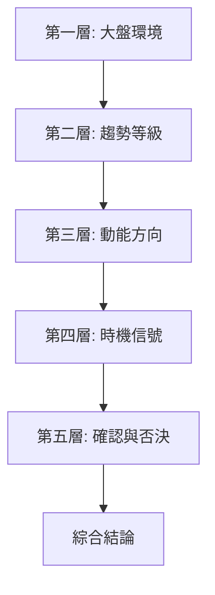

# 圖表綜合評估框架

## 本篇你會學到

- 如何**系統性整合**多種指標，避免碎片化判讀
- **信號匯流（Confluence）** 的概念與計分方法
- 五層評估架構：由大到小的判讀順序
- 實用的**多空評估記錄模板**
- 不同投資模式的指標權重配置

!!! note "前置知識"
    本篇是各指標教學的**匯總應用**。建議先完成以下頁面再讀本篇：
    [均線 MA](ma.md) · [MACD](macd.md) · [RSI](rsi.md) · [KD](kd.md) · [布林通道](bollinger.md) · [量價圖](volume-price.md)

---

## 為什麼需要綜合評估

| 問題 | 說明 |
|------|------|
| 單一指標矛盾 | MA 偏多、RSI 偏空——該信誰？ |
| 碎片化判讀 | 看了 5 個指標但不知如何統整結論 |
| 缺乏可重複框架 | 每次看盤靠「感覺」，無法回測與改善 |
| 信號強弱不分 | 所有指標同等看待，沒有權重區分 |

**解法**：建立一套**信號匯流評估系統**——多個獨立指標指向同一方向時，信號可信度大幅提升。

---

## 核心原則：信號匯流（Confluence）

!!! tip "信號匯流定律"
    **三個以上獨立來源指向同一結論時，該結論的可信度遠高於單一訊號。** 這就像三個不認識彼此的證人都說了同一件事。

### 獨立信號源

| 來源 | 給出什麼信號 | 對應教學 |
|------|------------|---------|
| **趨勢**（MA 排列） | 大方向：多/空/盤整 | [MA](ma.md#多均線排列) |
| **動能**（MACD） | 加速還是減速 | [MACD](macd.md#三層解讀) |
| **震盪**（RSI/KD） | 過熱或過冷 | [RSI](rsi.md) · [KD](kd.md) |
| **波動**（布林） | 波動收縮或擴張 | [布林](bollinger.md#四種狀態) |
| **量能** | 市場參與度 | [量價圖](volume-price.md#量能型態) |
| **K 線型態** | 單根或組合的多空暗示 | [16型態](candle-patterns.md) |
| **位置**（支撐壓力） | 關鍵價位附近的反應 | [MA支撐](ma.md#支撐壓力評估) |

---

## 五層評估架構 {#五層架構}

由大到小、由環境到訊號的判讀順序：



### 第一層：大盤環境（權重 ×3）

**先看海，再看魚。** 見 [大盤與類股圖](market-charts.md)。

| 大盤狀態 | 環境分數 | 個股操作傾向 |
|---------|---------|-------------|
| 大盤多頭排列 + 量增 | +3 | 積極做多 |
| 大盤偏多但動能減速 | +1 | 選擇性做多 |
| 大盤盤整 | 0 | 觀望或僅短線 |
| 大盤偏空 | −2 | 防禦、減倉 |
| 大盤空頭排列 + 量增 | −3 | 空手或極防禦 |

### 第二層：個股趨勢等級（權重 ×2）

使用 [均線排列](ma.md#多均線排列) 判斷：

| 排列 | 趨勢分數 |
|------|---------|
| 多頭排列（MA5>10>20>60 向上） | +4 |
| 多頭散亂 | +2 |
| 均線糾結 | 0 |
| 空頭散亂 | −2 |
| 空頭排列 | −4 |

### 第三層：動能方向（權重 ×2）

使用 [MACD 三層解讀](macd.md#三層解讀) 與 [量能評估](volume-price.md#量能評估)：

| MACD 狀態 | 動能分數 |
|-----------|---------|
| 零軸上 + 金叉 + 柱遞增 | +4 |
| 零軸上 + 金叉 | +2 |
| 零軸附近 | 0 |
| 零軸下 + 死叉 | −2 |
| 零軸下 + 死叉 + 柱遞增（綠） | −4 |

| 量能狀態 | 量能分數 |
|---------|---------|
| 漲放量跌縮量（潮汐量） | +2 |
| 突破放量 | +2 |
| 量能中性 | 0 |
| 漲縮量跌放量 | −2 |
| 量價背離 | −2 |

### 第四層：時機信號（權重 ×1）

使用 [RSI](rsi.md#信號評估)、[KD](kd.md#信號評估)、[布林](bollinger.md#信號評估)：

| 震盪指標狀態 | 時機分數 |
|-------------|---------|
| RSI + KD 雙超賣回升 | +3 |
| RSI 超賣或 KD 低檔金叉（單一） | +1 |
| 中性 | 0 |
| RSI 超買或 KD 高檔死叉（單一） | −1 |
| RSI + KD 雙超買回落 | −3 |

| 布林狀態 | 布林分數 |
|---------|---------|
| 擠壓後向上爆發 | +3 |
| 盤整觸下軌 + 型態確認 | +2 |
| 通道內中段 | 0 |
| 盤整觸上軌 + 型態確認 | −2 |
| 擠壓後向下跌破 | −3 |

### 第五層：確認與否決（權重 ×1）

| 確認項目 | 加分/扣分 |
|---------|-----------|
| K 線出現看漲型態（鎚子、吞噬等） | +2 |
| K 線出現看跌型態（倒鎚、暮星等） | −2 |
| 背離（MACD 或 RSI 頂/底背離） | +2（底背離）/ −2（頂背離） |
| 法人籌碼配合（累計買超向上） | +1 |
| 法人籌碼不配合（累計賣超） | −1 |

---

## 綜合評分與決策 {#評分決策}

將五層分數加總：

| 總分範圍 | 多空判定 | 操作建議 | 倉位參考 |
|---------|---------|---------|---------|
| **+15 以上** | 極度看漲 | 積極做多 | 7–10 成 |
| **+10 ~ +14** | 強看漲 | 做多 | 5–7 成 |
| **+5 ~ +9** | 偏看漲 | 可做多，嚴控停損 | 3–5 成 |
| **−4 ~ +4** | 中性 | 觀望或僅極短線 | 0–2 成 |
| **−9 ~ −5** | 偏看跌 | 不做多，考慮減碼 | 0 成 |
| **−14 ~ −10** | 強看跌 | 清倉 | 0 成 |
| **−15 以下** | 極度看跌 | 絕對空手 | 0 成 |

!!! warning "免責"
    本評分框架為**教學用**結構化思考工具，非保證獲利。實際交易仍須自行判斷並嚴格 [停損](../06-risk/stop-loss.md)。

---

## 否決條件（一票否決）{#否決條件}

即使總分偏多，以下任一條件成立時**應降級或觀望**：

| 否決條件 | 原因 |
|---------|------|
| 大盤空頭排列且破月線 | 系統性風險，個股難獨善其身 |
| 個股連續頂背離（MACD + RSI 同時） | 動能嚴重衰竭 |
| 爆量長黑跌破所有短均線 | 趨勢可能已反轉 |
| 即將除權息且無填息歷史 | 特殊事件風險 |
| 注意/處置/全額交割標記 | 流動性風險極大 |

---

## 多空評估記錄模板 {#評估模板}

每次分析一檔股票時，填入以下模板（可用紙筆或試算表）：

```
═══════════════════════════════════════
股票：_________ 日期：_________
═══════════════════════════════════════

【第一層】大盤環境
  大盤排列：多頭 / 盤整 / 空頭
  環境分數：___

【第二層】個股趨勢
  均線排列：多頭 / 散亂 / 糾結 / 空頭
  MA20 斜率：向上 / 走平 / 向下
  趨勢分數：___

【第三層】動能
  MACD：零軸上/下 + 金叉/死叉 + 柱狀態
  量能型態：爆量/堆量/遞增/窒息/潮汐
  量價配合：是 / 否
  動能分數：___

【第四層】時機
  RSI(14)：___ 區間：超買/中性/超賣
  KD(9)：K=___ D=___ 交叉：金/死/無
  布林狀態：沿上軌/沿下軌/震盪/擠壓
  時機分數：___

【第五層】確認
  K 線型態：___
  背離：有(頂/底) / 無
  籌碼方向：買超/賣超/中性
  確認分數：___

───────────────────────────────────────
  總分：___
  判定：___
  操作：___（方向 + 倉位 + 停損點）
  否決條件檢查：無 / 有（___）
═══════════════════════════════════════
```

---

## 依投資模式調整權重 {#模式權重}

不同模式重視不同層：

| 層 | 當沖 | 短線 | 中線 | 長線 |
|----|------|------|------|------|
| 第一層（大盤） | 中 | 高 | 高 | 中 |
| 第二層（趨勢） | 低 | 高 | **最高** | **最高** |
| 第三層（動能） | 高 | 高 | 高 | 中 |
| 第四層（時機） | **最高** | 高 | 中 | 低 |
| 第五層（確認） | 高 | 高 | 中 | 低 |

| 模式 | 核心指標組合 | 次要參考 |
|------|------------|---------|
| [當沖](../08-investing/day-trade.md) | 分K量價 + KD + MA5/10 | 大盤分時 |
| [短線](../08-investing/swing-short.md) | 日K型態 + MA20 + MACD + 量 | RSI + 籌碼 |
| [中線](../08-investing/swing-mid.md) | 週日K + MA60 + MACD + 基本面圖 | 布林帶寬 |
| [長線](../08-investing/long-term.md) | 月週K趨勢 + 基本面圖 + 估值 | 大盤位階 |

---

## 信號匯流實例 {#匯流實例}

### 例一：多方匯流（強做多）

| 層 | 觀察 | 分數 |
|----|------|------|
| 大盤 | 多頭排列 | +3 |
| 趨勢 | 個股多頭排列 | +4 |
| 動能 | MACD 零軸上金叉 + 漲放量 | +4 |
| 時機 | RSI 50 回升、KD 40 金叉 | +1 |
| 確認 | 低檔鎚子 + 站回 MA20 | +2 |
| **總計** | | **+14** |

結論：**強看漲**，可做多 5–7 成。

### 例二：矛盾信號（觀望）

| 層 | 觀察 | 分數 |
|----|------|------|
| 大盤 | 盤整 | 0 |
| 趨勢 | 多頭散亂（MA20 走平） | +2 |
| 動能 | MACD 零軸附近死叉 | −2 |
| 時機 | RSI 55 中性、KD 60 中性 | 0 |
| 確認 | 無明確型態 | 0 |
| **總計** | | **0** |

結論：**中性**，觀望或僅極短線。

### 例三：空方匯流（離場）

| 層 | 觀察 | 分數 |
|----|------|------|
| 大盤 | 跌破月線 | −2 |
| 趨勢 | 個股空頭排列 | −4 |
| 動能 | MACD 零軸下死叉 + 跌放量 | −4 |
| 時機 | RSI 35 向下、KD 30 死叉 | −2 |
| 確認 | 頂背離確認 + 大黑K | −4 |
| **總計** | | **−16** |

結論：**極度看跌**，絕對空手。

---

## 評估的週期與更新 {#更新頻率}

| 投資模式 | 評估頻率 | 使用的 K 線週期 |
|---------|---------|--------------|
| 當沖 | 盤中即時 | 分K + 日K |
| 短線 | 每日收盤後 | 日K |
| 中線 | 每週一次 | 日K + 週K |
| 長線 | 每月或每季 | 週K + 月K |

---

## 進步路徑

1. **新手**：先學會辨識 [均線排列](ma.md#多均線排列)（趨勢等級）+ 量價是否配合，這兩項就能過濾大部分假信號。
2. **進階**：加入 MACD 三層判讀 + RSI/KD 震盪確認。
3. **熟練**：完整五層評估 + 記錄模板 + 定期回顧改善。

---

## 常見誤區

| 誤區 | 正確認知 |
|------|----------|
| 等所有指標一致才行動 | 完美匯流極少見，3–4 層一致已足夠 |
| 只看第四層（時機）忽略趨勢 | 趨勢是最重要的濾網，逆趨勢信號成功率低 |
| 給每個指標等權重 | 趨勢指標權重應高於震盪指標 |
| 不記錄就靠記憶 | 人的記憶有偏誤，模板紀錄才能回測改善 |
| 一套框架永不修正 | 市場環境變化時，閘門需微調 |

---

## 自我檢查

??? question "1.（概念題）什麼是信號匯流？為何比單一指標可靠？"
    參考答案：多個**獨立**信號源指向同一結論。獨立來源的一致性排除了偶然，如同多個證人獨立作證。

??? question "2.（判斷題）RSI 超買但大盤多頭、個股多頭排列，該看空嗎？"
    參考答案：不該。趨勢（第二層）權重高於時機（第四層）。強勢股 RSI 超買是正常現象，趨勢優先。

??? question "3.（情境題）總分 +8 但檢查到注意股標記，你怎麼做？"
    參考答案：觸發**否決條件**——注意/處置股流動性風險大。即使分數偏多也應降級觀望或放棄。

??? question "4.（進階題）五層中哪一層的權重最高？為什麼？"
    參考答案：**第一層（大盤）與第二層（趨勢）** 權重最高。因為「順勢」是技術分析的第一法則——逆趨勢的信號成功率遠低於順勢信號。

---

## 重點回顧

- **信號匯流**是圖表分析的核心方法——多源一致時可信度倍增。
- **五層由大到小**：大盤 → 趨勢 → 動能 → 時機 → 確認。
- 趨勢指標的權重**高於**震盪指標；先定方向，再找時機。
- 使用**評估模板**記錄每次分析，可回測改善準確度。
- 有**否決條件**就降級，不論分數多高。

相關：[指標速查表](indicator-quickref.md) · [均線](ma.md) · [MACD](macd.md) · [RSI](rsi.md) · [KD](kd.md) · [布林](bollinger.md) · [量價圖](volume-price.md) · [多週期分析](../09-advanced/multi-timeframe.md)
