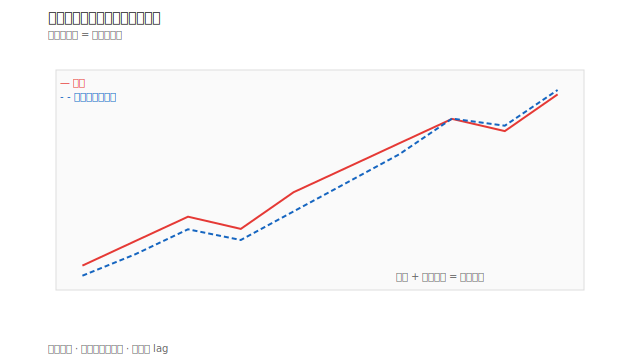
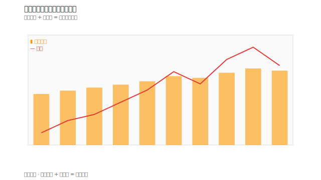

# 籌碼圖表怎麼看

## 本篇你會學到

- 法人累計圖、融資餘額圖的讀法
- 圖與表的對照

[← 圖表總覽](index.md) · 本分類：**籌碼類圖表**（與 K 線、基本面圖不同）

## 法人累計買賣超圖

| 圖形特徵 | 解讀 |
|----------|------|
| 累計線向上 | 近期法人淨買超為主 |
| 累計線向下 | 近期法人淨賣超為主 |
| 股價漲 + 累計向上 | 籌碼與價格一致 |
| 股價漲 + 累計向下 | 價漲量縮籌碼，警惕 |

對照 [三大法人表](../03-tables/institutional.md)。

## 融資餘額趨勢圖

| 圖形特徵 | 解讀 |
|----------|------|
| 融資餘額攀升 + 股價漲 | 散戶槓桿增加 |
| 融資餘額急降 + 股價跌 | 可能斷頭或停損潮 |
| 融資餘額橫盤 | 籌碼安定 |

對照 [融資融券表](../03-tables/margin.md)。

## 集保大戶持股變化

週資料，適合**中線**：

- 大戶（400–1000 張以上）持股增加 → 籌碼集中。
- 散戶級距增加 → 籌碼分散。

## 閱讀流程

## 重點回顧

- 籌碼圖是**趨勢化**呈現表格資料，便於看連續性。
- 背離（價與籌碼相反）值得特別筆記。
- 資料有 lag，勿當即時 tick 使用。

相關：[法人術語](../02-glossary/chips.md) · [法人案例](../07-cases/institutional-flow.md)
