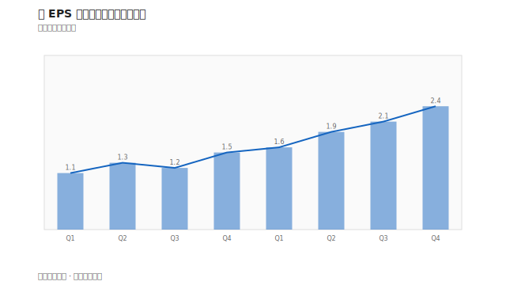
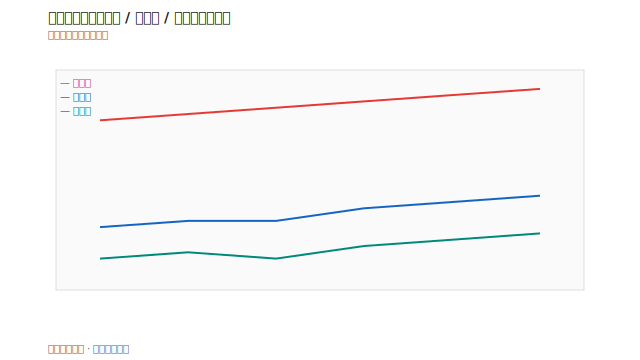
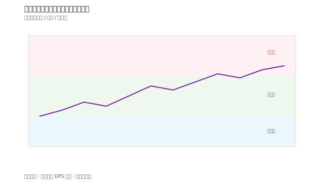
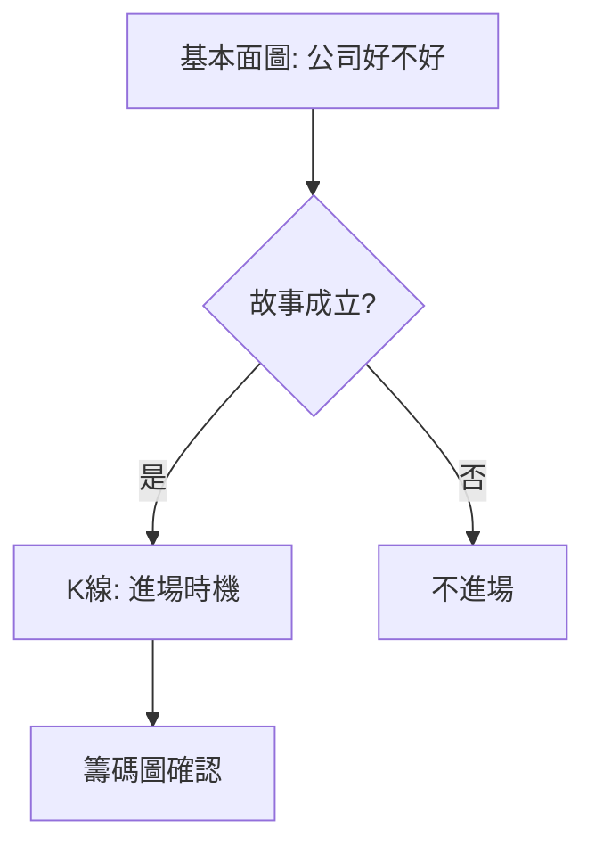

# 基本面圖表

## 本篇你會學到

- 營收、獲利、估值趨勢圖怎麼讀
- 基本面圖與 K 線圖的分工
- 中長線投資者必看的圖表類型

[← 圖表總覽](index.md)

---

## 為什麼需要另一類圖

K 線與指標描述**市場行為**；基本面圖描述**公司營運數字隨時間的變化**。

| 圖表類型 | 資料來源 | 回答 |
|----------|----------|------|
| K 線 | 成交價 | 市場怎麼定價 |
| **營收柱狀圖** | 月營收公告 | 業績有沒有成長 |
| **EPS 折線** | 季報 | 獲利趨勢 |
| **三率趨勢** | 季報 | 毛利率、營益率變化 |
| **估值歷史帶** | 股價÷EPS 等 | 現在貴還是便宜 |

---

## 月營收柱狀圖

| 讀法 | 說明 |
|------|------|
| 柱高上升 | 營收規模擴大 |
| 連續 MoM 正成長 | 短期動能佳 |
| YoY 轉正 | 常見轉折訊號 |

對照 [月營收表](../03-tables/revenue.md) · 案例 [營收轉折](../07-cases/revenue-turn.md)。

軟體常以**雙軸圖**呈現：柱狀 = 營收，折線 = 股價（觀察是否 lead/lag）。

案例對照：[營收轉折](../07-cases/revenue-turn.md)

---

## 獲利與三率趨勢圖

| 圖 | 重點 |
|----|------|
| EPS 走勢 | 一季一季是否成長 |
| 毛利率曲線 | 產品競爭力 |
| 營益率 | 本業賺錢能力 |

對照 [財報摘要](../03-tables/financials.md) · [三率術語](../02-glossary/fundamentals.md#三率)。

---

## 估值趨勢圖

| 類型 | 用途 |
|------|------|
| PER 歷史帶 | 目前 PER 在歷史高位還是低位 |
| PBR 走勢 | 資產型或金融股常參考 |
| 殖利率曲線 | [存股](../08-investing/dividend-investing.md) 參考 |

!!! warning
    景氣循環股在獲利頂峰時 PER 可能**看起來很低**——這是陷阱，見 [估值陷阱案例](../07-cases/valuation-trap.md)。

---

## 與 K 線對照閱讀

[中線](../08-investing/swing-mid.md) 與 [長線](../08-investing/long-term.md) 宜**先看基本面圖，再看 K 線位置**。

---

## 哪裡找到這些圖

| 來源 | 說明 |
|------|------|
| 券商 APP 個股頁 | 營收、財務圖表分頁 |
| 公開資訊觀測站 | 歷史數據下載 |
| [深入分析分頁](../03-tables/deep-dive-tabs.md) | 基本面、季報分頁 |

## 常見誤區

| 誤區 | 正確認知 |
|------|----------|
| 營收好圖就買 | 股價可能已反映，要看估值與位置 |
| PER 歷史低就撿便宜 | 循環股獲利頂峰時 PER 可能假象偏低 |
| 只看基本面圖不看 K 線 | 中長線仍要管**進場時機** |

## 自我檢查

??? question "1.（概念題）基本面圖與 K 線圖各回答什麼？"
    參考答案：基本面圖 → 公司**好不好**；K 線 → 市場**怎麼定價／何時進**。

??? question "2.（判斷題）月營收連續 MoM 正成長，可以不看季報？"
    參考答案：不行。月營收快但**毛利率、EPS** 才反映真實獲利，見 [財報表](../03-tables/financials.md)。

??? question "3.（情境題）PER 落在歷史低位，你還會查什麼？"
    參考答案：是否循環股獲利高點、營收趨勢、一次性收益；見 [估值陷阱](../07-cases/valuation-trap.md)。

## 重點回顧

- 基本面圖是**獨立大類**，不是 K 線的附屬。
- 營收看**趨勢**；估值看**歷史區間**。
- 延伸：[基本面框架](../05-analysis/fundamental-framework.md) · [估值表](../03-tables/valuation.md)
