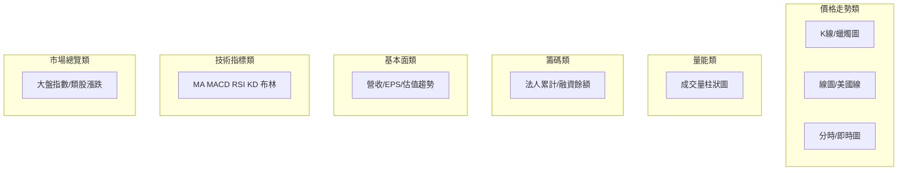

# 圖表總覽

## 本篇你會學到

- 看盤軟體裡有哪些**圖表分類**（K 線只是其中一類）
- 各類圖表回答什麼問題、適合哪種投資模式
- 建議閱讀順序

!!! tip "常見誤解"
    「學技術分析 = 學 K 線」——其實還有**分時圖、量價圖、籌碼圖、基本面趨勢圖**等，各自回答不同問題。

---

## 六大圖表分類

| 分類 | 回答的問題 | 專章 |
|------|------------|------|
| **K 線圖** | 這段時間多空誰贏？型態？ | [K 線基礎](kline-basics.md) 起 · [2330/0050 日K](../01-basics/quote-screen.md) |
| **線圖** | 收盤價趨勢是否單純向上？ | [線圖與美國線](line-charts.md) |
| **分時圖** | 今天盤中怎麼走？ | [分時與即時圖](intraday-charts.md) · [2330/0050 範例](../01-basics/quote-screen.md) |
| **量價圖** | 漲跌有沒有量配合？ | [量價圖](volume-price.md) · [2330/0050 範例](../01-basics/quote-screen.md) |
| **籌碼圖** | 誰在買賣？槓桿高嗎？ | [籌碼圖表](chips-charts.md) |
| **基本面圖** | 營收獲利趨勢如何？ | [基本面圖表](fundamental-charts.md) |
| **技術指標** | 趨勢/動能/超買超賣？ | [指標速查](indicator-quickref.md) |
| **大盤圖** | 整體市場風險？ | [大盤與類股圖](market-charts.md) |

---

## K 線子系列（本類最完整）

K 線是**價格走勢類**中最細的一支，本站拆為：

| 順序 | 頁面 |
|------|------|
| 1 | [K 線基礎](kline-basics.md) |
| 2 | [三招讀懂 K 線](kline-reading.md) |
| 3 | [16 種 K 棒型態](candle-patterns.md) |
| 4 | [型態速查表](candle-quickref.md) |
| 5 | [K 線組合型態](candle-combinations.md) |

技術指標（MA、MACD 等）常**疊加在 K 線圖上**，但屬於**指標類**，見下方。

---

## 依投資模式選圖

| 模式 | 優先圖表 | 輔助 |
|------|----------|------|
| [當沖](../08-investing/day-trade.md) | 分時、分 K、量價 | 大盤分時 |
| [隔日沖](../08-investing/overnight.md) | 日 K、量價 | 分時收盤段 |
| [短線](../08-investing/swing-short.md) | 日 K + 指標 | 籌碼圖 |
| [中線](../08-investing/swing-mid.md) | 日/週 K、基本面圖 | 法人累計 |
| [長線](../08-investing/long-term.md) | 週月 K、基本面圖 | 估值趨勢 |
| [ETF](../08-investing/etf-investing.md) | 大盤圖、線圖 | 持股配置 |

---

## 圖 vs 表

| 圖表 | 對應表格 |
|------|----------|
| 量價 | [個股總覽](../03-tables/watchlist.md) |
| 籌碼圖 | [法人](../03-tables/institutional.md)、[融資融券](../03-tables/margin.md) |
| 基本面圖 | [營收](../03-tables/revenue.md)、[財報](../03-tables/financials.md) |
| K 線+指標 | [評分表](../03-tables/scoring.md) 技術因子 |

圖看**趨勢與型態**；表看**精確數字**。兩者宜對照。

---

## 建議學習順序

> 全站路徑見 [首頁](../index.md)。以下為**看圖章**建議順序（請先選定 [投資模式](../08-investing/index.md)）。

=== "完全新手"

    1. [報價畫面](../01-basics/quote-screen.md)
    2. [線圖](line-charts.md)（最簡單的趨勢）
    3. [K 線基礎](kline-basics.md)
    4. [量價圖](volume-price.md)

=== "已有 K 線基礎"

    1. [分時圖](intraday-charts.md) 或 [籌碼圖](chips-charts.md)（依模式）
    2. [指標速查](indicator-quickref.md)
    3. [基本面圖](fundamental-charts.md)（中線以上）

---

## 重點回顧

- **K 線**是價格圖的一種，不是全部圖表。
- 先選[投資模式](../08-investing/index.md)，再選圖表組合。
- 下一步：依上表進入對應專章。
