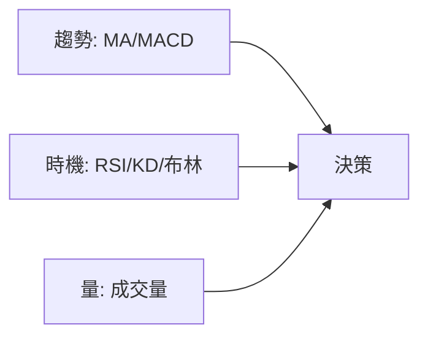

# 技術指標速查表

[← 圖表總覽](index.md) · 本分類：**技術指標類**（常疊加在 K 線圖上）

## 本篇你會學到

- 五大指標一頁對照
- 各指標適合回答什麼問題

詳細教學請點各指標連結。建議先完成 [K 線單元](kline-basics.md)。

## 總表

| 指標 | 回答什麼 | 常見參數 | 偏多訊號（簡化） | 偏空訊號（簡化） | 詳細 |
|------|----------|----------|------------------|------------------|------|
| **MA 均線** | 趨勢方向 | 5/10/20/60 | 價格站上均線、黃金交叉 | 價格跌破均線、死亡交叉 | [MA](ma.md) |
| **MACD** | 趨勢動能 | 12,26,9 | DIF 上穿 Signal、零軸上金叉 | DIF 下穿 Signal、頂背離 | [MACD](macd.md) |
| **RSI** | 過熱過冷 | 14 | 超賣區回升、50 以上 | 超買區回落、50 以下 | [RSI](rsi.md) |
| **KD** | 短線位置 | 9,3,3 | 低檔 K 上穿 D | 高檔 K 下穿 D | [KD](kd.md) |
| **布林** | 波動範圍 | 20,2 | 下軌反彈、沿上軌多頭 | 上軌受阻、沿下軌空頭 | [布林](bollinger.md) |

## 時間框架建議

| 框架 | 優先指標 |
|------|----------|
| 當沖 | MA5/10、KD、成交量 |
| 短線 | MA20、MACD、RSI |
| 中線 | MA60、MACD、布林 |
| 長線 | MA120/240、基本面（非指標） |

## 搭配原則

- **趨勢指標**（MA、MACD）告訴你「大方向」
- **震盪指標**（RSI、KD）告訴你「短線冷熱」
- **布林**告訴你「波動是否變大」
- 三者同向時訊號較一致，但仍需 [停損](../06-risk/stop-loss.md)

## 重點回顧

- 沒有萬用指標；當沖重 MA+量，波段重 MA+MACD。
- 指標是滯後或統計工具，不能取代 [K 線位置](candle-patterns.md) 判斷。

相關：[技術面術語](../02-glossary/technical.md) · [MACD 背離案例](../07-cases/macd-divergence.md)
