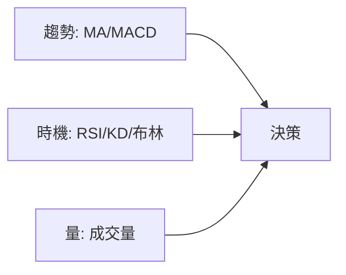

# 技術指標速查表

[← 圖表總覽](index.md) · 本分類：**技術指標類**（常疊加在 K 線圖上）

## 本篇你會學到

- 五大指標一頁對照
- 各指標適合回答什麼問題

詳細教學請點各指標連結。建議先完成 [K 線單元](kline-basics.md)。

## 總表

| 指標 | 回答什麼 | 常見參數 | 偏多訊號（簡化） | 偏空訊號（簡化） | 詳細 |
|------|----------|----------|------------------|------------------|------|
| **MA 均線** | 趨勢方向 | 5/10/20/60 | 價格站上均線、黃金交叉 | 價格跌破均線、死亡交叉 | [MA](ma.md) |
| **MACD** | 趨勢動能 | 12,26,9 | DIF 上穿 Signal、零軸上金叉 | DIF 下穿 Signal、頂背離 | [MACD](macd.md) |
| **RSI** | 過熱過冷 | 14 | 超賣區回升、50 以上 | 超買區回落、50 以下 | [RSI](rsi.md) |
| **KD** | 短線位置 | 9,3,3 | 低檔 K 上穿 D | 高檔 K 下穿 D | [KD](kd.md) |
| **布林** | 波動範圍 | 20,2 | 下軌反彈、沿上軌多頭 | 上軌受阻、沿下軌空頭 | [布林](bollinger.md) |

## 時間框架建議

| 框架 | 優先指標 |
|------|----------|
| 當沖 | MA5/10、KD、成交量 |
| 短線 | MA20、MACD、RSI |
| 中線 | MA60、MACD、布林 |
| 長線 | MA120/240、基本面（非指標） |

## 搭配原則

```mermaid
flowchart LR
    A[趨勢: MA/MACD] --> C[決策]
    B[時機: RSI/KD/布林] --> C
    D[量: 成交量] --> C
```

- **趨勢指標**（MA、MACD）告訴你「大方向」
- **震盪指標**（RSI、KD）告訴你「短線冷熱」
- **布林**告訴你「波動是否變大」
- 三者同向時訊號較一致，但仍需 [停損](../06-risk/stop-loss.md)
- 想分辨**接盤 vs 追高**：用四層框架 → [手冊：接盤還是追高](catch-or-chase.md)

## 接盤／追高一覽（極簡）

| 疑慮 | 優先看 | 詳見 |
|------|--------|------|
| 是不是接盤？ | 均線空方 + MACD **零軸下**金叉 + 縮量反彈 | [手冊：接盤還是追高](catch-or-chase.md) · [案例十七：弱勢反彈](../07-cases/weak-rebound-trap.md) |
| 是不是追高？ | 頂背離、高檔量縮、乖離過大 | [手冊：接盤還是追高](catch-or-chase.md) · [案例：MACD 頂背離](../07-cases/macd-divergence.md) |

## 自我檢查

??? question "1.（概念題）MA/MACD 與 RSI/KD 各回答什麼？"
    參考答案：**趨勢**（大方向）vs **震盪**（短線冷熱）；詳見各指標教學頁。

??? question "2.（判斷題）五個指標都偏多，可以不加停損全倉？"
    參考答案：不行。指標**滯後**且可能假訊號；仍須 [停損](../06-risk/stop-loss.md) 與位置判斷。

??? question "3.（情境題）當沖族優先盯哪幾個指標？"
    參考答案：**MA5/10、KD、成交量**；波段則重 MA+MACD，見本篇時間框架表。

## 各指標深度教學

每個指標的專章已包含**信號分級表**、**評估框架**與**搭配確認方法**：

| 指標 | 新增深度內容 |
|------|------------|
| [MA](ma.md) | 多均線排列分級、乖離率、扣抵值、交叉五維度評分 |
| [MACD](macd.md) | 三層解讀、柱狀圖縮頭領先信號、背離分級、多時間框架 |
| [RSI](rsi.md) | 趨勢環境區間修正、失敗擺盪、信號強度評估表 |
| [KD](kd.md) | 交叉位置分級、鈍化應對策略、J 值、雙指標搭配 |
| [布林](bollinger.md) | %B 精確位置、帶寬量化、擠壓戰法、四種市場狀態 |

學完各指標後 → **[圖表綜合評估框架](chart-evaluation.md)**：五層信號匯流系統。

## 重點回顧

- 沒有萬用指標；當沖重 MA+量，波段重 MA+MACD。
- 指標是滯後或統計工具，不能取代 [K 線位置](candle-patterns.md) 判斷。
- 多指標同向（信號匯流）時可信度遠高於單一指標。

## 相關

- 手冊：[接盤還是追高](catch-or-chase.md) · [速查：接盤／追高](catch-chase-quickref.md) · [圖表綜合評估](chart-evaluation.md)
- 定義：[技術面術語](../02-glossary/technical.md)
- 案例：[MACD 頂背離](../07-cases/macd-divergence.md) · [追高陷阱](../07-cases/chase-high-trap.md) · [健康回檔](../07-cases/healthy-pullback.md)
