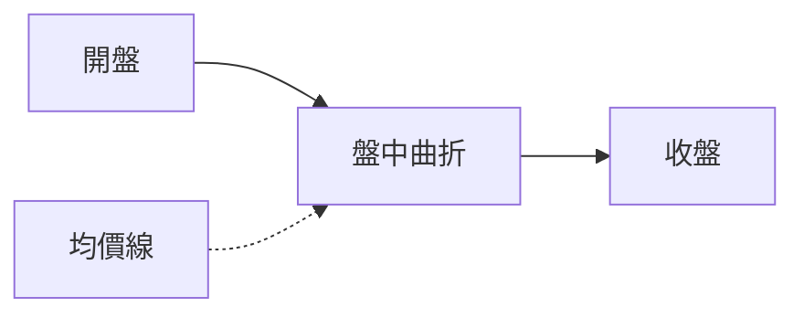

# 分時與即時圖

## 本篇你會學到

- 分時圖（走勢圖、江波圖）怎麼讀
- 盤中時間熱點：為何早盤宜集中觀望走向
- 分 K 與日 K 的差異
- 當沖、隔日沖為何依賴這類圖

[← 圖表總覽](index.md)

!!! example "實例圖"
    2330、0050 分時走勢**教學示意**（含均價、昨收線）：


更多報價布局見 **[報價畫面](../01-basics/quote-screen.md)**。

---

## 分時圖（走勢圖）

| 項目 | 說明 |
|------|------|
| **橫軸** | 當日交易時間（09:00–13:30） |
| **縱軸** | 價格 |
| **曲線** | 依時間連接成交價，形成當日走勢 |
| **常見輔線** | **均價線**（當日成交加權均價） |

口語「**江波圖**」常指此類盤中走勢圖。



---

## 怎麼讀

| 現象 | 常見解讀 |
|------|----------|
| 價格在均價線上方 | 當日偏強 |
| 開高走低 | [開高走低](../02-glossary/quotes.md#開高開低) |
| 尾盤急拉 | 可能影響收盤 K 線形態 |
| 量（若顯示） | 配合 [量價](volume-price.md) |

!!! note "與 K 線的關係"
    同一交易日，分時圖是**過程**；日 K 是**結果摘要**。見 [K 線是簡化的結果](kline-basics.md#k-線是簡化的結果)。

---

## 盤中時間熱點：早盤宜集中觀望 {#盤中時間熱點早盤宜集中觀望}

台股連續撮合 **09:00–13:30**，但成交量與波動**並非均勻分布**。短線常說「熱點在 10:30 前」——白話是：**開盤後約 1～1.5 小時，最值得集中盯盤、判斷當日走向**；不是說 10:30 後就不能交易。

```mermaid
gantt
    title 盤中時間熱點（教學示意）
    dateFormat HH:mm
    axisFormat %H:%M
    section 盤前
    試撮 08:30-09:00 :08:30, 30m
    section 早盤熱區
    開盤亂流 09:00-09:30 :09:00, 30m
    方向試探 09:30-10:30 :09:30, 60m
    section 中段
    常較平淡 10:30-13:00 :10:30, 150m
    section 尾盤
    平倉與收盤 13:00-13:30 :13:00, 30m
```

| 時段 | 常見現象 | 短線建議 |
|------|----------|----------|
| **09:00–09:30** | 跳空、試撮後第一輪買賣；散戶情緒交易集中 | **先觀望**，判斷大盤氛圍與個股是否站穩均價線；開盤壓力大時少追 → [期貨輔助](../09-advanced/futures-signal.md) |
| **09:30–10:30** | 量能仍高，當日多空方向較明朗 | 當沖主戰區；隔日沖隔日**最關鍵 30 分鐘**在此區間前半 |
| **10:30–13:00** | 整體常趨平淡 | 已有部位依計畫持倉；新進場須更嚴格篩選 |
| **13:00–13:30** | 當沖平倉、收盤 K 形態 | 當沖須規劃強制出場，見 [當沖](../08-investing/day-trade.md) |

### 為什麼「前面要更集中觀望」？

1. **資訊最密集**：夜盤、08:45 期貨、09:00 現貨開盤的訊號在這段一次釋放。
2. **假突破多**：開盤 15 分鐘內的急拉急跌，常是情緒而非趨勢定論。
3. **錯過代價大**：短線若開盤方向判錯，後面補救空間小；中長線則影響較小。

!!! tip "紀律切點（教學參考）"
    - **09:30**：開盤亂流過後再考慮首次進場（期貨續跌時尤其適用）。
    - **10:30**：早盤主戰區尾聲；此後新開倉須有明確理由，勿因無聊而交易。
    - 以上為**觀望框架**，非絕對規則；尾盤對當沖同樣關鍵。

| 模式 | 早盤觀望重點 |
|------|--------------|
| [當沖](../08-investing/day-trade.md) | 09:00–10:30 集中盯；13:20 前平倉 |
| [隔日沖](../08-investing/overnight.md) | 隔日 09:00–09:30 決定出場或加碼 |
| [短線](../08-investing/swing-short.md) | 每日 1～2 次檢視即可，不必盤中全時 |
| 中長線 / ETF | 偶爾看分時即可，以日週 K 為主 |

---

## 分 K 圖（1 分、5 分…）

| 項目 | 說明 |
|------|------|
| **每根 K** | 代表 1 / 5 / 15 分鐘等區間 |
| **用途** | [當沖](../08-investing/day-trade.md)、[短線](../08-investing/swing-short.md) 進出點 |
| **優點** | 比日 K 細，可看盤中型態 |
| **缺點** | 雜訊多，需嚴格停損 |

週期對照見 [K 線時間週期](kline-basics.md#時間週期)。

---

## Tick 明細

逐筆成交列表（時間、價、量、內外盤），是更細的資料，見 [報價畫面](../01-basics/quote-screen.md#分時成交明細tick)。

---

## 適用模式

| 模式 | 建議圖 |
|------|--------|
| 當沖 | 分時 + 1/5 分 K + 五檔 |
| 隔日沖 | 日 K + 收盤前分時 |
| 中長線 | 偶爾看即可，以日週 K 為主 |

## 常見誤區

| 誤區 | 正確認知 |
|------|----------|
| 開盤 5 分鐘就全倉 | 早盤假突破多，宜觀望至 09:30 後 |
| 分K 訊號當日K結論 | 週期不同，雜訊量不同 |
| 中長線每天盯分時 | 以日週 K 為主，分時僅輔助 |

## 自我檢查

??? question "1.（概念題）分時圖與 5 分 K 差在哪？"
    參考答案：分時是**當日價格路徑**；分 K 是把短區間收成**開高低收**一根棒。

??? question "2.（判斷題）當沖族可以忽略 13:20 前平倉？"
    參考答案：不行。當沖須在收盤前處理部位，見 [當沖模式](../08-investing/day-trade.md)。

??? question "3.（情境題）期貨開盤大跌，你至少觀望到幾點再考慮進場（教學參考）？"
    參考答案：**09:30** 後再評估，避開開盤亂流；仍須依個人計畫。

## 重點回顧

- **分時圖**看當日路徑；**分 K** 是短週期 K 線。
- 早盤（尤其 09:00–10:30）宜**集中觀望走向**，再決定是否進場。
- 盤中圖與日 K 互補，不可只選其一。
- 延伸：[報價畫面](../01-basics/quote-screen.md) · [當沖模式](../08-investing/day-trade.md)
