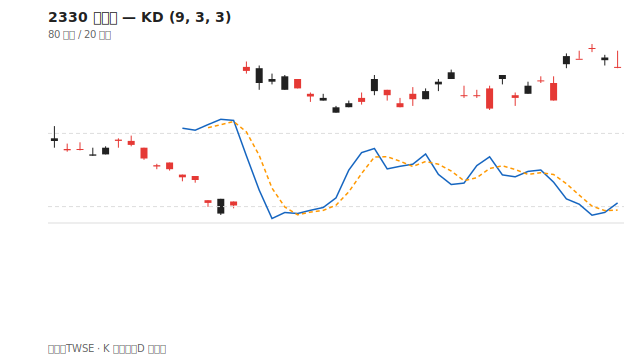

# KD 指標

## 本篇你會學到

- K 線、D 線的意義
- 超買超賣與交叉訊號

## 定義

**KD（隨機指標）** 比較收盤價在近期高低區間中的相對位置。常見參數 **9, 3, 3**。

| 線 | 說明 |
|----|------|
| **K 線** | 較敏感 |
| **D 線** | K 的移動平均，較平滑 |

## 區間解讀

| 區間 | 標籤 |
|------|------|
| K, D > 80 | 超買區 |
| K, D < 20 | 超賣區 |

## 交叉訊號

| 現象 | 簡化解讀 |
|------|----------|
| K 上穿 D（低檔） | 短線買訊參考 |
| K 下穿 D（高檔） | 短線賣訊參考 |
| 高檔鈍化 | K、D 黏在 80 以上，強勢延續 |
| 低檔鈍化 | 弱勢延續，勿急著抄底 |

## 與 RSI 的差異

| 指標 | 側重 |
|------|------|
| RSI | 漲跌力道 |
| KD | 收盤在區間的位置 |

兩者同向超買/超賣時，短線修正機率較高，但仍非必然。

## 讀圖三步驟

1. **區間**：K、D 在 80 以上還是 20 以下？
2. **交叉**：K 上穿或下穿 D？發生在什麼區間？
3. **鈍化**：強勢股 K、D 可長期黏在 80 以上——勿機械認為超買必跌

## 搭配確認

| 情境 | 解讀 |
|------|------|
| 20 以下金叉 | 短線買訊參考 |
| 80 以上死叉 | 短線賣訊參考 |
| 與 RSI 同向超買 | 短線修正機率增 |

## 自我檢查

??? question "1.（概念題）KD 的 K 線與 D 線差在哪？"
    參考答案：K 較敏感；D 是 K 的移動平均、較平滑。

??? question "2.（判斷題）K、D 黏在 80 以上叫什麼？代表必跌嗎？"
    參考答案：**高檔鈍化**；強勢股可延續，不代表立刻下跌。

??? question "3.（情境題）20 以下 K 上穿 D，該注意什麼？"
    參考答案：低檔金叉是短線買訊**參考**，仍須對照趨勢與量，非保證反轉。

## 重點回顧

- KD 適合**短線**與盤整市，趨勢市易鈍化。
- 交叉要看發生在**高檔還是低檔**。
- 速查：[指標速查表](indicator-quickref.md)

相關：[KD 術語](../02-glossary/technical.md#kd)
