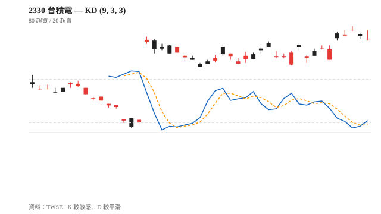
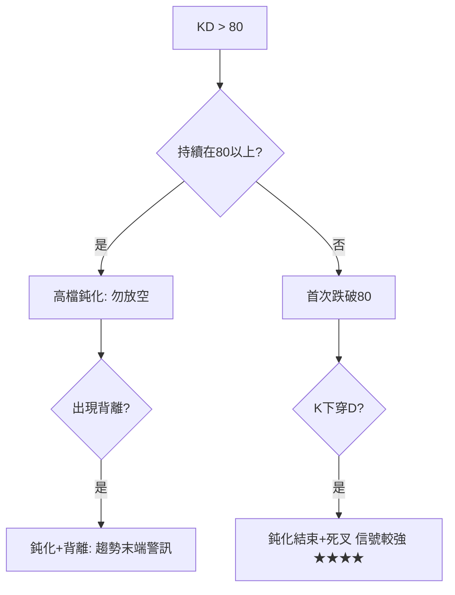

# KD 指標（隨機指標）

## 本篇你會學到

- KD 的計算邏輯與參數意義
- 超買超賣的**趨勢修正**（與 RSI 相同概念）
- 交叉訊號的**位置分級與信號強度**
- **鈍化現象**的正確應對策略
- J 值的輔助參考
- KD 與 RSI 如何搭配形成更完整的評估

## 定義與計算概念

**KD（Stochastic Oscillator）** 衡量收盤價在近期高低區間中的相對位置。

### 計算邏輯（白話）

| 步驟 | 公式 | 意義 |
|------|------|------|
| RSV | (今收 − 9日最低) ÷ (9日最高 − 9日最低) × 100 | 收盤在近9日高低範圍中的**相對位置** |
| K 值 | 前日K × 2/3 + 今日RSV × 1/3 | RSV 的平滑值（較敏感） |
| D 值 | 前日D × 2/3 + 今日K × 1/3 | K 的平滑值（更平滑） |
| J 值 | 3K − 2D | K 與 D 差距的放大（非所有軟體顯示） |

常見參數 **9, 3, 3**（9日區間、K平滑 3、D平滑 3）。

!!! tip "核心觀念"
    KD 告訴你的是：「收盤價落在近期波動範圍的哪個位置？」K=80 代表收盤接近近9日的最高點；K=20 代表接近最低點。

---

## 區間解讀與趨勢修正 {#區間修正}

### 標準區間

| 區間 | 標籤 | 教科書操作 |
|------|------|-----------|
| K, D > 80 | 超買區 | 留意賣訊 |
| K, D < 20 | 超賣區 | 留意買訊 |
| 20–80 | 中性區 | 觀望或順勢 |

### 趨勢環境修正（同 [RSI 區間修正](rsi.md#區間修正) 邏輯）

| 環境 | KD 超買警戒 | KD 超賣觀察 | 說明 |
|------|-----------|-----------|------|
| **強勢多頭** | > 90 | < 50 | 多頭市 KD 常在 50–90 波動 |
| **一般市場** | > 80 | < 20 | 標準 |
| **弱勢空頭** | > 70 | < 15 | 空頭市 KD 常在 15–70 波動 |

---

## 交叉信號：位置分級 {#交叉分級}

KD 交叉的價值**完全取決於發生位置**：

| 交叉位置 | 信號類型 | 強度 | 說明 |
|---------|---------|------|------|
| **20 以下金叉** | 超賣區反轉信號 | ★★★★ | 最有價值的買訊 |
| **20–50 金叉** | 偏低區金叉 | ★★★ | 需配合趨勢確認 |
| **50–80 金叉** | 中性區金叉 | ★★ | 可能是盤整中的波動 |
| **80 以上金叉** | 超買區金叉 | ★ | 通常無意義（已在高位） |
| **80 以上死叉** | 超買區反轉信號 | ★★★★ | 最有價值的賣訊 |
| **50–80 死叉** | 偏高區死叉 | ★★★ | 需配合趨勢確認 |
| **20–50 死叉** | 偏低區死叉 | ★★ | 可能是弱勢中的波動 |
| **20 以下死叉** | 超賣區死叉 | ★ | 通常無意義（已在低位） |

### 交叉信號強度五維度

| 維度 | 強信號 | 弱信號 |
|------|--------|--------|
| **位置** | 極端區（<20 或 >80） | 中性區（40–60） |
| **角度** | K 線以大角度穿越 D | 幾乎平行纏繞 |
| **趨勢配合** | 均線方向一致 | 均線反向 |
| **量能** | 交叉日放量 | 量縮 |
| **二次確認** | K 穿越後拉開距離 | 穿越後立刻回纏 |

---

## 鈍化現象與應對策略 {#鈍化}

### 什麼是鈍化

當股價走出**單邊趨勢**時，KD 會長期停留在超買或超賣區，此時交叉信號**失效**。

| 鈍化類型 | 現象 | 代表 |
|---------|------|------|
| **高檔鈍化** | K、D 黏在 80 以上反覆 | 強勢多頭持續上漲 |
| **低檔鈍化** | K、D 黏在 20 以下反覆 | 弱勢空頭持續下跌 |

### 鈍化的判讀策略

| 策略 | 做法 | 說明 |
|------|------|------|
| **不反向操作** | 高檔鈍化時不放空、低檔鈍化時不抄底 | KD 在趨勢市中是「強度指標」非「反轉指標」 |
| **等鈍化結束** | KD 從超買區**首次跌破 80** 或從超賣區**首次站上 20** | 鈍化結束後的首次交叉信號較可靠 |
| **改看 MACD** | 鈍化期間 KD 失效，改用趨勢指標 | [MACD](macd.md) 在趨勢市更適用 |
| **看背離** | 鈍化期間若出現背離，代表趨勢可能快結束 | 鈍化 + 背離 = 最強反轉預警 |

```mermaid
flowchart TD
    A[KD > 80] --> B{持續在80以上?}
    B -->|是| C[高檔鈍化: 勿放空]
    B -->|否| D[首次跌破80]
    D --> E{K下穿D?}
    E -->|是| F[鈍化結束+死叉 信號較強 ★★★★]
    C --> G{出現背離?}
    G -->|是| H[鈍化+背離: 趨勢末端警訊]
```

---

## J 值輔助判讀 {#j值}

J = 3K − 2D，是 K 與 D 差距的放大版。

| J 值範圍 | 意義 | 參考 |
|---------|------|------|
| J > 100 | 極度超買，短線過熱 | 強勢股仍可能持續 |
| J < 0 | 極度超賣，短線過冷 | 弱勢股仍可能持續 |
| J 由負轉正 | 動能由空轉多的極早信號 | 比 K 穿 D 更快但雜訊多 |
| J 由正轉負 | 動能由多轉空的極早信號 | 同上 |

!!! note "J 值定位"
    J 值在台股軟體中不一定顯示。它是 KD 的「加速版」，訊號更快但假訊號也更多。適合搭配其他指標做輔助確認，不宜單獨使用。

---

## KD 信號綜合評估 {#信號評估}

| 評估項目 | 強看漲 (+2) | 偏看漲 (+1) | 中性 (0) | 偏看跌 (−1) | 強看跌 (−2) |
|---------|------------|------------|---------|------------|------------|
| KD 位置 | <20 超賣 | 20–35 偏低 | 35–65 | 65–80 偏高 | >80 超買 |
| 交叉 | 20 以下金叉 | 50 以下金叉 | 無交叉 | 50 以上死叉 | 80 以上死叉 |
| 鈍化 | 低檔鈍化結束+站上20 | — | 無鈍化 | — | 高檔鈍化結束+跌破80 |
| 背離 | KD 底背離 | — | 無 | — | KD 頂背離 |
| 趨勢配合 | 均線多頭+KD回檔 | — | 盤整 | — | 均線空頭+KD反彈 |

| 總分 | 判定 | 操作建議 |
|------|------|---------|
| +6 以上 | 短線強看漲 | 積極找買點 |
| +3 ~ +5 | 短線偏看漲 | 小量試單，搭配確認 |
| −2 ~ +2 | 中性 | 觀望 |
| −5 ~ −3 | 短線偏看跌 | 減碼或觀望 |
| −6 以下 | 短線強看跌 | 不做多 |

---

## KD vs RSI：互補使用 {#kd-vs-rsi}

| 比較項目 | KD | RSI |
|---------|-----|------|
| 側重 | 收盤在區間的**位置** | 漲跌的**力道比例** |
| 速度 | 較快（對短期敏感） | 較慢（14日平滑） |
| 適用 | 盤整市短線 | 趨勢市動能判斷 |
| 鈍化 | 更容易鈍化 | 較少鈍化 |
| 最佳使用 | 盤整區找買賣點 | 趨勢中判斷動能 |

### 雙指標搭配評估

| KD 狀態 | RSI 狀態 | 綜合判讀 |
|---------|---------|---------|
| 超賣金叉 | 超賣回升 | **雙重確認**，短線反彈機率高 ★★★★★ |
| 超買死叉 | 超買回落 | **雙重確認**，短線修正機率高 ★★★★★ |
| 超賣金叉 | RSI 仍低但未超賣 | 單一確認，信號中等 ★★★ |
| 高檔鈍化 | RSI 持續 > 60 | 趨勢仍強，勿逆勢 |

---

## 常見誤用

| 誤用 | 正確認知 |
|------|----------|
| 高檔鈍化就放空 | 鈍化 = 強勢延續，不是反轉信號 |
| 中性區交叉就操作 | 50 附近交叉雜訊多，要在極端區才有意義 |
| KD 當唯一依據 | KD 是震盪指標，趨勢市要搭配 MA/MACD |
| 不分環境用 80/20 | 多頭市 KD 常在 50–90，空頭市在 15–70 |
| 忽略鈍化期間的背離 | 鈍化 + 背離 = 最強反轉預警 |

---

## 讀圖五步驟（評估流程）

1. **環境**：先判斷多頭/空頭/盤整 → 決定 KD 適用性（盤整最佳）
2. **位置**：K、D 在超買/超賣/中性？→ 用趨勢修正後的區間
3. **交叉**：有無金叉/死叉？發生在什麼位置？→ 位置分級
4. **鈍化**：是否正在鈍化？→ 鈍化中暫停使用交叉信號
5. **搭配**：RSI 是否同向？量能與 K 線是否配合？→ 綜合評分

---

## 自我檢查

??? question "1.（概念題）KD 的 K 值計算邏輯，白話怎麼說？"
    參考答案：K 是 RSV 的平滑值。RSV = 收盤在過去 9 日高低範圍中的相對位置（百分比）。K=80 代表收盤接近近 9 日最高點。

??? question "2.（判斷題）K、D 黏在 80 以上（高檔鈍化）該放空嗎？"
    參考答案：不該。高檔鈍化代表**強勢延續**。應等鈍化結束（K 首次跌破 80）且出現死叉時再評估。

??? question "3.（情境題）20 以下 K 上穿 D + RSI 也超賣回升，你怎麼評估？"
    參考答案：**雙重確認**，短線反彈機率高（★★★★★）。但仍須確認均線方向——若空頭排列，可能僅是弱勢反彈。

??? question "4.（進階題）KD 高檔鈍化期間出現 KD 頂背離，代表什麼？"
    參考答案：這是**最強的反轉預警**——趨勢仍強但動能已衰，一旦鈍化結束（K 跌破 80）+ 死叉，反轉確認度極高。

---

## 重點回顧

- KD 最適合**盤整市與短線**；趨勢市中易鈍化，此時改看 MACD。
- 交叉信號的價值取決於**位置**：極端區（<20, >80）才是黃金區。
- **鈍化**不是反轉信號，是趨勢延續的表現。鈍化結束後的首次交叉最值得關注。
- KD + RSI 雙重確認時，短線信號強度顯著提升。
- 速查：[指標速查表](indicator-quickref.md)

相關：[KD 術語](../02-glossary/technical.md#kd) · [RSI](rsi.md) · [圖表綜合評估](chart-evaluation.md) · [接盤還是追高](catch-or-chase.md)
