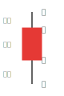
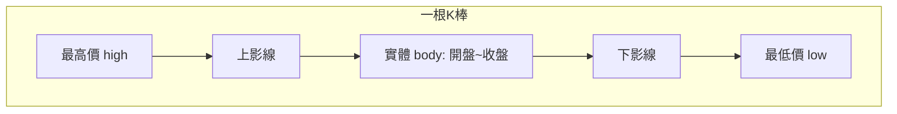

# K 線基礎

## 本篇你會學到

- K 線的起源與一根 K 棒代表什麼
- 開高低收、實體與影線的意義
- 台股紅黑K 慣例與影線占比判讀

!!! note "圖表分類"
    K 線屬於**價格走勢類**圖表之一。分時圖、量價圖、籌碼圖、基本面圖等見 **[圖表總覽](index.md)**。

## K 線是什麼

**K 線**（又稱 K 棒、日本蠟燭圖）起源於 17 世紀日本米市，由本間宗久將價格與時間記錄成圖，後來成為全球技術分析最常用的工具之一。

每一根 K 線代表**一個時間區間**內的價格走勢，由四個價格組成：

| 價格 | 英文 | 意義 |
|------|------|------|
| 開盤 | Open | 區間開始時的成交價 |
| 最高 | High | 區間內最高成交價 |
| 最低 | Low | 區間內最低成交價 |
| 收盤 | Close | 區間結束時的成交價 |

交易圈常說的「**開、高、低、收**」即指這四個數字。例如日 K 線：一根 K = 一個交易日的完整價格故事。

## 一根 K = 一段時間的拔河

可以把每根 K 棒想像成多方與空方在該時段內的拔河：

- **多方**：想把價格往上推
- **空方**：想把價格往下壓

若收盤較開盤上漲，代表多方在這段時間獲勝；反之則空方獲勝。

!!! tip "重點"
    「今天漲 3%」只告訴你**結果**，K 線還能告訴你**過程**——是完勝（長紅少影線）、險勝（長下影後收高），還是慘勝（長上影代表上方賣壓大）。這正是看 K 線的價值。

## K 棒結構

| 部位 | 計算 | 意義 |
|------|------|------|
| **實體** | \|收盤 - 開盤\| | 多空交戰的**結果** |
| **上影線** | 最高 - max(開,收) | 盤中拉高後被壓回的**過程** |
| **下影線** | min(開,收) - 最低 | 盤中殺低後被買回的**過程** |
| **整體長度** | 最高 - 最低 | 該時段波動幅度 |

**實體**呈現「最後誰贏」；**影線**呈現「中間曾發生什麼掙扎」。

## 紅K 與黑K {#紅-k-與黑-k}

### 台股慣例（本站預設）

| 顏色 | 條件 | 意義 |
|------|------|------|
| **紅K** | 收盤 ≥ 開盤 | 當根時段多方勝出 |
| **黑K** | 收盤 < 開盤 | 當根時段空方勝出 |

### 與西方軟體的差異

| 地區 | 上漲 K | 下跌 K |
|------|--------|--------|
| 台灣、中國 | 紅色 | 黑色或綠色 |
| 美國、歐洲常見 | 綠色或白色 | 紅色 |

使用 TradingView、Yahoo 等國際軟體時，請先確認配色設定，避免把顏色讀反。

!!! note "注意"
    紅K **不代表**相對昨收上漲。可能開高走低仍收紅K，但較昨收下跌。

## 實體大小

實體長度 = |收盤 - 開盤|。

| 大小 | 意義 |
|------|------|
| **長實體** | 趨勢明顯，一方占優，價格延續性較高 |
| **短實體** | 多空猶豫，常見於盤整或轉折前夕 |

大 / 中 / 小 的判定可參考**近 20 根 K 棒的平均實體**；若無歷史資料，則以實體占收盤價約 **4% / 1.5%** 為大 / 小的參考（詳見 [16 種型態](candle-patterns.md)）。

## 影線的訊息與占比

| 影線 | 常見解讀 |
|------|----------|
| 長上影 | 上方賣壓重，追高受阻 |
| 長下影 | 下方有買盤承接 |
| 上下都長 | 多空激烈交戰 |

### 影線占整體長度的比例

將上影線 + 下影線的長度，除以整根 K 的總長度（最高 - 最低），可判斷交戰激烈程度：

| 影線占比 | 解讀 |
|----------|------|
| **≤ 20%** | 阻力小，趨勢延續機率較高 |
| **20%～50%** | 阻力中等，方向較不明朗 |
| **≥ 50%** | 多空激戰激烈，宜謹慎、等待確認 |

此時實體 K 線（影線合計 ≤ 20%）通常代表趨勢較為單純；影線過長則需搭配 [16 種型態](candle-patterns.md) 進一步分類。

## K 線是簡化的結果 {#k-線是簡化的結果}

一根 K 線只記錄**四個價格**（開高低收），盤中實際走勢可能被濃縮成同一形狀：

| 盤中過程 | 可能畫出 |
|----------|----------|
| 早盤重挫，尾盤拉回 | 長下影紅K |
| 早盤上漲，尾盤急殺 | 長上影黑K |
| 兩種極端過程 | **相同**開高低收時，K 線長得一模一樣 |

因此讀 K 線時要記得：你看到的是**結果摘要**，不是分時圖的每一筆成交。需要盤中細節時，請切換**分 K** 或對照當日量價。

參考影片：[春哥 5 分鐘 K 線](../appendix/video-resources.md#春哥-spring-invest-k-線)

---

## 時間週期 {#時間週期}

同一檔股票可切換不同週期，每根 K 代表的時間不同：

| 週期 | 一根 K 代表 | 常見用途 |
|------|-------------|----------|
| 1 分 / 5 分 | 1 / 5 分鐘 | 當沖、極短線 |
| 30 分 / 60 分 | 30 / 60 分鐘 | 短線、當沖輔助 |
| 日 K | 一個交易日 | 波段、中期 |
| 週 K / 月 K | 一週 / 一月 | 長期趨勢 |

**日 K + 週 K** 是多數投資人分析趨勢的常用組合：日 K 看進出節奏，週 K 過濾短期雜訊、看清大方向。

範例：看 2330 的 **30 分 K**，每根 K 濃縮該 30 分鐘內的開高低收，讓你快速瀏覽價格變化過程。

## 單根 vs 組合

- **單根型態**：本站 [16 種型態](candle-patterns.md) 的重點。
- **組合型態**：兩根以上形成（如吞噬、晨星），見 [K 線組合型態](candle-combinations.md)。

## 建議閱讀順序

1. 本篇（結構與名詞）
2. [三招讀懂 K 線](kline-reading.md)（觀念與優缺點）
3. [16 種 K 棒型態](candle-patterns.md)（逐型態定義）
4. [型態速查表](candle-quickref.md)（實務查閱）

## 常見誤區

| 誤區 | 正確認知 |
|------|----------|
| 紅K = 今天漲 | 紅K只代表收 ≥ 開，未必相對昨收上漲 |
| 長上影 = 必跌 | 要看位置（高檔壓力 vs 低檔拒絕）與量 |
| 只看單根就下單 | 型態需搭配趨勢、量與次日確認 |
| 分K 與日K 混用結論 | 週期不同，訊號意義不同 |

## 自我檢查

??? question "1.（概念題）一根日K 由哪四個價格組成？"
    參考答案：**開盤、最高、最低、收盤**（開高低收）。

??? question "2.（判斷題）實體很長、上下影線都很短，通常代表什麼？"
    參考答案：該時段多空一方**完勝**，趨勢延續性通常較高（仍要看位置與量）。

??? question "3.（情境題）看到長下影紅K，你還會確認什麼？"
    參考答案：是否低檔、是否放量、能否站回 [均線](ma.md)；見 [鎚子線案例](../07-cases/hammer-ma.md)。

## 重點回顧

- 一根 K = 一個時間區間的開高低收，是多空拔河的濃縮。
- **實體**是結果，**影線**是過程。
- 影線占比 ≤ 20% 時，趨勢延續性通常較高。
- 下一步：[三招讀懂 K 線](kline-reading.md)。

相關：[行情術語](../02-glossary/quotes.md) · [鎚子線案例](../07-cases/hammer-ma.md)
