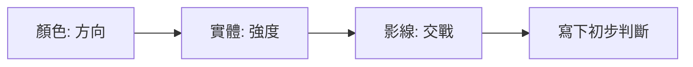
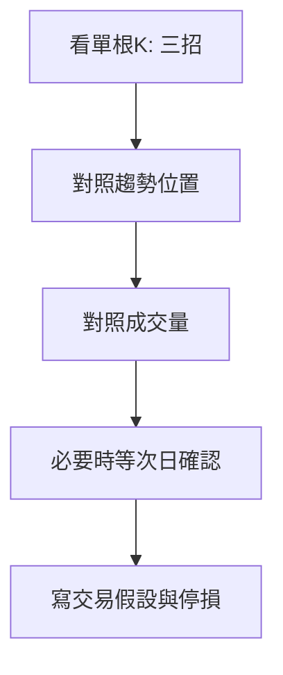

# 三招讀懂 K 線

## 本篇你會學到

- 快速讀 K 線的三個步驟
- K 線的優缺點與為何要看 K 線
- 不應單靠 K 線下判斷的原因

建議先讀 [K 線基礎](kline-basics.md)，再讀本篇建立觀念框架。

## 三招看懂 K 線

根據 [量化通 K 棒型態學](https://quantpass.org/kbar-pattern-1/) 的框架改寫，濃縮為三步驟：

| 步驟 | 看什麼 | 得到什麼 |
|------|--------|----------|
| **1. 顏色** | 紅 K 或黑 K | **方向**：紅 = 多方勝、黑 = 空方勝 |
| **2. 實體** | 實體長短 | **強度**：長實體 = 趨勢明確；短實體 = 猶豫 |
| **3. 影線** | 上下影線長短 | **交戰**：長影線 = 阻力大、方向不明 |

### 延續性組合（實務經驗）

| 組合 | 趨勢延續性 |
|------|------------|
| **長實體 + 短影線** | 高——一方明顯占優，較可能延續 |
| **短實體 + 長影線** | 低——多空拉鋸，可能變盤或盤整 |

此為參考框架，非保證；仍須搭配位置、成交量與大盤。

## 為什麼做交易要看 K 線？

### 1. 判斷市場多空力道

K 線直觀呈現多空力量：長紅少影線代表多方強勢；長黑少影線代表空方強勢；短實體長影線代表勢均力敵。

### 2. 訊號反應相對即時

每一根 K 代表一個週期的價格變動，比月營收、季報等基本面資料更即時，適合短線與當沖輔助判斷（但非唯一依據）。

### 3. 市場交易的共同語言

「大紅 K」「十字線」「鎚子」是交易員之間共通的描述方式，便於溝通與查閱 [16 種型態](candle-patterns.md)。

## K 線的優點

### 價格訊息直觀

四個價格（開高低收）一目了然，能快速掌握當日或當時段的價格變化與情緒。

### 幫助趨勢分析

連續 K 線的排列可觀察趨勢與型態；不同單根型態可能暗示反轉或延續（需搭配確認）。

## K 線的缺點

### 不適用於基本面分析

K 線只反映價格與成交量，不包含公司獲利、產業、總經等資訊。存股或價值投資仍需 [基本面](../05-analysis/three-pillars.md)。

### 不能作為單一分析工具

僅靠 K 線容易在盤整市場被假訊號误导。應搭配 [均線](ma.md)、[MACD](macd.md)、[成交量](../02-glossary/quotes.md#成交量)、[籌碼](../02-glossary/chips.md) 等。

### 無法預測突發事件

政策、災害、法說意外等無法從 K 線預知。即使做技術分析，仍應關注 [重大訊息](../05-analysis/conference.md) 與風險控管。

## 讀 K 線的實務流程

## 重點回顧

- 三招：顏色 → 實體 → 影線。
- 長實體短影線偏延續；短實體長影線偏猶豫。
- K 線是共通語言，但不是萬能工具。
- 下一步：[16 種 K 棒型態](candle-patterns.md) · [型態速查表](candle-quickref.md)

## 參考來源

- 型態分類框架參考 [量化通 QuantPass — 16種K線型態介紹](https://quantpass.org/kbar-pattern-1/)（K棒型態學一），本站為台股教學改寫，量化判斷門檻與相鄰 Stock Bot 工具一致。

相關：[K 線基礎](kline-basics.md) · [三大分析支柱](../05-analysis/three-pillars.md)
