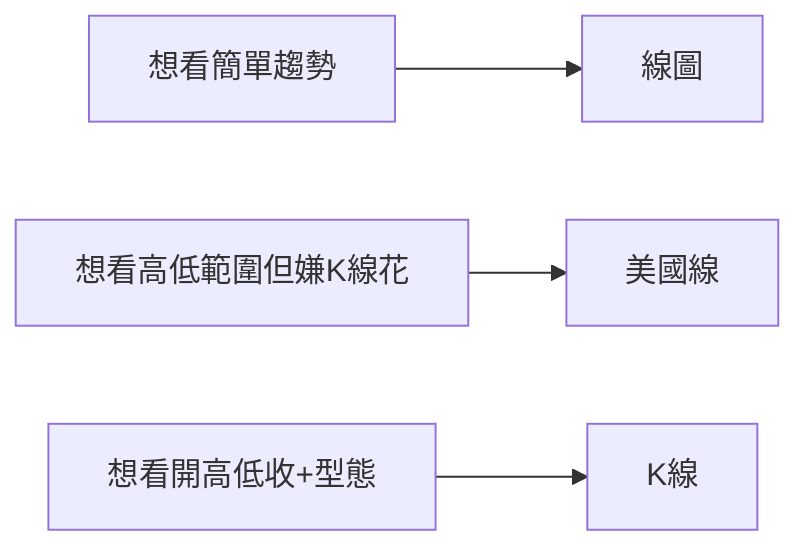
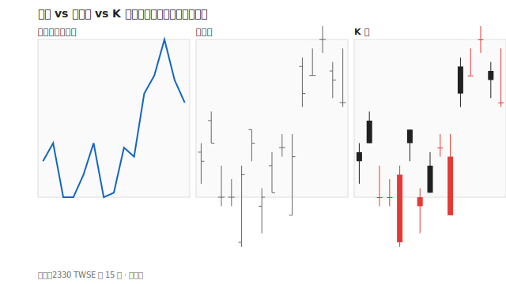

# 線圖與美國線

## 本篇你會學到

- 線圖、階梯圖、美國線（棒形圖）的差異
- 何時用線圖比 K 線更清楚
- 與 K 線的取捨

[← 圖表總覽](index.md)

---

## 三種常見「非 K 線」價格圖

| 類型 | 長什麼樣 | 記錄什麼 |
|------|----------|----------|
| **線圖（Line）** | 一條連接收盤價的曲線 | 通常只有**收盤價** |
| **階梯圖** | 水平線段 + 垂直跳躍 | 收盤價，強調離散 |
| **美國線 / 棒形圖（Bar）** | 垂直線 + 左右短橫 | **高、低、收**（開盤用左橫標記） |

---

## 線圖怎麼讀

| 觀察 | 意義 |
|------|------|
| 線向上 | 收盤價趨勢偏多 |
| 線向下 | 收盤價趨勢偏空 |
| 線橫盤 | 整理 |

**優點**：雜訊少，適合 [長線](../08-investing/long-term.md)、[ETF](../08-investing/etf-investing.md) 看大方向。

**缺點**：看不到盤中波動、影線與 [型態](candle-patterns.md)。

---

## 美國線怎麼讀

| 部位 | 意義 |
|------|------|
| 垂直線頂端 | 最高價 |
| 垂直線底端 | 最低價 |
| 左短橫 | 開盤價 |
| 右短橫 | 收盤價 |

與 K 線資訊量相近，西方軟體常見。台股學員多習慣 K 線，但讀法可互通。

---

## 與 K 線的選擇

| 情境 | 建議 |
|------|------|
| 大盤 / ETF 長期配置 | 線圖或週 K |
| 波段型態學習 | K 線 |
| 國際軟體預設綠漲紅跌 | 先確認配色，見 [K 線慣例](kline-basics.md#紅-k-與黑-k) |

---

## 重點回顧

- 線圖 = **收盤趨勢**；美國線 = **OHLC 簡化版**。
- K 線在台股教學中最常用，但線圖更適合看長期方向。
- 延伸：[量價圖](volume-price.md) · [大盤圖](market-charts.md)
