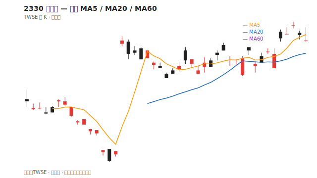
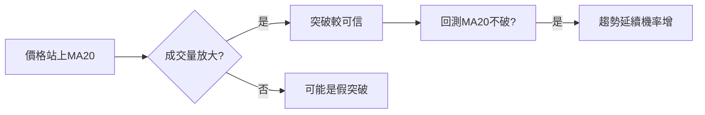

# 均線（MA）

## 本篇你會學到

- 常用均線週期與意義
- 黃金交叉、死亡交叉、支撐壓力

## 定義

**移動平均線（MA）** = 過去 N 根 K 線收盤價的平均值，隨每根新 K 更新。

| 均線 | 常見用途 |
|------|----------|
| MA5 | 極短線、當沖輔助 |
| MA10 | 短線趨勢 |
| MA20 | 月線，波段常用 |
| MA60 | 季線，中期趨勢 |
| MA120 / 240 | 半年、年線，長期 |

## 示意解讀

| 股價與均線關係 | 簡化解讀 |
|----------------|----------|
| 收盤 > MA20 | 短期偏多 |
| 收盤 < MA20 | 短期偏空 |
| MA5 上穿 MA20 | 黃金交叉，動能轉強訊號 |
| MA5 下穿 MA20 | 死亡交叉，動能轉弱訊號 |

??? note "圖表來源（維護者）"
    示意圖由腳本繪製，產圖指令見 [架構說明](../ARCHITECTURE.md)。

## 訊號流程

## 常見誤用

| 誤用 | 說明 |
|------|------|
| 均線是支撐鐵底 | 趨勢轉空時會一路沿均線下跌 |
| 交叉就進場 | 盤整區假交叉頻繁 |
| 只看一條均線 | 多週期互相驗證 |

## 與 K 線型態搭配

- 低檔 **紅K鎚子** + 站回 MA20 → 反轉故事較完整（見 [案例](../07-cases/hammer-ma.md)）。
- 高檔 **倒鎚** + 跌破 MA5 → 短線轉弱。

## 讀圖三步驟

1. **定方向**：收盤在 MA20 上還是下？MA20 斜率向上還是向下？
2. **看交叉**：短期均線是否上穿/下穿長期均線？
3. **確認**：突破或跌破是否 [放量](../02-glossary/quotes.md#成交量)？回測均線是否守住？

## 搭配確認

| 組合 | 意義 |
|------|------|
| MA 金叉 + MACD 金叉 | 短線動能轉強較一致 |
| 站上 MA20 + 紅K鎚子 | 見 [鎚子案例](../07-cases/hammer-ma.md) |
| 跌破 MA60 + 大黑K | 中期趨勢轉弱警訊 |

## 重點回顧

- 均線是**滯後**趨勢指標，適合描述而非預測。
- 週期愈長，訊號愈慢但愈穩。
- 速查：[指標速查表](indicator-quickref.md) · 搭配 [MACD](macd.md)

相關：[技術面術語](../02-glossary/technical.md#均線-ma)
