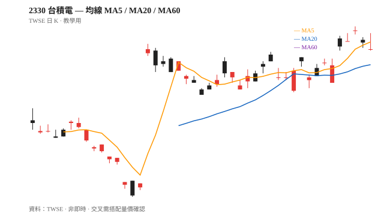
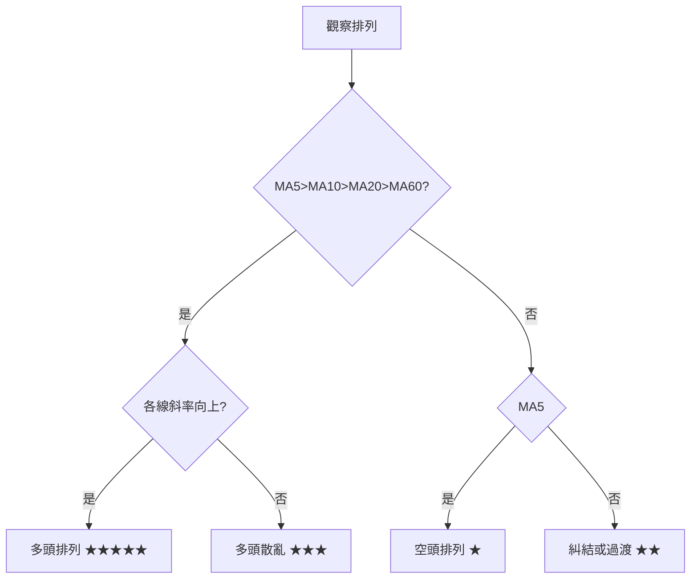
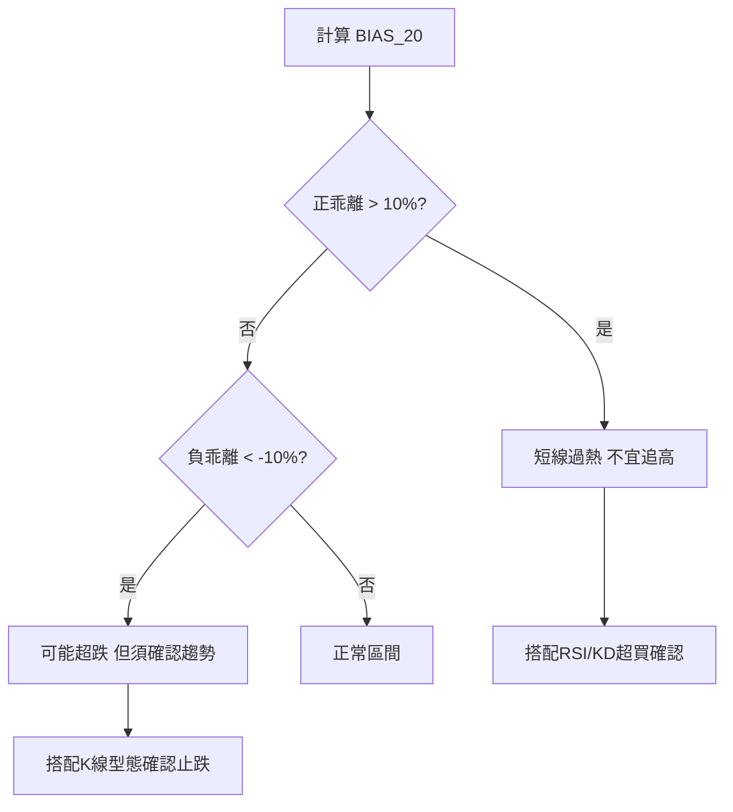
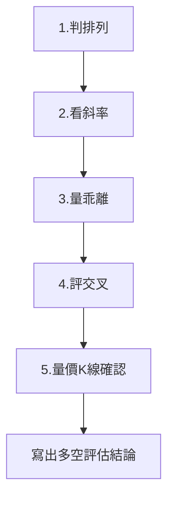

# 均線（MA）

## 本篇你會學到

- 常用均線週期與意義
- 黃金交叉、死亡交叉、支撐壓力
- **多均線排列**判讀趨勢強弱等級
- **乖離率**與扣抵值的實務應用
- 信號強度分級：如何評估一組均線訊號的可信度

## 定義

**移動平均線（MA）** = 過去 N 根 K 線收盤價的平均值，隨每根新 K 更新。

| 均線 | 俗稱 | 常見用途 | 代表「誰的成本」 |
|------|------|----------|-----------------|
| MA5 | 週線 | 極短線、當沖輔助 | 近一週進場者平均成本 |
| MA10 | 雙週線 | 短線趨勢 | 近兩週進場者 |
| MA20 | 月線 | 波段常用 | 近一個月進場者 |
| MA60 | 季線 | 中期趨勢 | 近三個月進場者 |
| MA120 | 半年線 | 長期趨勢 | 近半年進場者 |
| MA240 | 年線 | 長期多空分界 | 近一年進場者 |

!!! tip "核心觀念"
    股價在某條均線之上 = 該週期內進場的人**平均獲利**；反之平均虧損。均線是「市場多數人的成本共識」。

??? note "圖表來源（維護者）"
    示意圖由腳本繪製，產圖指令見 [架構說明](../ARCHITECTURE.md)。

---

## 多均線排列：趨勢強弱分級 {#多均線排列}

單看「收盤在 MA20 上還是下」太粗糙。多條均線的**排列順序**與**斜率方向**才能精確定義趨勢等級。

### 排列判讀表

| 排列 | 定義 | 趨勢等級 | 操作參考 |
|------|------|----------|----------|
| **多頭排列** | MA5 > MA10 > MA20 > MA60，且各線斜率向上 | ★★★★★ 強勢 | 順勢做多，回測短均線可加碼 |
| **多頭散亂** | 短均線在上，但長均線走平或糾結 | ★★★ 中性偏多 | 可做多但降倉位，收緊停損 |
| **均線糾結** | 多條均線黏合，無明顯方向 | ★★ 盤整 | 觀望或縮小部位，等待突破 |
| **空頭散亂** | 短均線在下，但長均線走平 | ★★ 中性偏空 | 不做多，短線反彈可小量 |
| **空頭排列** | MA5 < MA10 < MA20 < MA60，且各線斜率向下 | ★ 弱勢 | 空手或只做極短線反彈 |

```mermaid
flowchart TD
    A[觀察排列] --> B{MA5>MA10>MA20>MA60?}
    B -->|是| C{各線斜率向上?}
    C -->|是| D[多頭排列 ★★★★★]
    C -->|否| E[多頭散亂 ★★★]
    B -->|否| F{MA5<MA10<MA20<MA60?}
    F -->|是| G[空頭排列 ★]
    F -->|否| H[糾結或過渡 ★★]
```

### 排列評估實務

1. **看日K排列**判斷波段方向
2. **看週K排列**確認中期趨勢是否一致
3. 日K多頭 + 週K多頭 → 趨勢信號最強；日K多頭 + 週K糾結 → 可能只是反彈

---

## 均線斜率與角度 {#均線斜率}

均線的**斜率**（向上的陡峭程度）反映趨勢的加速或減速：

| MA20 斜率狀態 | 意義 | 評估 |
|--------------|------|------|
| 陡峭向上（45°以上） | 趨勢加速，但可能過熱 | 追高風險增，乖離率注意 |
| 穩定向上（15°–45°） | 健康多頭 | 最佳做多環境 |
| 走平 | 趨勢暫停或方向待定 | 觀望，等待方向選擇 |
| 彎頭向下 | 趨勢可能反轉 | 持倉者提高警覺 |

---

## 乖離率（BIAS）{#乖離率}

**乖離率** = （收盤價 − MA）÷ MA × 100%

衡量股價**偏離均線的程度**。乖離過大時，價格有「回歸」均線的傾向（非必然）。

### 常見參考門檻（台股一般個股）

| 均線 | 正乖離警戒 | 負乖離觀察 | 適用說明 |
|------|-----------|-----------|----------|
| MA5 | > +5% | < −5% | 極短線超買超賣 |
| MA20 | > +10% | < −10% | 波段過熱/過冷 |
| MA60 | > +15% | < −15% | 中期過度偏離 |

!!! warning "強勢股例外"
    飆股正乖離可維持 +20% 以上數週不回；弱勢股可長期負乖離。門檻因個股波動性而異，上表為**一般情況參考**。

### 乖離率判讀流程

```mermaid
flowchart TD
    A[計算 BIAS_20] --> B{正乖離 > 10%?}
    B -->|是| C[短線過熱 不宜追高]
    B -->|否| D{負乖離 < -10%?}
    D -->|是| E[可能超跌 但須確認趨勢]
    D -->|否| F[正常區間]
    C --> G[搭配RSI/KD超買確認]
    E --> H[搭配K線型態確認止跌]
```

---

## 扣抵值概念 {#扣抵值}

MA 的計算會「**扣掉最舊一天、加入最新一天**」。扣抵值 = 即將被「踢出」計算窗口的那根 K 的收盤價。

| 情境 | 意義 |
|------|------|
| 扣抵值**低**（即將踢出的是低價） | MA 未來可能走平或向下彎——除非新價格夠高 |
| 扣抵值**高**（即將踢出的是高價） | MA 未來可能上揚——踢出高價後換入中等價格即可拉升 MA |

實務：多數看盤軟體可顯示「MA20 扣抵值」。當扣抵值 > 目前股價時，MA20 有向下彎的壓力；反之向上。

---

## 黃金交叉與死亡交叉：信號分級 {#交叉信號分級}

並非所有交叉都等值。以下從**五個維度**評估交叉信號的強度：

| 維度 | 強信號 | 弱信號 |
|------|--------|--------|
| **位置** | 低檔盤整後首次金叉 | 盤整區反覆金叉死叉 |
| **角度** | 短均線以大角度穿越 | 幾乎平行後緩慢穿越 |
| **成交量** | 交叉日放量 | 交叉日量縮 |
| **長均線方向** | 長均線（MA60）同向 | 長均線反向或走平 |
| **多指標共振** | MACD 同步金叉 | MACD 仍死叉 |

### 信號強度評分參考

| 評分 | 判定 | 操作建議 |
|------|------|----------|
| 4–5 維度符合 | **強信號** | 可考慮進場，部位偏積極 |
| 2–3 維度符合 | **中等信號** | 小量試單，嚴控停損 |
| 0–1 維度符合 | **弱信號** | 觀望，等更多確認 |

---

## 均線作為支撐壓力的評估 {#支撐壓力評估}

均線並非「鐵底」或「鐵頂」，其有效性取決於：

| 因素 | 支撐較有效 | 支撐較無效 |
|------|-----------|-----------|
| 觸及次數 | 首次或第二次回測 | 第三次以上反覆測試 |
| 趨勢方向 | 均線斜率向上 | 均線走平或向下 |
| 成交量 | 觸均線時量縮（惜售） | 觸均線時放量（恐慌賣） |
| 回測速度 | 緩跌回測 | 急跌刺穿 |
| K 線型態 | 觸線出現鎚子/十字 | 觸線後繼續長黑 |

---

## 讀圖五步驟（評估流程）

1. **排列**：多頭排列？空頭排列？糾結？ → 定趨勢等級
2. **斜率**：MA20 / MA60 斜率向上/走平/向下？ → 定趨勢健康度
3. **位置**：收盤在 MA20 之上或之下？乖離多少？ → 定偏離程度
4. **交叉**：近期是否出現金叉/死叉？→ 用五維度評估信號強度
5. **確認**：交叉或突破是否 [放量](../02-glossary/quotes.md#成交量)？K 線型態配合否？

```mermaid
flowchart TD
    A[1.判排列] --> B[2.看斜率]
    B --> C[3.量乖離]
    C --> D[4.評交叉]
    D --> E[5.量價K線確認]
    E --> F[寫出多空評估結論]
```

---

## 與 K 線型態搭配

| 組合情境 | 評估結論 | 信號等級 |
|---------|---------|---------|
| 低檔紅K鎚子 + 站回 MA20 + 放量 | 短線反轉機率較高 | ★★★★ |
| 高檔倒鎚 + 跌破 MA5 + 量增 | 短線轉弱明確 | ★★★★ |
| 盤整區小紅 + 站上 MA20 + 量縮 | 假突破可能 | ★★ |
| 多頭排列中回測 MA20 + 鎚子 + 縮量 | 回檔找買點 | ★★★★★ |

見 [鎚子線案例](../07-cases/hammer-ma.md)。

---

## 搭配確認

| 組合 | 意義 | 評估加分 |
|------|------|---------|
| MA 金叉 + MACD 金叉 | 趨勢與動能同步轉強 | +2 |
| 多頭排列 + RSI > 50 | 趨勢健康且動能中性以上 | +1 |
| 站上 MA20 + 紅K鎚子 + 放量 | 位置+型態+量能三合一 | +3 |
| 跌破 MA60 + 大黑K + 空頭排列 | 中期趨勢轉弱全面性確認 | 離場信號 |

---

## 常見誤用

| 誤用 | 說明 | 正確做法 |
|------|------|----------|
| 均線是支撐鐵底 | 趨勢轉空時會一路沿均線下跌 | 看斜率、觸線型態與量 |
| 交叉就進場 | 盤整區假交叉頻繁 | 用五維度評分，≥3 才考慮 |
| 只看一條均線 | 無法辨識排列與趨勢等級 | 至少同時看 MA5/20/60 |
| 乖離大就反向操作 | 強勢股可持續高乖離 | 乖離是警示，不是交易指令 |
| 忽略扣抵值 | 不知 MA 未來走向 | 看扣抵推估 MA 即將翻揚或壓回 |

---

## 自我檢查

??? question "1.（概念題）MA20 常被稱為什麼？多頭排列的定義是？"
    參考答案：**月線**。多頭排列 = MA5 > MA10 > MA20 > MA60 且各線斜率向上。

??? question "2.（判斷題）MA5 上穿 MA20（黃金交叉）就該全倉買進？"
    參考答案：不行。須用五維度（位置、角度、量、長均線方向、多指標共振）評估信號強度，盤整區假交叉多。見 [多週期](../09-advanced/multi-timeframe.md)。

??? question "3.（情境題）價格站上 MA20 但量縮，且 MA60 仍向下，你怎麼評估？"
    參考答案：信號偏弱（量不配合 + 長均線反向）。可能是空頭反彈而非趨勢反轉。觀望或僅極小量試單。警惕 [案例：缺口假突破](../07-cases/gap-breakout.md)。

??? question "4.（進階題）MA20 扣抵值高於目前股價，代表什麼？"
    參考答案：MA20 即將被「踢出」一個高價日，若新價格無法彌補，MA20 有**上彎**的動力（舊高價移除後均線降低門檻）。反之若扣抵值低，代表 MA 可能壓回。

---

## 重點回顧

- 均線是**滯後**趨勢指標，適合描述而非預測。
- **多頭排列**是最強的做多環境；**空頭排列**最弱。
- **乖離率**衡量偏離程度，過大有回歸傾向但非必然。
- **交叉信號**需用五維度評估強度，不可無腦跟單。
- 均線作為支撐的有效性取決於斜率、觸及次數、量與 K 線型態。
- 速查：[指標速查表](indicator-quickref.md) · 搭配 [MACD](macd.md)

相關：[技術面術語](../02-glossary/technical.md#均線-ma) · [指標速查表](indicator-quickref.md)
