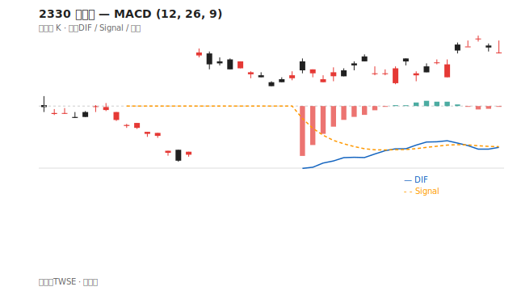
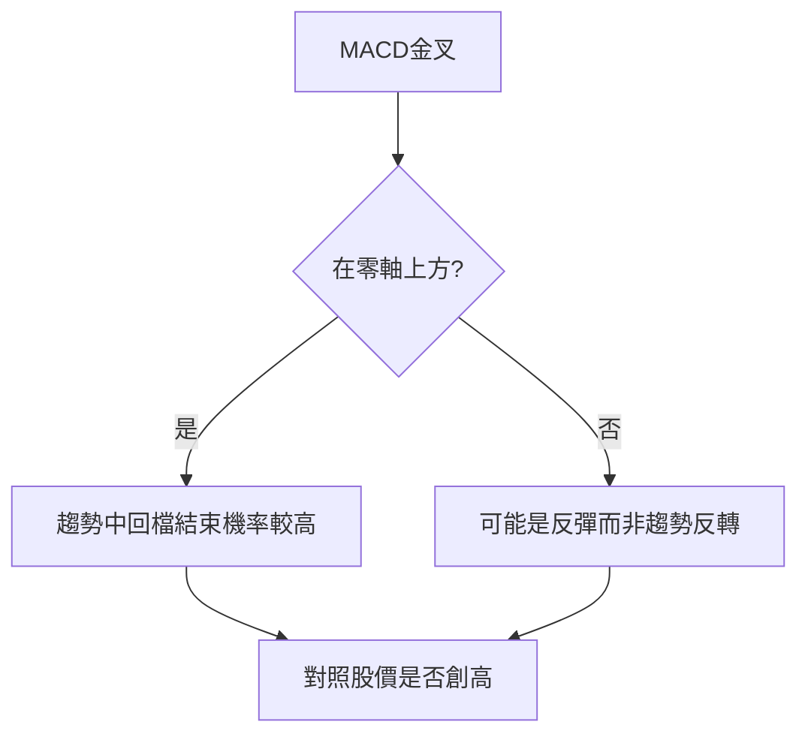

# MACD

## 本篇你會學到

- DIF、Signal、柱狀圖的意義
- 金叉、死叉與背離概念

## 組成

| 元件 | 說明 |
|------|------|
| **DIF** | 快線 EMA(12) − 慢線 EMA(26) |
| **Signal** | DIF 的 EMA(9) |
| **柱狀圖（MACD 柱）** | DIF − Signal |

常見參數：12, 26, 9（可依軟體調整）。

??? note "圖表來源（維護者）"
    示意圖由腳本繪製，產圖指令見 [架構說明](../ARCHITECTURE.md)。

## 讀圖方式

| 現象 | 簡化解讀 |
|------|----------|
| DIF 上穿 Signal | 金叉，動能轉強 |
| DIF 下穿 Signal | 死叉，動能轉弱 |
| 柱狀由負轉正 | 多方動能增溫 |
| DIF 在零軸上方 | 中期偏多環境 |
| DIF 在零軸下方 | 中期偏空環境 |

## 訊號流程

## 背離（進階） {#背離進階}

| 類型 | 現象 | 意義 |
|------|------|------|
| 頂背離 | 股價新高，MACD 未新高 | 上漲動能衰竭警訊 |
| 底背離 | 股價新低，MACD 未新低 | 下跌動能衰竭警訊 |

背離需多次確認，單次不可靠。

## 常見誤用

- 零軸下方金叉就當大反轉 → 可能是弱勢反彈。
- 忽略大盤與產業 → 個股 MACD 受板塊影響。

## 讀圖三步驟

1. **零軸**：DIF 在零軸上（偏多環境）還是下（偏空）？
2. **交叉**：DIF 與 Signal 金叉或死叉？
3. **背離**：股價新高/新低時，MACD 是否同步？見 [背離案例](../07-cases/macd-divergence.md)

## 搭配確認

| 現象 | 動作參考 |
|------|----------|
| 零軸上金叉 + 量增 | 趨勢延續機率較高 |
| 零軸下金叉 | 可能只是弱勢反彈 |
| 頂背離 + 高檔倒鎚 | 不加碼、守停利 |

## 重點回顧

- MACD 是**趨勢 + 動能**指標，適合趨勢市，盤整假訊號多。
- 金叉/死叉應看**零軸位置**與**價格結構**。
- 速查：[指標速查表](indicator-quickref.md)

相關：[MACD 術語](../02-glossary/technical.md#macd)
