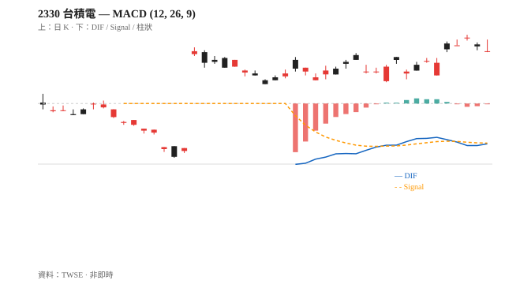
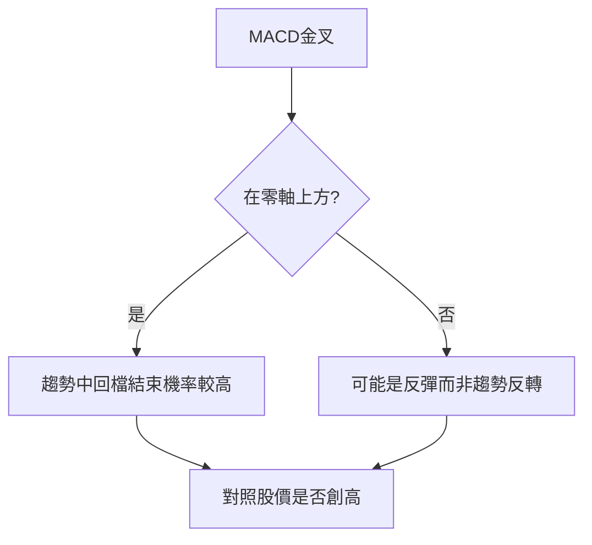

# MACD

## 本篇你會學到

- DIF、Signal、柱狀圖的意義
- 金叉、死叉與背離概念
- **如何用零軸位置分辨「趨勢延續」與「弱勢反彈（接盤風險）」**
- 高檔頂背離與追高風險的讀法

## 組成

| 元件 | 說明 |
|------|------|
| **DIF** | 快線 EMA(12) − 慢線 EMA(26) |
| **Signal** | DIF 的 EMA(9) |
| **柱狀圖（MACD 柱）** | DIF − Signal |

常見參數：12, 26, 9（可依軟體調整）。

??? note "圖表來源（維護者）"
    示意圖由腳本繪製，產圖指令見 [架構說明](../ARCHITECTURE.md)。

## 讀圖方式

| 現象 | 簡化解讀 |
|------|----------|
| DIF 上穿 Signal | 金叉，動能轉強 |
| DIF 下穿 Signal | 死叉，動能轉弱 |
| 柱狀由負轉正 | 多方動能增溫 |
| DIF 在零軸上方 | 中期偏多環境 |
| DIF 在零軸下方 | 中期偏空環境 |

## 訊號流程

```mermaid
flowchart TD
    A[MACD金叉] --> B{在零軸上方?}
    B -->|是| C[趨勢中回檔結束機率較高]
    B -->|否| D[可能是反彈而非趨勢反轉]
    C --> E[對照股價是否創高]
    D --> E
```

## 用 MACD 想「接盤還是追高」 {#接盤還是追高}

完整四層框架（均線 → MACD → 冷熱 → 量價）見專章：[手冊：接盤還是追高](catch-or-chase.md)。本節只抓 MACD 最常用的兩刀：

### 1. 會不會接盤？看「零軸下的金叉」

| 組合 | 較常見含義 |
|------|------------|
| 零軸下金叉 + 股價仍在 MA20 下 | 弱勢反彈機率高，**接盤風險偏高** |
| 零軸下金叉後柱狀很快縮回 | 反彈力道不足 |
| 金叉後柱連續擴大，並朝零軸靠近 | 止跌候選，仍須量與均線確認 |

演練案例：[案例：弱勢反彈接盤](../07-cases/weak-rebound-trap.md)。

### 2. 會不會追高？看「頂背離與高檔死叉」

| 組合 | 較常見含義 |
|------|------------|
| 股價新高、DIF 未新高（頂背離） | 上漲動能衰竭，**追高／加碼風險偏高** |
| 零軸上死叉 + 量縮 | 多頭修正警訊，空手不宜追反彈高點 |
| 零軸上金叉 + 量增 + 非背離 | 較像趨勢延續，仍避免乖離過大時追價 |

演練案例：[MACD 頂背離](../07-cases/macd-divergence.md)。

!!! tip "口訣"
    **金叉先問零軸上或下；創高先問 DIF 有沒有一起創高。**

## 柱狀圖進階讀法

| 柱狀變化 | 解讀 |
|----------|------|
| 負柱縮短（朝零軸） | 空方動能減弱，未必已轉多 |
| 正柱拉長 | 多方動能增溫 |
| 正柱縮短 | 上漲動能減弱（常早於死叉出現） |
| 金叉／死叉當日 | 只是交叉瞬間；之後柱是否**連續**擴大更重要 |

盤整時柱狀常在零軸上下來回，假訊號多——宜降權重，改看 [均線](ma.md) 與價格區間。

## 背離（進階） {#背離進階}

| 類型 | 現象 | 意義 |
|------|------|------|
| 頂背離 | 股價新高，MACD 未新高 | 上漲動能衰竭警訊 |
| 底背離 | 股價新低，MACD 未新低 | 下跌動能衰竭警訊 |

背離需多次確認，單次不可靠。頂背離常見於「追高末段」討論；底背離是止跌**候選**，不是自動抄底指令。

## 常見誤用

| 誤用 | 說明 |
|------|------|
| 零軸下方金叉就當大反轉 | 可能是弱勢反彈（接盤） |
| 忽略大盤與產業 | 個股 MACD 受板塊影響 |
| 只看交叉不看柱狀連續性 | 交叉後立刻縮柱，訊號含金量低 |
| 背離出現就立刻反向開倉 | 背離是警訊，常先橫盤或緩修 |
| 當沖每根分 K 都盯 MACD | 參數與雜訊不適合極短線；當沖優先量價與分時 |

## 讀圖三步驟

1. **零軸**：DIF 在零軸上（偏多環境）還是下（偏空）？
2. **交叉**：DIF 與 Signal 金叉或死叉？之後柱狀有沒有連續擴大？
3. **背離**：股價新高/新低時，MACD 是否同步？見 [案例：MACD 頂背離](../07-cases/macd-divergence.md)

## 搭配確認

| 現象 | 動作參考 |
|------|----------|
| 零軸上金叉 + 量增 | 趨勢延續機率較高 |
| 零軸下金叉 | 可能只是弱勢反彈 → [手冊：接盤還是追高](catch-or-chase.md) |
| 頂背離 + 高檔倒鎚 | 不加碼、守停利 |
| MA 金叉 + MACD 金叉（同向） | 短線動能較一致，見 [均線](ma.md) |

## 自我檢查

??? question "1.（概念題）MACD 柱狀圖代表什麼？"
    參考答案：**DIF − Signal**，反映兩線差距與動能強弱。

??? question "2.（判斷題）零軸下方金叉一定是大反轉？"
    參考答案：不一定，常只是**弱勢反彈**；零軸上方金叉較像趨勢延續。見 [案例：弱勢反彈接盤](../07-cases/weak-rebound-trap.md)。

??? question "3.（情境題）股價新高但 MACD 未新高，這叫什麼、該怎麼做？"
    參考答案：**頂背離**，動能衰竭警訊；宜守停利、勿盲目加碼，見 [案例：MACD 頂背離](../07-cases/macd-divergence.md)。

## 重點回顧

- MACD 是**趨勢 + 動能**指標，適合趨勢市，盤整假訊號多。
- 金叉/死叉應看**零軸位置**與**價格結構**——這也是分辨接盤與追高的第一刀。
- [指標速查](indicator-quickref.md) · [手冊：接盤還是追高](catch-or-chase.md)

## 相關

- 定義：[定義：MACD](../02-glossary/technical.md#macd)
- 案例：[案例：MACD 頂背離](../07-cases/macd-divergence.md) · [案例：弱勢反彈接盤](../07-cases/weak-rebound-trap.md)
