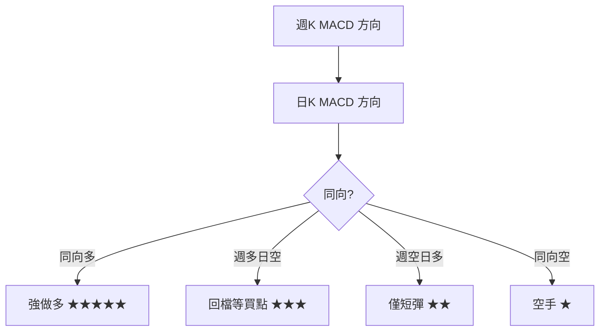

# MACD

## 本篇你會學到

- DIF、Signal、柱狀圖的三層意義
- 金叉、死叉的**信號分級**（非所有交叉等價）
- **柱狀圖細讀**：縮頭、翻紅翻綠的領先意義
- **背離分級**：一次背離 vs 連續背離的差異
- **多時間框架 MACD** 的匯整邏輯
- 系統性評估方法與信號權重
- 如何用零軸位置分辨「接盤風險」與「追高風險」→ [手冊](catch-or-chase.md)

## 組成

| 元件 | 計算 | 意義 |
|------|------|------|
| **DIF（快線）** | EMA(12) − EMA(26) | 短期趨勢相對長期的偏離 |
| **Signal（慢線）** | DIF 的 EMA(9) | DIF 的平滑，作為觸發基準 |
| **柱狀圖（MACD 柱）** | DIF − Signal | 兩線差距的**變化速率**——動能的動能 |

常見參數：12, 26, 9（可依軟體調整）。

!!! tip "核心觀念"
    DIF 衡量「趨勢方向」；柱狀圖衡量「動能加速還是減速」。柱狀圖的高度變化往往**領先**於 DIF 的交叉。

??? note "圖表來源（維護者）"
    示意圖由腳本繪製，產圖指令見 [架構說明](../ARCHITECTURE.md)。

---

## MACD 三層解讀框架 {#三層解讀}

### 第一層：零軸位置（趨勢環境）

| DIF 位置 | 環境判定 | 操作傾向 |
|---------|---------|---------|
| DIF **遠高於**零軸 | 強勢多頭 | 順勢做多，回檔找買點 |
| DIF **略高於**零軸 | 偏多但動能有限 | 選擇性做多 |
| DIF **接近**零軸 | 轉折或盤整 | 觀望，等方向確認 |
| DIF **略低於**零軸 | 偏空但可能築底 | 不做多，觀察止跌訊號 |
| DIF **遠低於**零軸 | 強勢空頭 | 空手或防禦 |

### 第二層：交叉方向（動能轉折）

| 交叉類型 | 位置 | 意義 | 信號等級 |
|---------|------|------|---------|
| 零軸上方金叉 | 多頭環境 | 回檔結束，趨勢延續 | ★★★★ |
| 零軸附近金叉 | 轉折區 | 可能趨勢反轉起步 | ★★★ |
| 零軸下方金叉 | 空頭環境 | 弱勢反彈居多 | ★★ |
| 零軸下方死叉 | 空頭環境 | 跌勢延續 | ★★★★ |
| 零軸附近死叉 | 轉折區 | 可能趨勢反轉向下 | ★★★ |
| 零軸上方死叉 | 多頭環境 | 可能是回檔，非必然反轉 | ★★ |

### 第三層：柱狀圖形態（動能加速度）

| 柱狀圖狀態 | 意義 | 領先性 |
|-----------|------|--------|
| 紅柱**遞增** | 多方動能加速 | DIF 即將拉開 Signal |
| 紅柱**遞減（縮頭）** | 多方動能衰減 | **領先警告**：金叉可能即將結束 |
| 翻綠（紅→綠） | 動能正式轉弱 | 等同或接近死叉 |
| 綠柱**遞增** | 空方動能加速 | 跌勢加速 |
| 綠柱**遞減（縮腳）** | 空方動能衰減 | **領先暗示**：止跌或反彈接近 |
| 翻紅（綠→紅） | 動能正式轉強 | 等同或接近金叉 |

!!! tip "柱狀圖是最早的警報"
    還沒交叉時，柱狀圖的「縮頭」或「縮腳」已經在告訴你動能正在改變。這是 MACD 最有價值的領先信號。

---

## 交叉信號的五維度評分 {#交叉信號評分}

| 維度 | 加分條件（金叉為例） | 權重 |
|------|---------------------|------|
| **零軸位置** | 在零軸上方或剛突破零軸 | ×2 |
| **柱狀圖配合** | 綠柱已明顯縮腳，翻紅確認 | ×2 |
| **成交量** | 金叉日或前一日放量 | ×1 |
| **均線排列** | [多頭排列](ma.md#多均線排列) 或至少站上 MA20 | ×1 |
| **K 線型態** | 金叉前後出現看漲型態（鎚子、吞噬等） | ×1 |

| 加權總分 | 信號判定 | 操作參考 |
|---------|---------|---------|
| 5–7 分 | **強信號** | 積極進場 |
| 3–4 分 | **中等信號** | 半倉或等回測確認 |
| 1–2 分 | **弱信號** | 觀望，可能假信號 |

---

## 接盤與追高風險判讀 {#接盤還是追高}

MACD 是判斷「接盤 vs 追高」最常用的兩刀：

| 情境 | MACD 觀察 | 風險判定 |
|------|-----------|---------|
| 零軸下金叉 + MA20 下方 | 弱勢反彈機率高 | **接盤風險偏高** |
| 股價新高、DIF 未新高 | 頂背離，動能衰竭 | **追高風險偏高** |
| 零軸上金叉 + 多頭排列 | 回檔結束 | 趨勢延續，風險較低 |

完整四層框架見專章：[手冊：接盤還是追高](catch-or-chase.md)

---

## 背離：分類與分級 {#背離進階}

### 背離類型

| 類型 | 現象 | 意義 |
|------|------|------|
| **頂背離** | 股價新高，DIF 或柱狀圖未新高 | 上漲動能衰竭 |
| **底背離** | 股價新低，DIF 或柱狀圖未新低 | 下跌動能衰竭 |
| **隱藏背離（多頭）** | 股價回檔未破前低，DIF 卻破前低 | 洗盤後趨勢可能延續 |
| **隱藏背離（空頭）** | 股價反彈未破前高，DIF 卻過前高 | 反彈後趨勢可能延續下跌 |

### 背離強度分級

| 等級 | 條件 | 可信度 |
|------|------|--------|
| **一級背離** | DIF 與柱狀圖**同時**背離 + 高/低檔位置 | ★★★★★ |
| **二級背離** | 僅 DIF 背離或僅柱狀圖背離 | ★★★ |
| **連續背離** | 股價連續兩次新高/低，MACD 連續兩次未跟 | ★★★★★ |
| **單次背離** | 僅一次比較 | ★★★ |

!!! warning "背離不等於立即反轉"
    背離是**動能衰竭警訊**，不是「賣出指令」。強勢股可背離多次仍續漲，直到某次配合 K 線反轉型態才真正見頂。見 [背離案例](../07-cases/macd-divergence.md)。

### 背離確認清單

出現背離後，檢查以下項目再下結論：

- [ ] 背離出現在**高檔或低檔**（盤整區背離意義不大）
- [ ] 量能是否配合（頂背離 + 量縮新高 → 信號更強）
- [ ] K 線是否出現反轉型態（倒鎚、吞噬等）
- [ ] 次日是否確認（頂背離後長黑、底背離後長紅）

---

## 多時間框架 MACD {#多時間框架}

| 週K MACD | 日K MACD | 環境判定 | 操作方向 |
|---------|---------|---------|---------|
| 多頭（DIF > 0, 金叉） | 金叉 | 大小周期同向多 | **最強做多環境** |
| 多頭 | 死叉 | 大周期多，小周期回檔 | 回檔找買點 |
| 空頭 | 金叉 | 大周期空，小周期反彈 | 僅做極短線或觀望 |
| 空頭（DIF < 0, 死叉） | 死叉 | 大小周期同向空 | **最弱環境，空手** |

```mermaid
flowchart TD
    W[週K MACD 方向] --> D[日K MACD 方向]
    D --> C{同向?}
    C -->|同向多| S[強做多 ★★★★★]
    C -->|週多日空| R[回檔等買點 ★★★]
    C -->|週空日多| B[僅短彈 ★★]
    C -->|同向空| X[空手 ★]
```

---

## MACD 環境評估總表 {#環境評估總表}

將三層與多時間框架合併，得出完整環境評估：

| 評估項目 | 偏多得分 | 中性 | 偏空得分 |
|---------|---------|------|---------|
| 零軸位置 | DIF > 0 (+2) | DIF ≈ 0 (0) | DIF < 0 (−2) |
| 交叉狀態 | 金叉 (+1) | 無交叉 (0) | 死叉 (−1) |
| 柱狀圖 | 紅柱遞增 (+2) | 持平 (0) | 綠柱遞增 (−2) |
| 背離 | 底背離 (+1) | 無 (0) | 頂背離 (−1) |
| 週K方向 | 週K金叉 (+2) | 中性 (0) | 週K死叉 (−2) |

| 總分 | 環境 | 操作建議 |
|------|------|---------|
| +5 以上 | 強多 | 積極做多 |
| +2 ~ +4 | 偏多 | 順勢做多、適當倉位 |
| −1 ~ +1 | 中性 | 觀望或區間操作 |
| −4 ~ −2 | 偏空 | 不做多、防禦 |
| −5 以下 | 強空 | 空手 |

---

## 常見誤用

| 誤用 | 說明 | 正確做法 |
|------|------|----------|
| 零軸下方金叉就當大反轉 | 多數是弱勢反彈 | 看週K方向與背離確認 |
| 忽略柱狀圖 | 錯失最早的動能變化警報 | 先讀柱狀縮頭/縮腳 |
| 背離一次就全力反向 | 強勢股可背離多次 | 等 K 線確認，背離是「警訊」非「指令」 |
| 盤整區解讀 MACD | 橫盤時假信號極多 | 辨識盤整後暫停使用，等突破 |
| 忽略大盤與產業 | 個股 MACD 受系統性影響 | 先看 [大盤圖](market-charts.md) 環境 |

---

## 讀圖五步驟（評估流程）

1. **零軸**：DIF 在零軸上（偏多）還是下（偏空）？距離多遠？
2. **柱狀圖**：紅柱遞增/縮頭？綠柱遞增/縮腳？→ 動能正在加速還是減速？
3. **交叉**：近期金叉或死叉？用五維度評分判斷強度
4. **背離**：股價新高/新低時，DIF 與柱狀圖是否同步？分級判斷
5. **多框架**：週K MACD 與日K是否同向？→ 定最終環境等級

---

## 自我檢查

??? question "1.（概念題）MACD 柱狀圖「縮頭」代表什麼？為何說它是領先信號？"
    參考答案：紅柱遞減（縮頭）代表多方動能正在**衰減**。它比 DIF 交叉更早出現，是還沒死叉前的動能減速警報。

??? question "2.（判斷題）零軸下方金叉一定是大反轉？"
    參考答案：不一定，常只是**弱勢反彈**。須配合週K方向、量能與 K 線型態確認。零軸上方金叉才較可能是趨勢延續。

??? question "3.（情境題）股價連續兩次新高但 MACD DIF 連續兩次未新高，你怎麼評估？"
    參考答案：**連續頂背離**，屬一級背離強度（★★★★★）。動能嚴重衰竭警訊，搭配高檔倒鎚或量縮時，應守停利或減碼。見 [背離案例](../07-cases/macd-divergence.md)。

??? question "4.（進階題）週K MACD 死叉但日K金叉，你的操作傾向？"
    參考答案：大周期偏空、小周期反彈。僅適合**極短線**搶反彈或觀望。不宜中線做多。

---

## 重點回顧

- MACD 有**三層**：零軸定環境、交叉定方向、柱狀圖定加速度。
- **柱狀圖縮頭/縮腳**是最早的動能警報，善用可領先判斷。
- **背離**分級：連續背離 > 單次背離；DIF + 柱同時背離 > 單一。
- **多時間框架**同向時信號最強。
- 速查：[指標速查表](indicator-quickref.md)

相關：[MACD 術語](../02-glossary/technical.md#macd) · [背離案例](../07-cases/macd-divergence.md) · [指標速查表](indicator-quickref.md) · [手冊：接盤還是追高](catch-or-chase.md)
